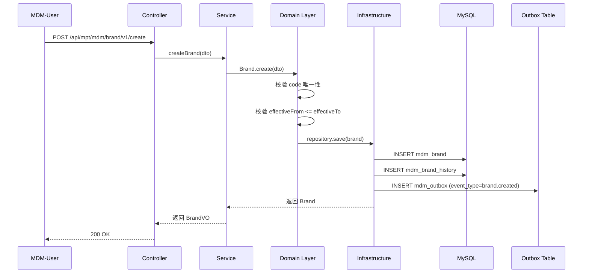
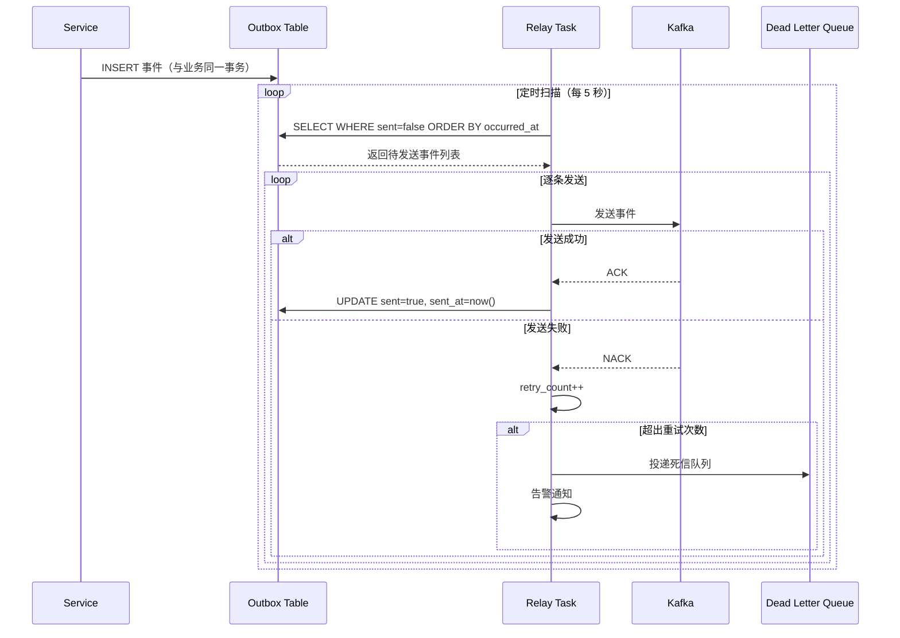
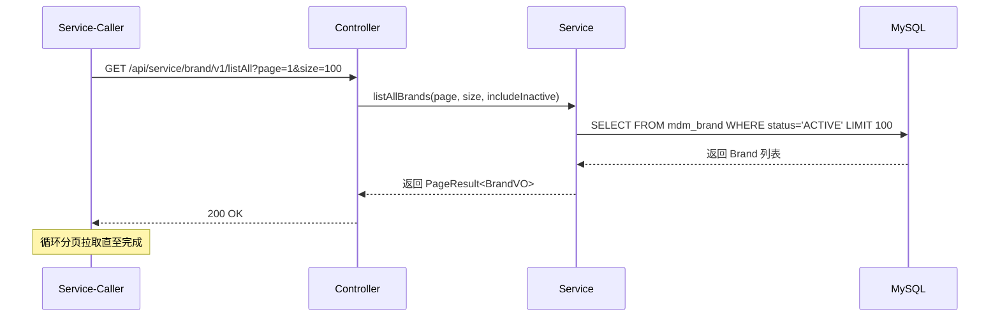
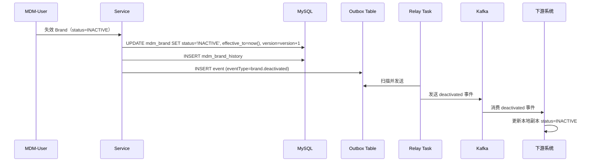
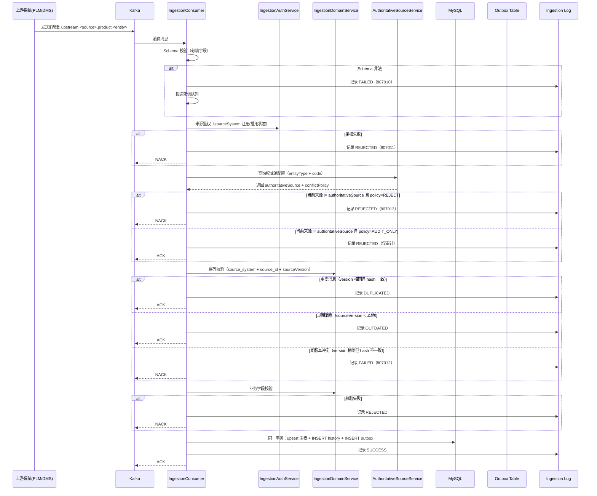
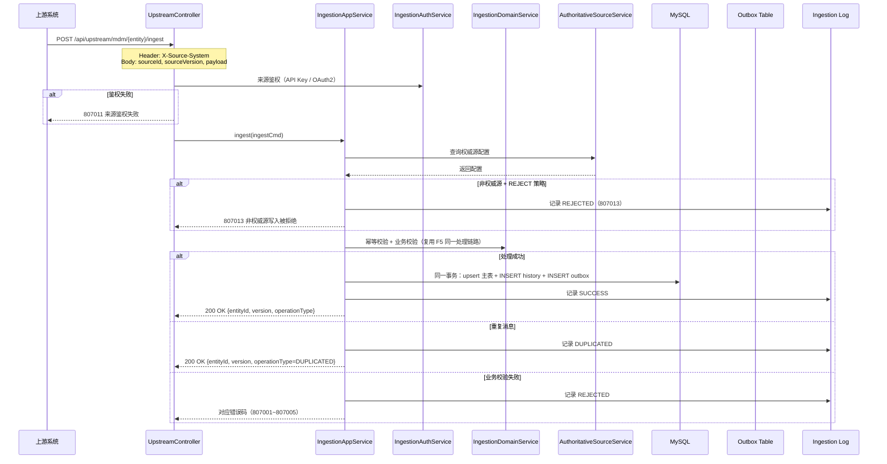
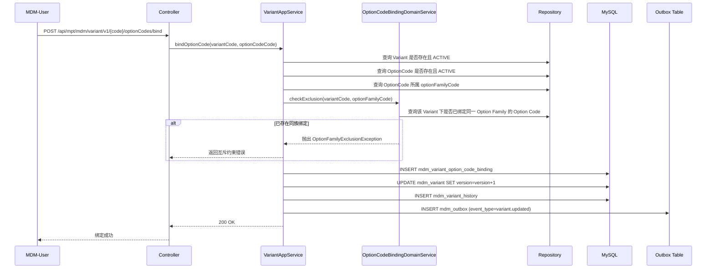
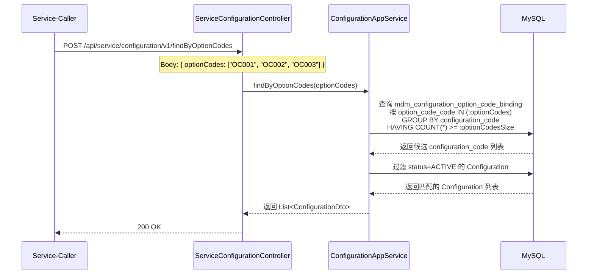
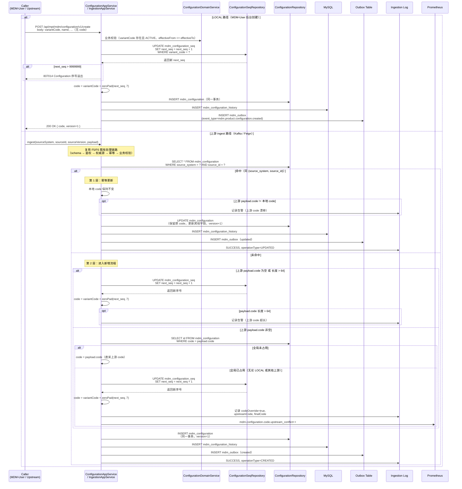

# MDM 平台 - Design

## 1. Architecture Overview

### 系统上下文图

```mermaid
graph TB
    subgraph "本地维护"
        MDM-User[MDM-User<br/>后台运营/工程师]
        MDM-Admin[MDM-Admin<br/>管理员]
    end
    
    subgraph "上游系统"
        PLM[PLM<br/>产品生命周期]
        DMS[DMS<br/>经销商管理]
        GMDM[集团主数据平台]
        ERP[ERP<br/>企业资源计划]
        SRM[SRM<br/>供应商关系管理]
    end
    
    subgraph "edd-mdm 服务"
        API[API Layer<br/>Controller]
        INGEST[Ingestion Layer<br/>上游接入处理链路]
        APP[Application Layer<br/>Service]
        DOMAIN[Domain Layer<br/>Entity/Repository]
        INFRA[Infrastructure Layer<br/>Mapper/Kafka/Outbox]
        RELAY[Outbox Relay<br/>后台任务]
    end
    
    subgraph "下游消费方"
        VMD[VMD<br/>车辆主数据]
        ORDER[订单服务]
        CONFIG[销售配置器]
        BI[BI 系统]
        PURCHASE[采购系统]
        FINANCE[财务系统]
    end
    
    subgraph "基础设施"
        DB[(MySQL)]
        KAFKA[Kafka]
        NACOS[Nacos]
        PROM[Prometheus]
    end
    
    MDM-User -->|HTTP CRUD| API
    MDM-Admin -->|HTTP 配置/审计| API
    API --> APP
    APP --> DOMAIN
    DOMAIN --> INFRA
    INFRA --> DB
    INFRA -->|写入 Outbox| DB
    RELAY -->|扫描 Outbox| DB
    RELAY -->|投递事件| KAFKA
    
    PLM -->|Kafka upstream.*.product.*| KAFKA
    DMS -->|Kafka upstream.*.product.*| KAFKA
    GMDM -->|Kafka upstream.*| KAFKA
    ERP -->|Kafka upstream.*.party.supplier| KAFKA
    SRM -->|Kafka upstream.*.party.supplier| KAFKA
    KAFKA -->|消费上游消息| INGEST
    PLM -->|POST /api/upstream/mdm/*/ingest| API
    DMS -->|POST /api/upstream/mdm/*/ingest| API
    GMDM -->|POST /api/upstream/mdm/*/ingest| API
    ERP -->|POST /api/upstream/mdm/supplier/v1/ingest| API
    SRM -->|POST /api/upstream/mdm/supplier/v1/ingest| API
    API --> INGEST
    INGEST --> APP
    
    VMD -->|Feign| API
    ORDER -->|Feign| API
    CONFIG -->|Feign| API
    BI -->|Feign| API
    PURCHASE -->|Feign| API
    FINANCE -->|Feign| API
    
    VMD -->|订阅 mdm.product.*| KAFKA
    ORDER -->|订阅 mdm.product.*| KAFKA
    CONFIG -->|订阅 mdm.product.*| KAFKA
    BI -->|订阅 mdm.product.* / mdm.party.*| KAFKA
    PURCHASE -->|订阅 mdm.party.supplier.*| KAFKA
    FINANCE -->|订阅 mdm.party.supplier.*| KAFKA
    
    INFRA -->|指标上报| PROM
```



### 模块依赖

#### Parent POM

| 模块 | 继承 | 说明 |
|------|------|------|
| edd-mdm-api | `net.hwyz.iov.cloud.parent:api:0.0.1-SNAPSHOT` | API 模块 |
| edd-mdm-service | `net.hwyz.iov.cloud.parent:service:0.0.1-SNAPSHOT` | Service 模块 |

#### Framework Starter 依赖

| Starter | GroupId | ArtifactId | 职责 |
|---------|---------|-----------|------|
| 常用 | `net.hwyz.iov.cloud.framework` | `framework-common` | 常用对象、常量、枚举、工具类 |
| MySQL | `net.hwyz.iov.cloud.framework` | `framework-mysql-starter` | 数据源配置、MyBatis-Plus 集成、分页插件 |
| Kafka | `net.hwyz.iov.cloud.framework` | `framework-kafka-starter` | Kafka 生产者/消费者配置 |
| Web | `net.hwyz.iov.cloud.framework` | `framework-web-starter` | WEB 服务相关（Service 模块默认依赖） |

**使用约定**：
- Service 模块按需引入所需的 Framework Starter，不直接依赖底层中间件原生 starter
- Service 模块的 Parent 已默认依赖 framework-web-starter，且 framework-web-starter 已默认依赖 framework-common
- Framework Starter 已包含对应中间件的 Spring Boot Starter 传递依赖，业务模块无需重复声明
- 版本由 Parent POM 统一管理，业务模块不指定 Framework Starter 版本号

#### 包结构

**API 模块** (`net.hwyz.iov.cloud.edd.mdm.api`)

```
net.hwyz.iov.cloud.edd.mdm.api
├── service                          // 服务API接口，命名规则：MdmXxxService
│   ├── BrandService.java
│   ├── CarLineService.java
│   ├── PlatformService.java
│   ├── ModelService.java
│   ├── VariantService.java
│   ├── ConfigurationService.java
│   ├── OptionFamilyService.java
│   ├── OptionCodeService.java
│   └── SupplierService.java
├── fallback                         // 服务API接口fallback类，命名规则：MdmXxxServiceFallbackFactory
│   ├── BrandServiceFallbackFactory.java
│   ├── CarLineServiceFallbackFactory.java
│   ├── PlatformServiceFallbackFactory.java
│   ├── ModelServiceFallbackFactory.java
│   ├── VariantServiceFallbackFactory.java
│   ├── ConfigurationServiceFallbackFactory.java
│   ├── OptionFamilyServiceFallbackFactory.java
│   ├── OptionCodeServiceFallbackFactory.java
│   └── SupplierServiceFallbackFactory.java
└── vo
    ├── request                      // 入参 VO，命名规则：XxxRequest
    │   ├── BrandCreateRequest.java
    │   ├── BrandUpdateRequest.java
    │   └── ...
    └── response                     // 出参 VO，命名规则：XxxResponse
        ├── BrandResponse.java
        ├── BrandPageResponse.java
        └── ...
```

**Service 模块** (`net.hwyz.iov.cloud.edd.mdm.service`)

```
net.hwyz.iov.cloud.edd.mdm.service
├── adapter                          【接入层 / Interface Adapter】
│   ├── web
│   │   ├── controller
│   │   │   ├── service              // 服务端，命名规则：ServiceXxxController
│   │   │   │   ├── ServiceBrandController.java
│   │   │   │   ├── ServiceCarLineController.java
│   │   │   │   ├── ServicePlatformController.java
│   │   │   │   ├── ServiceModelController.java
│   │   │   │   ├── ServiceVariantController.java
│   │   │   │   ├── ServiceConfigurationController.java
│   │   │   │   ├── ServiceOptionFamilyController.java
│   │   │   │   ├── ServiceOptionCodeController.java
│   │   │   │   └── ServiceSupplierController.java
│   │   │   ├── mpt                  // 管理后台，命名规则：MptXxxController
│   │   │   │   ├── MptBrandController.java
│   │   │   │   ├── MptCarLineController.java
│   │   │   │   ├── MptPlatformController.java
│   │   │   │   ├── MptModelController.java
│   │   │   │   ├── MptVariantController.java
│   │   │   │   ├── MptConfigurationController.java
│   │   │   │   ├── MptOptionFamilyController.java
│   │   │   │   ├── MptOptionCodeController.java
│   │   │   │   ├── MptSupplierController.java
│   │   │   │   └── MptIngestionController.java   // 上游接入审计查询
│   │   │   └── upstream             // 上游系统接入，命名规则：UpstreamXxxController
│   │   │       ├── UpstreamBrandController.java
│   │   │       ├── UpstreamCarLineController.java
│   │   │       ├── UpstreamPlatformController.java
│   │   │       ├── UpstreamModelController.java
│   │   │       ├── UpstreamVariantController.java
│   │   │       ├── UpstreamConfigurationController.java
│   │   │       ├── UpstreamOptionFamilyController.java
│   │   │       ├── UpstreamOptionCodeController.java
│   │   │       └── UpstreamSupplierController.java
│   │   ├── vo
│   │   │   ├── request              // 入参 VO，命名规则：XxxRequest
│   │   │   └── response             // 出参 VO，命名规则：XxxResponse
│   │   └── assembler                // VO ⇄ DTO 转换器
│   │       ├── BrandAssembler.java
│   │       ├── CarLineAssembler.java
│   │       ├── PlatformAssembler.java
│   │       ├── ModelAssembler.java
│   │       ├── VariantAssembler.java
│   │       ├── ConfigurationAssembler.java
│   │       ├── OptionFamilyAssembler.java
│   │       ├── OptionCodeAssembler.java
│   │       └── SupplierAssembler.java
│   ├── mq
│   │   └── consumer                 // 消息消费入口(驱动 Application)
│   │       └── UpstreamIngestionConsumer.java  // 上游 Kafka 消息消费
│   └── task
│       └── scheduler                // 定时任务入口(驱动 Application)
│           └── OutboxRelayScheduler.java
│
├── application                      【应用层 / Use Case Orchestration】
│   ├── service                      // 用例编排、事务边界，命名规则：XxxAppService
│   │   ├── BrandAppService.java
│   │   ├── CarLineAppService.java
│   │   ├── PlatformAppService.java
│   │   ├── ModelAppService.java
│   │   ├── VariantAppService.java
│   │   ├── ConfigurationAppService.java
│   │   ├── OptionFamilyAppService.java
│   │   ├── OptionCodeAppService.java
│   │   ├── SupplierAppService.java
│   │   └── IngestionAppService.java  // 上游接入处理编排（鉴权→权威源校验→幂等→业务校验→upsert）
│   ├── dto
│   │   ├── cmd                      // 写入类入参，命名规则：XxxCmd
│   │   │   ├── BrandCreateCmd.java
│   │   │   ├── BrandUpdateCmd.java
│   │   │   ├── ModelCreateCmd.java
│   │   │   ├── ModelUpdateCmd.java
│   │   │   ├── VariantCreateCmd.java
│   │   │   ├── VariantUpdateCmd.java
│   │   │   ├── VariantBindOptionCodeCmd.java    // 版本绑定选项码
│   │   │   ├── ConfigurationCreateCmd.java // CR-005 不含 code 字段，code 由系统自动生成
│   │   │   ├── ConfigurationUpdateCmd.java // CR-005 不含 code 字段，仅 path 参数定位
│   │   │   ├── ConfigurationBindOptionCodeCmd.java // 配置绑定选项码
│   │   │   ├── OptionFamilyCreateCmd.java
│   │   │   ├── OptionFamilyUpdateCmd.java
│   │   │   ├── OptionCodeCreateCmd.java
│   │   │   ├── OptionCodeUpdateCmd.java
│   │   │   ├── SupplierCreateCmd.java
│   │   │   ├── SupplierUpdateCmd.java
│   │   │   ├── IngestCmd.java       // 上游接入统一入参
│   │   │   └── ...
│   │   ├── query                    // 查询类入参，命名规则：XxxQuery
│   │   │   ├── BrandQuery.java
│   │   │   ├── CarLineQuery.java
│   │   │   ├── ModelQuery.java
│   │   │   ├── VariantQuery.java
│   │   │   ├── ConfigurationQuery.java
│   │   │   ├── ConfigurationByOptionCodesQuery.java // 按选项码组合反查
│   │   │   ├── OptionFamilyQuery.java
│   │   │   ├── OptionCodeQuery.java
│   │   │   ├── SupplierQuery.java
│   │   │   ├── IngestionLogQuery.java  // 接入日志查询
│   │   │   └── ...
│   │   └── result                   // 出参，命名规则：XxxResult / XxxDto
│   │       ├── BrandDto.java
│   │       ├── CarLineDto.java
│   │       ├── ModelDto.java
│   │       ├── VariantDto.java
│   │       ├── ConfigurationDto.java
│   │       ├── OptionFamilyDto.java
│   │       ├── OptionCodeDto.java
│   │       ├── SupplierDto.java
│   │       ├── IngestionResult.java   // 接入处理结果（entityId/version/operationType）
│   │       ├── IngestionLogDto.java   // 接入日志详情
│   │       └── ...
│   ├── assembler                    // DTO ⇄ Domain Model 转换器，命名规则：XxxAssembler
│   │   ├── BrandDomainAssembler.java
│   │   ├── CarLineDomainAssembler.java
│   │   ├── PlatformDomainAssembler.java
│   │   ├── ModelDomainAssembler.java
│   │   ├── VariantDomainAssembler.java
│   │   ├── ConfigurationDomainAssembler.java
│   │   ├── OptionFamilyDomainAssembler.java
│   │   ├── OptionCodeDomainAssembler.java
│   │   └── SupplierDomainAssembler.java
│   └── port                         // ★ Application 定义的出站端口
│       ├── gateway                  // 外部系统 Port(跨上下文、三方 API)
│       │   └── KafkaEventGateway.java
│       └── service                  // 技术能力 Port(日志、幂等、锁、ID)
│           ├── OutboxService.java
│           └── IngestionAuthService.java  // 上游来源鉴权端口
│
├── domain                           【领域层 / Domain Core】
│   ├── model
│   │   ├── aggregate                // 聚合根
│   │   │   ├── Brand.java
│   │   │   ├── CarLine.java
│   │   │   ├── Platform.java
│   │   │   ├── Model.java
│   │   │   ├── Variant.java
│   │   │   ├── Configuration.java
│   │   │   ├── OptionFamily.java
│   │   │   ├── OptionCode.java
│   │   │   └── Supplier.java
│   │   ├── entity                   // 实体(聚合内)
│   │   │   ├── IngestionLog.java    // 接入审计日志实体
│   │   │   ├── VariantOptionCodeBinding.java   // 版本-选项码绑定关系
│   │   │   └── ConfigurationOptionCodeBinding.java // 配置-选项码绑定关系
│   │   ├── valueobject              // 值对象
│   │   │   ├── BrandStatus.java
│   │   │   ├── CarLineType.java
│   │   │   ├── PlatformType.java
│   │   │   ├── ModelYear.java       // 年款值对象
│   │   │   ├── SourceSystem.java    // 来源系统枚举（LOCAL/PLM/DMS/GROUP_MDM）
│   │   │   ├── IngestionChannel.java // 接入通道枚举（LOCAL/KAFKA/FEIGN）
│   │   │   ├── IngestionStatus.java  // 接入处理状态（SUCCESS/DUPLICATED/OUTDATED/REJECTED/FAILED）
│   │   │   └── ...
│   │   └── event                    // 领域事件
│   │       ├── BrandCreatedEvent.java
│   │       ├── BrandUpdatedEvent.java
│   │       ├── BrandDeactivatedEvent.java
│   │       ├── ModelCreatedEvent.java
│   │       ├── ModelUpdatedEvent.java
│   │       ├── ModelDeactivatedEvent.java
│   │       ├── VariantCreatedEvent.java
│   │       ├── VariantUpdatedEvent.java
│   │       ├── VariantDeactivatedEvent.java
│   │       ├── ConfigurationCreatedEvent.java
│   │       ├── ConfigurationUpdatedEvent.java
│   │       ├── ConfigurationDeactivatedEvent.java
│   │       ├── OptionFamilyCreatedEvent.java
│   │       ├── OptionFamilyUpdatedEvent.java
│   │       ├── OptionFamilyDeactivatedEvent.java
│   │       ├── OptionCodeCreatedEvent.java
│   │       ├── OptionCodeUpdatedEvent.java
│   │       ├── OptionCodeDeactivatedEvent.java
│   │       ├── SupplierCreatedEvent.java
│   │       ├── SupplierUpdatedEvent.java
│   │       ├── SupplierDeactivatedEvent.java
│   │       └── ...
│   ├── service                      // 领域服务(跨聚合业务逻辑)
│   │   ├── ProductDomainService.java
│   │   ├── OptionCodeBindingDomainService.java  // 选项码绑定/互斥校验领域服务
│   │   ├── IngestionDomainService.java  // 上游接入领域服务（幂等校验、权威源校验、冲突裁决）
│   │   └── AuthoritativeSourceService.java // 权威源配置查询与匹配
│   ├── repository                   // ★ 聚合持久化接口(仅接口)，命名规则：XxxRepository
│   │   ├── BrandRepository.java
│   │   ├── CarLineRepository.java
│   │   ├── PlatformRepository.java
│   │   ├── ModelRepository.java
│   │   ├── VariantRepository.java
│   │   ├── ConfigurationRepository.java
│   │   ├── OptionFamilyRepository.java
│   │   ├── OptionCodeRepository.java
│   │   ├── SupplierRepository.java
│   │   ├── VariantOptionCodeBindingRepository.java
│   │   ├── ConfigurationOptionCodeBindingRepository.java
│   │   ├── ConfigurationSeqRepository.java       // CR-005 Configuration code 自增序列
│   │   ├── OutboxRepository.java
│   │   ├── IngestionLogRepository.java       // 接入审计日志
│   │   └── AuthoritativeSourceConfigRepository.java // 权威源配置
│   ├── gateway                      // ★ (可选)领域级外部依赖接口
│   ├── policy                       // 业务策略 / 规则引擎
│   │   └── AuthoritativeSourcePolicy.java // 权威源策略（匹配规则、回退逻辑）
│   ├── factory                      // 聚合工厂，命名规则：XxxFactory
│   └── exception                    // 领域异常
│       ├── BrandNotFoundException.java
│       ├── DuplicateCodeException.java
│       ├── ReferenceIntegrityException.java      // 引用完整性校验失败（上层不存在或状态无效）
│       ├── ReferenceDependencyException.java     // 引用依赖校验失败（下层存在引用，不允许删除）
│       ├── OptionFamilyExclusionException.java   // 同一选项族互斥约束违反
│       ├── IngestionSchemaException.java     // 807010 消息 schema 非法
│       ├── IngestionAuthException.java       // 807011 来源鉴权失败
│       ├── IngestionVersionConflictException.java // 807012 同版本冲突
│       ├── NonAuthoritativeSourceException.java   // 807013 非权威源写入被拒绝
│       ├── ConfigurationSeqOverflowException.java // 807014 Configuration 序号溢出
│       ├── VariantCodeTooLongException.java       // 807015 Variant code 长度超限
│       ├── SupplierDuplicateCodeException.java    // 807020 Supplier code 重复
│       └── ...
│
├── infrastructure                   【基础设施层 / Implementation】
│   ├── persistence
│   │   ├── po                       // 数据库对象,不得外泄，命名规则：XxxPo
│   │   │   ├── BrandPo.java
│   │   │   ├── CarLinePo.java
│   │   │   ├── PlatformPo.java
│   │   │   ├── ModelPo.java
│   │   │   ├── VariantPo.java
│   │   │   ├── ConfigurationPo.java
│   │   │   ├── OptionFamilyPo.java
│   │   │   ├── OptionCodePo.java
│   │   │   ├── SupplierPo.java
│   │   │   ├── BrandHistoryPo.java
│   │   │   ├── CarLineHistoryPo.java
│   │   │   ├── PlatformHistoryPo.java
│   │   │   ├── ModelHistoryPo.java
│   │   │   ├── VariantHistoryPo.java
│   │   │   ├── ConfigurationHistoryPo.java
│   │   │   ├── OptionFamilyHistoryPo.java
│   │   │   ├── OptionCodeHistoryPo.java
│   │   │   ├── SupplierHistoryPo.java
│   │   │   ├── VariantOptionCodeBindingPo.java   // 版本-选项码绑定关系
│   │   │   ├── ConfigurationOptionCodeBindingPo.java // 配置-选项码绑定关系
│   │   │   ├── ConfigurationSeqPo.java           // CR-005 Configuration code 自增序列
│   │   │   ├── OutboxPo.java
│   │   │   ├── IngestionLogPo.java           // 接入审计日志
│   │   │   └── AuthoritativeSourceConfigPo.java // 权威源配置
│   │   ├── mapper                   // MyBatis / JPA Mapper，命名规则：XxxMapper
│   │   │   ├── BrandMapper.java
│   │   │   ├── CarLineMapper.java
│   │   │   ├── PlatformMapper.java
│   │   │   ├── ModelMapper.java
│   │   │   ├── VariantMapper.java
│   │   │   ├── ConfigurationMapper.java
│   │   │   ├── OptionFamilyMapper.java
│   │   │   ├── OptionCodeMapper.java
│   │   │   ├── SupplierMapper.java
│   │   │   ├── BrandHistoryMapper.java
│   │   │   ├── CarLineHistoryMapper.java
│   │   │   ├── PlatformHistoryMapper.java
│   │   │   ├── ModelHistoryMapper.java
│   │   │   ├── VariantHistoryMapper.java
│   │   │   ├── ConfigurationHistoryMapper.java
│   │   │   ├── OptionFamilyHistoryMapper.java
│   │   │   ├── OptionCodeHistoryMapper.java
│   │   │   ├── SupplierHistoryMapper.java
│   │   │   ├── VariantOptionCodeBindingMapper.java
│   │   │   ├── ConfigurationOptionCodeBindingMapper.java
│   │   │   ├── ConfigurationSeqMapper.java       // CR-005 Configuration code 自增序列
│   │   │   ├── OutboxMapper.java
│   │   │   ├── IngestionLogMapper.java
│   │   │   └── AuthoritativeSourceConfigMapper.java
│   │   ├── repository               // Domain Repository 接口实现，命名规则：XxxRepositoryImpl
│   │   │   ├── BrandRepositoryImpl.java
│   │   │   ├── CarLineRepositoryImpl.java
│   │   │   ├── PlatformRepositoryImpl.java
│   │   │   ├── ModelRepositoryImpl.java
│   │   │   ├── VariantRepositoryImpl.java
│   │   │   ├── ConfigurationRepositoryImpl.java
│   │   │   ├── OptionFamilyRepositoryImpl.java
│   │   │   ├── OptionCodeRepositoryImpl.java
│   │   │   ├── SupplierRepositoryImpl.java
│   │   │   ├── VariantOptionCodeBindingRepositoryImpl.java
│   │   │   ├── ConfigurationOptionCodeBindingRepositoryImpl.java
│   │   │   ├── ConfigurationSeqRepositoryImpl.java   // CR-005 Configuration code 自增序列
│   │   │   ├── OutboxRepositoryImpl.java
│   │   │   ├── IngestionLogRepositoryImpl.java
│   │   │   └── AuthoritativeSourceConfigRepositoryImpl.java
│   │   └── converter                // DO ⇄ Domain Model 转换器，命名规则：XxxConverter
│   │       ├── BrandConverter.java
│   │       ├── CarLineConverter.java
│   │       ├── PlatformConverter.java
│   │       ├── ModelConverter.java
│   │       ├── VariantConverter.java
│   │       ├── ConfigurationConverter.java
│   │       ├── OptionFamilyConverter.java
│   │       ├── OptionCodeConverter.java
│   │       └── SupplierConverter.java
│   ├── cache
│   │   └── redis
│   │       └── AuthoritativeSourceConfigCache.java // 权威源配置缓存（支持热更新）
│   ├── gateway                      // ★ Application/Domain 定义的 Gateway 实现
│   │   └── mq                       // 消息生产者(对外发消息)
│   │       └── KafkaEventGatewayImpl.java
│   ├── service                      // ★ Application 定义的 Service Port 实现
│   │   ├── OutboxServiceImpl.java
│   │   └── IngestionAuthServiceImpl.java  // 上游来源鉴权实现（API Key / OAuth2）
│   ├── config                       // Spring 配置、数据源、Bean 装配
│   │   └── IngestionMonitoringConfig.java // 接入监控指标配置（Prometheus）
│   └── common                       // Infra 内部工具
│
└── common / shared                  【跨层通用】
    ├── constant
    │   └── MdmConstants.java
    ├── enums                        // 与协议/存储无关的通用枚举
    │   ├── EntityStatus.java
    │   ├── EventType.java
    │   ├── SourceSystem.java        // 来源系统（LOCAL/PLM/DMS/GROUP_MDM/ERP/SRM）
    │   ├── IngestionChannel.java    // 接入通道（LOCAL/KAFKA/FEIGN）
    │   ├── IngestionStatus.java     // 接入状态（SUCCESS/DUPLICATED/OUTDATED/REJECTED/FAILED）
    │   ├── ConflictPolicy.java      // 冲突策略（REJECT/AUDIT_ONLY）
    │   └── EntityType.java          // 实体类型（BRAND/SERIES/PLATFORM/.../SUPPLIER）
    ├── exception                    // 基础异常类(ServiceException 等)
    │   └── MdmBusinessException.java
    └── util                         // 纯工具类(日期、字符串)
```

### DDD 四层架构

| 层 | 英文 | 职责 | 对应对象 | 主要组件 |
|---|------|------|----------|----------|
| **接入层** | Controller / Adapter | 协议适配、参数校验、鉴权、序列化 | VO | Controller、Assembler |
| **应用层** | Application | 用例编排、事务边界、跨聚合协调，**不含业务规则** | DTO | AppService、DTO、Assembler、Port |
| **领域层** | Domain | 业务规则、实体、值对象、领域服务、领域事件 | Domain Model | Aggregate、Entity、VO、Event、Repository 接口 |
| **基础设施层** | Infrastructure | 持久化、消息、缓存、外部 RPC | DO | Mapper、Repository 实现、Converter、Gateway 实现 |

**依赖方向**：Controller → Application → Domain ← Infrastructure

Domain 是核心，不得依赖任何其他层。Infrastructure 通过依赖倒置（DIP）实现 Domain 定义的接口（Repository、Gateway 等）。

#### 对象约束

| 对象 | 定义位置 | 命名规范 | 说明 |
|------|----------|----------|------|
| **PO** | infrastructure.persistence.po | XxxPo | 与数据库表结构一一对应，包含审计字段 |
| **Domain Model** | domain.model | 业务名（如 Brand） | 纯 POJO，包含业务逻辑方法，不含框架注解 |
| **DTO** | application.dto | XxxDto / XxxCmd / XxxQuery | 应用层输入/输出契约，纯数据载体 |
| **VO** | adapter.web.vo 或 api.vo | XxxRequest / XxxResponse | 对外暴露的数据对象，字段对前端友好 |

#### 转换规则

| 转换 | 归属层 | 推荐组件 |
|------|--------|----------|
| VO ⇄ DTO | Controller 层 | Assembler |
| DTO ⇄ Domain Model | Application 层 | Assembler |
| Domain Model ⇄ DO | Infrastructure 层 | Converter |

**规范**：
- 禁止跨层直接转换（例如 VO → Domain Model、DO → VO）
- 转换器为无状态 @Component 或静态工具，禁止在转换器中写业务逻辑
- 所有层间对象转换必须使用 MapStruct，禁止手动写 setXxx() 转换代码

## 2. Tech Stack & Decisions

### 平台统一 Parent 与 Framework

本项目继承 OpenIOV 平台统一的 Parent POM 和 Framework Starter，不自行管理基础中间件版本与配置。

| 决策 | 选择 | 说明 |
|------|------|------|
| Parent POM (API) | `net.hwyz.iov.cloud.parent:api:0.0.1-SNAPSHOT` | API 模块继承 |
| Parent POM (Service) | `net.hwyz.iov.cloud.parent:service:0.0.1-SNAPSHOT` | Service 模块继承 |
| Framework Common | `net.hwyz.iov.cloud.framework:framework-common` | 常用对象、常量、枚举、工具类 |
| Framework MySQL | `net.hwyz.iov.cloud.framework:framework-mysql-starter` | 数据源配置、MyBatis-Plus 集成、分页插件 |
| Framework Kafka | `net.hwyz.iov.cloud.framework:framework-kafka-starter` | Kafka 生产者/消费者配置 |
| Framework Web | `net.hwyz.iov.cloud.framework:framework-web-starter` | WEB 服务相关（Service 模块默认依赖） |

**使用约定**：
- Service 模块按需引入所需的 Framework Starter，不直接依赖底层中间件原生 starter
- Service 模块的 Parent 已默认依赖 framework-web-starter，且 framework-web-starter 已默认依赖 framework-common
- Framework Starter 已包含对应中间件的 Spring Boot Starter 传递依赖，业务模块无需重复声明
- 版本由 Parent POM 统一管理，业务模块不指定 Framework Starter 版本号
- 设计 MySQL 数据库的 Service，引入 framework-mysql-starter 后，相关 Dao 或 Mapper 需要继承 `net.hwyz.iov.cloud.framework.mysql.dao.BaseDao`

### 2.1 审计字段填充策略

| 字段 | 填充方式 | 说明 |
|------|----------|------|
| create_by | 优先使用客户端传值，为空时自动从 `SecurityUtils.getUsername()` 获取 | 当前认证用户 |
| modify_by | 优先使用客户端传值，为空时自动从 `SecurityUtils.getUsername()` 获取 | 当前认证用户 |
| create_time | 服务端自动填充 `new Date()` | 不接受客户端传值 |
| modify_time | 服务端自动填充 `new Date()` | 不接受客户端传值 |

### 2.2 技术选型

| Decision | Choice | Alternatives | Rationale |
|----------|--------|--------------|-----------|
| JDK 版本 | JDK 17 | JDK 8, JDK 11 | 与 VMD 对齐，LTS 版本 |
| Web 框架 | Spring Boot 2.7.x + Spring Cloud | Quarkus, Micronaut | 与 VMD 对齐，生态成熟 |
| 注册中心 | Nacos | Eureka, Consul | 与 VMD 对齐，支持配置管理 |
| ORM | MyBatis-Plus | JPA, MyBatis | 与 VMD 对齐，简化 CRUD |
| 数据库迁移 | Flyway | Liquibase | 与 VMD 对齐，版本化管理 |
| 消息队列 | Apache Kafka | RabbitMQ, RocketMQ | 与 VMD 对齐，高吞吐 |
| 事件分发模式 | Outbox Pattern + Relay | 直接 Kafka, CDC | 事务一致性、不丢消息 |
| 历史版本存储 | 独立 history 表 | 同表 version 字段, Event Sourcing | 查询简单、主表性能好 |
| Brand-CarLine 关联 | 逻辑引用 (brandCode) | 物理外键 | 解耦、灵活 |
| API 风格 | RESTful | gRPC, GraphQL | 与 VMD 对齐，通用性好 |
| 分页支持 | PageHelper + 分页 VO | 游标分页 | 与 VMD 对齐，简单通用 |

### 新增技术决策

| 决策 | 选择 | 说明 |
|------|------|------|
| Outbox 实现 | 本地表 + 后台 Relay 任务 | 不依赖 Debezium，运维简单 |
| Kafka Topic 命名 | `mdm.product.<entity>.<eventType>` | 语义清晰，便于订阅 |
| Feign 契约策略 | edd-mdm-api 模块定义接口 + VO | 契约 SSOT，下游依赖 api jar |
| FallbackFactory | 返回空对象 + 日志告警 | 避免 NPE，便于排查 |
| 错误码段位 | 807XXX | 与企业数字底座领域其他服务对齐 |
| 上游 Kafka Topic 命名 | `upstream.<sourceSystem>.product.<entity>` | 与下游事件 Topic 隔离，语义清晰 |
| 上游接入处理链路 | 统一处理链路（鉴权→权威源→幂等→业务→upsert） | Kafka/Feign 复用同一逻辑，维护成本低 |
| 权威源配置存储 | MySQL 配置表 + Redis 缓存 + Nacos 热更新 | 支持动态调整，无需重启 |
| 幂等校验维度 | (source_system, source_id, source_version) | 三元组定位上游记录，支持版本递增 |
| 接入监控 | Prometheus 按 sourceSystem/entityType/status 维度 | 与现有监控体系统一 |
| 上游鉴权方式 | API Key（Feign）+ 来源系统注册校验（Kafka） | 轻量级，与现有安全体系对齐 |

### CR-004 新增技术决策

| 决策 | 选择 | 说明 |
|------|------|------|
| Model-CarLine/Platform 关联 | 逻辑引用 (car_line_code, platform_code) | 与 Brand-CarLine 一致，解耦灵活 |
| Variant-Model 关联 | 逻辑引用 (model_code) | 同上 |
| Configuration-Variant 关联 | 逻辑引用 (variant_code) | 同上 |
| OptionCode-OptionFamily 关联 | 逻辑引用 (option_family_code) | 同上 |
| Option Code 绑定关系存储 | 独立绑定关系表 | 避免 JSON 数组存储，支持高效查询和互斥约束 |
| 互斥约束实现 | 数据库唯一约束 (entity_code, option_family_code) | 数据库层面保证一致性，应用层做前置校验提升体验 |
| 按选项码反查配置 | SQL GROUP BY + HAVING COUNT | 利用关系表索引，避免全表扫描；包含匹配语义 |
| 绑定关系冗余 option_family_code | 冗余存储 | 避免反查时 JOIN option_code 表，提升互斥校验和反查性能 |
| 5 类新实体 Kafka Topic | `mdm.product.<entity>.<eventType>` | 沿用现有命名规则 |

### CR-005 新增技术决策

| 决策 | 选择 | 说明 |
|------|------|------|
| Configuration code 生成方式 | 系统按 `{variantCode}` + 7 位零填充自增序号自动生成 | 让 code 自带 Variant 归属语义，便于排查与审计 |
| 序号分配机制 | DB 序列表 mdm_configuration_seq + 行锁 | 与业务事务同库同事务，回滚一致；不引入 Redis，避免跨系统补偿与跳号风险 |
| 序号回收策略 | 只增不复用（DRAFT 物理删除不回退 next_seq） | 避免 history / outbox / 下游订阅出现"同 code 不同实体"的歧义 |
| code 不可变性 | DTO 不暴露 code 入参，更新接口忽略入参中的 code 字段 | 静默忽略，符合 REST 风格，避免上游粗心修改 |
| Variant code 长度上限 | 57 字符（57+7=64） | 保证 Configuration code 拼接后不超过现有 VARCHAR(64)，无需扩字段 |
| 上游 ingest code 决策 | 两层判定（先 (source_system, source_id) 幂等，再按 code 是否占用决定直采或兜底生成） | 兼顾"上游已有 code 直接复用"和"全局命名空间冲突保护"，复用 US-016 既有幂等锚 |
| code 命名空间冲突响应 | 兜底生成 + 告警 + Prometheus 计数 | 不阻塞写入，保留排查证据；下游可识别本地 code 与上游 code 的差异 |

### CR-006 新增技术决策

| 决策 | 选择 | 说明 |
|------|------|------|
| Party MDM 部署模式 | 与 Product MDM 共享同一 edd-mdm 服务实例 | 复用基础设施，降低运维成本；通过包结构和 Topic 命名空间隔离子域 |
| Supplier Kafka Topic 命名 | `mdm.party.supplier.<eventType>` | 使用 `party` 命名空间与 Product MDM 的 `product` 隔离，便于下游按子域订阅 |
| Supplier 上游 Kafka Topic 命名 | `upstream.<sourceSystem>.party.supplier` | 与下游事件 Topic 隔离，体现 Party 子域归属 |
| Supplier 数据库表前缀 | `mdm_supplier` | 与 Product MDM 共享同一 schema（mdm_*），通过表名区分实体 |
| Supplier 治理机制复用 | 复用 Outbox / Ingestion Log / 权威源配置 / 幂等校验 | entityType 扩展 SUPPLIER 取值，不新建基础设施表 |
| Supplier 上游来源系统 | ERP / SRM / 集团供应商主数据平台 | SourceSystem 枚举扩展 ERP / SRM 取值 |
| Supplier 错误码段位 | 807020 起按需新增 | 避免与 Product MDM 已用的 807001~807015 冲突 |

## 3. Data Model

### 3.1 主表

#### mdm_brand（品牌表）

| 字段 | 类型 | 必填 | 说明 |
|------|------|------|------|
| id | BIGINT | Y | 主键，自增 |
| code | VARCHAR(64) | Y | 业务主键，跨系统稳定 |
| name | VARCHAR(128) | Y | 官方名称（如 BMW） |
| name_local | VARCHAR(128) | N | 本地化名称（如 宝马） |
| description | VARCHAR(512) | N | 品牌描述 |
| logo | VARCHAR(256) | N | Logo URL |
| country | VARCHAR(64) | N | 国家 |
| founded_year | INT | N | 创立年份 |
| source_system | VARCHAR(32) | Y | 来源系统编码（LOCAL / PLM / DMS / GROUP_MDM） |
| source_id | VARCHAR(128) | N | 上游系统中的业务主键（本地维护时与 code 相同或为空） |
| source_version | VARCHAR(64) | N | 上游系统中的版本号（本地维护时可为空） |
| ingestion_channel | VARCHAR(16) | Y | 接入通道（LOCAL / KAFKA / FEIGN） |
| ingestion_time | DATETIME | Y | 最近一次接收/变更时间 |
| source_payload_hash | VARCHAR(64) | N | 最近一次接入消息体的哈希值 |
| version | INT | Y | 业务版本号，每次变更 +1 |
| effective_from | DATETIME | N | 生效开始时间 |
| effective_to | DATETIME | N | 生效结束时间 |
| status | VARCHAR(16) | Y | ACTIVE / INACTIVE / DEPRECATED / DRAFT |
| create_by | VARCHAR(64) | Y | 创建人 |
| create_time | DATETIME | Y | 创建时间 |
| modify_by | VARCHAR(64) | Y | 修改人 |
| modify_time | DATETIME | Y | 修改时间 |
| row_version | INT | Y | 乐观锁版本号，默认 0 |
| row_valid | TINYINT | Y | 行有效标记，1=有效，0=无效 |

**唯一约束**：UK(code)  
**业务约束**：(source_system, source_id) 作为上游记录的逻辑主键用于幂等校验

#### mdm_series（车系表）

| 字段 | 类型 | 必填 | 说明 |
|------|------|------|------|
| id | BIGINT | Y | 主键，自增 |
| code | VARCHAR(64) | Y | 业务主键 |
| name | VARCHAR(128) | Y | 官方名称（如 Model 3） |
| name_local | VARCHAR(128) | N | 本地化名称（如 汉） |
| brand_code | VARCHAR(64) | Y | 逻辑引用 Brand.code |
| series_type | VARCHAR(16) | N | 轿车/SUV/MPV/皮卡/商用 |
| lifecycle_status | VARCHAR(16) | N | 在研/在售/停售 |
| target_market | VARCHAR(16) | N | 国内/海外/全球 |
| source_system | VARCHAR(32) | Y | 来源系统编码（LOCAL / PLM / DMS / GROUP_MDM） |
| source_id | VARCHAR(128) | N | 上游系统中的业务主键（本地维护时与 code 相同或为空） |
| source_version | VARCHAR(64) | N | 上游系统中的版本号（本地维护时可为空） |
| ingestion_channel | VARCHAR(16) | Y | 接入通道（LOCAL / KAFKA / FEIGN） |
| ingestion_time | DATETIME | Y | 最近一次接收/变更时间 |
| source_payload_hash | VARCHAR(64) | N | 最近一次接入消息体的哈希值 |
| version | INT | Y | 业务版本号，每次变更 +1 |
| effective_from | DATETIME | N | 生效开始时间 |
| effective_to | DATETIME | N | 生效结束时间 |
| status | VARCHAR(16) | Y | ACTIVE / INACTIVE / DEPRECATED / DRAFT |
| create_by | VARCHAR(64) | Y | 创建人 |
| create_time | DATETIME | Y | 创建时间 |
| modify_by | VARCHAR(64) | Y | 修改人 |
| modify_time | DATETIME | Y | 修改时间 |
| row_version | INT | Y | 乐观锁版本号，默认 0 |
| row_valid | TINYINT | Y | 行有效标记，1=有效，0=无效 |

**唯一约束**：UK(code)  
**业务约束**：brand_code 必须指向已存在且 status=ACTIVE 的 Brand；(source_system, source_id) 作为上游记录的逻辑主键用于幂等校验

#### mdm_platform（平台表）

| 字段 | 类型 | 必填 | 说明 |
|------|------|------|------|
| id | BIGINT | Y | 主键，自增 |
| code | VARCHAR(64) | Y | 业务主键 |
| name | VARCHAR(128) | Y | 官方名称（如 MEB） |
| name_local | VARCHAR(128) | N | 本地化名称（如有） |
| platform_type | VARCHAR(16) | N | 油车/纯电/插混/增程 |
| architecture | VARCHAR(64) | N | EE 架构代号 |
| source_system | VARCHAR(32) | Y | 来源系统编码（LOCAL / PLM / DMS / GROUP_MDM） |
| source_id | VARCHAR(128) | N | 上游系统中的业务主键（本地维护时与 code 相同或为空） |
| source_version | VARCHAR(64) | N | 上游系统中的版本号（本地维护时可为空） |
| ingestion_channel | VARCHAR(16) | Y | 接入通道（LOCAL / KAFKA / FEIGN） |
| ingestion_time | DATETIME | Y | 最近一次接收/变更时间 |
| source_payload_hash | VARCHAR(64) | N | 最近一次接入消息体的哈希值 |
| version | INT | Y | 业务版本号，每次变更 +1 |
| effective_from | DATETIME | N | 生效开始时间 |
| effective_to | DATETIME | N | 生效结束时间 |
| status | VARCHAR(16) | Y | ACTIVE / INACTIVE / DEPRECATED / DRAFT |
| create_by | VARCHAR(64) | Y | 创建人 |
| create_time | DATETIME | Y | 创建时间 |
| modify_by | VARCHAR(64) | Y | 修改人 |
| modify_time | DATETIME | Y | 修改时间 |
| row_version | INT | Y | 乐观锁版本号，默认 0 |
| row_valid | TINYINT | Y | 行有效标记，1=有效，0=无效 |

**唯一约束**：UK(code)  
**业务约束**：(source_system, source_id) 作为上游记录的逻辑主键用于幂等校验

#### mdm_model（车型表）

| 字段 | 类型 | 必填 | 说明 |
|------|------|------|------|
| id | BIGINT | Y | 主键，自增 |
| code | VARCHAR(64) | Y | 业务主键 |
| name | VARCHAR(128) | Y | 官方名称（如"2024 款理想 L9"） |
| name_local | VARCHAR(128) | N | 本地化名称 |
| car_line_code | VARCHAR(64) | Y | 逻辑引用 CarLine.code |
| platform_code | VARCHAR(64) | Y | 逻辑引用 Platform.code |
| model_year | VARCHAR(8) | N | 年款（如 2024） |
| description | VARCHAR(512) | N | 车型描述 |
| source_system | VARCHAR(32) | Y | 来源系统编码 |
| source_id | VARCHAR(128) | N | 上游系统中的业务主键 |
| source_version | VARCHAR(64) | N | 上游系统中的版本号 |
| ingestion_channel | VARCHAR(16) | Y | 接入通道 |
| ingestion_time | DATETIME | Y | 最近一次接收/变更时间 |
| source_payload_hash | VARCHAR(64) | N | 最近一次接入消息体的哈希值 |
| version | INT | Y | 业务版本号，每次变更 +1 |
| effective_from | DATETIME | N | 生效开始时间 |
| effective_to | DATETIME | N | 生效结束时间 |
| status | VARCHAR(16) | Y | ACTIVE / INACTIVE / DRAFT |
| create_by | VARCHAR(64) | Y | 创建人 |
| create_time | DATETIME | Y | 创建时间 |
| modify_by | VARCHAR(64) | Y | 修改人 |
| modify_time | DATETIME | Y | 修改时间 |
| row_version | INT | Y | 乐观锁版本号，默认 0 |
| row_valid | TINYINT | Y | 行有效标记，1=有效，0=无效 |

**唯一约束**：UK(code)  
**业务约束**：car_line_code 必须指向已存在且 status=ACTIVE 的 CarLine；platform_code 必须指向已存在且 status=ACTIVE 的 Platform；(source_system, source_id) 作为上游记录的逻辑主键用于幂等校验

#### mdm_variant（版本表）

| 字段 | 类型 | 必填 | 说明 |
|------|------|------|------|
| id | BIGINT | Y | 主键，自增 |
| code | VARCHAR(64) | Y | 业务主键。**长度上限 57 字符**（为下层 Configuration code 拼接 7 位自增序号预留空间，保证 Configuration code 总长 ≤ 64） |
| name | VARCHAR(128) | Y | 官方名称（如 Pro / Max / Ultra） |
| name_local | VARCHAR(128) | N | 本地化名称 |
| model_code | VARCHAR(64) | Y | 逻辑引用 Model.code |
| description | VARCHAR(512) | N | 版本描述 |
| source_system | VARCHAR(32) | Y | 来源系统编码 |
| source_id | VARCHAR(128) | N | 上游系统中的业务主键 |
| source_version | VARCHAR(64) | N | 上游系统中的版本号 |
| ingestion_channel | VARCHAR(16) | Y | 接入通道 |
| ingestion_time | DATETIME | Y | 最近一次接收/变更时间 |
| source_payload_hash | VARCHAR(64) | N | 最近一次接入消息体的哈希值 |
| version | INT | Y | 业务版本号，每次变更 +1 |
| effective_from | DATETIME | N | 生效开始时间 |
| effective_to | DATETIME | N | 生效结束时间 |
| status | VARCHAR(16) | Y | ACTIVE / INACTIVE / DRAFT |
| create_by | VARCHAR(64) | Y | 创建人 |
| create_time | DATETIME | Y | 创建时间 |
| modify_by | VARCHAR(64) | Y | 修改人 |
| modify_time | DATETIME | Y | 修改时间 |
| row_version | INT | Y | 乐观锁版本号，默认 0 |
| row_valid | TINYINT | Y | 行有效标记，1=有效，0=无效 |

**唯一约束**：UK(code)  
**业务约束**：model_code 必须指向已存在且 status=ACTIVE 的 Model；(source_system, source_id) 作为上游记录的逻辑主键用于幂等校验

#### mdm_configuration（配置表）

| 字段 | 类型 | 必填 | 说明 |
|------|------|------|------|
| id | BIGINT | Y | 主键，自增 |
| code | VARCHAR(64) | Y | 业务主键。**LOCAL 路径下由系统按 `{variantCode}` + 7 位零填充自增序号自动生成**（如 `XREHSLA26PA0000001`），不接受调用方传入；**上游 ingest 路径**按 US-030 两层规则决定（先按 (source_system, source_id) 幂等更新保持原 code；未命中再按 code 是否被占用决定直采上游 code 或本地兜底生成）。code 全局唯一且不可变 |
| name | VARCHAR(128) | Y | 配置名称 |
| name_local | VARCHAR(128) | N | 本地化名称 |
| variant_code | VARCHAR(64) | Y | 逻辑引用 Variant.code |
| description | VARCHAR(512) | N | 配置描述 |
| source_system | VARCHAR(32) | Y | 来源系统编码 |
| source_id | VARCHAR(128) | N | 上游系统中的业务主键 |
| source_version | VARCHAR(64) | N | 上游系统中的版本号 |
| ingestion_channel | VARCHAR(16) | Y | 接入通道 |
| ingestion_time | DATETIME | Y | 最近一次接收/变更时间 |
| source_payload_hash | VARCHAR(64) | N | 最近一次接入消息体的哈希值 |
| version | INT | Y | 业务版本号，每次变更 +1 |
| effective_from | DATETIME | N | 生效开始时间 |
| effective_to | DATETIME | N | 生效结束时间 |
| status | VARCHAR(16) | Y | ACTIVE / INACTIVE / DRAFT |
| create_by | VARCHAR(64) | Y | 创建人 |
| create_time | DATETIME | Y | 创建时间 |
| modify_by | VARCHAR(64) | Y | 修改人 |
| modify_time | DATETIME | Y | 修改时间 |
| row_version | INT | Y | 乐观锁版本号，默认 0 |
| row_valid | TINYINT | Y | 行有效标记，1=有效，0=无效 |

**唯一约束**：UK(code)  
**业务约束**：variant_code 必须指向已存在且 status=ACTIVE 的 Variant；(source_system, source_id) 作为上游记录的逻辑主键用于幂等校验

#### mdm_option_family（选项族表）

| 字段 | 类型 | 必填 | 说明 |
|------|------|------|------|
| id | BIGINT | Y | 主键，自增 |
| code | VARCHAR(64) | Y | 业务主键 |
| name | VARCHAR(128) | Y | 选项族名称（如"外观颜色"、"内饰材质"） |
| name_local | VARCHAR(128) | N | 本地化名称 |
| description | VARCHAR(512) | N | 选项族描述 |
| source_system | VARCHAR(32) | Y | 来源系统编码 |
| source_id | VARCHAR(128) | N | 上游系统中的业务主键 |
| source_version | VARCHAR(64) | N | 上游系统中的版本号 |
| ingestion_channel | VARCHAR(16) | Y | 接入通道 |
| ingestion_time | DATETIME | Y | 最近一次接收/变更时间 |
| source_payload_hash | VARCHAR(64) | N | 最近一次接入消息体的哈希值 |
| version | INT | Y | 业务版本号，每次变更 +1 |
| effective_from | DATETIME | N | 生效开始时间 |
| effective_to | DATETIME | N | 生效结束时间 |
| status | VARCHAR(16) | Y | ACTIVE / INACTIVE / DRAFT |
| create_by | VARCHAR(64) | Y | 创建人 |
| create_time | DATETIME | Y | 创建时间 |
| modify_by | VARCHAR(64) | Y | 修改人 |
| modify_time | DATETIME | Y | 修改时间 |
| row_version | INT | Y | 乐观锁版本号，默认 0 |
| row_valid | TINYINT | Y | 行有效标记，1=有效，0=无效 |

**唯一约束**：UK(code)  
**业务约束**：(source_system, source_id) 作为上游记录的逻辑主键用于幂等校验

#### mdm_option_code（选项码表）

| 字段 | 类型 | 必填 | 说明 |
|------|------|------|------|
| id | BIGINT | Y | 主键，自增 |
| code | VARCHAR(64) | Y | 业务主键 |
| name | VARCHAR(128) | Y | 选项码名称（如"珍珠白"、"Nappa 真皮"） |
| name_local | VARCHAR(128) | N | 本地化名称 |
| option_family_code | VARCHAR(64) | Y | 逻辑引用 OptionFamily.code |
| description | VARCHAR(512) | N | 选项码描述 |
| source_system | VARCHAR(32) | Y | 来源系统编码 |
| source_id | VARCHAR(128) | N | 上游系统中的业务主键 |
| source_version | VARCHAR(64) | N | 上游系统中的版本号 |
| ingestion_channel | VARCHAR(16) | Y | 接入通道 |
| ingestion_time | DATETIME | Y | 最近一次接收/变更时间 |
| source_payload_hash | VARCHAR(64) | N | 最近一次接入消息体的哈希值 |
| version | INT | Y | 业务版本号，每次变更 +1 |
| effective_from | DATETIME | N | 生效开始时间 |
| effective_to | DATETIME | N | 生效结束时间 |
| status | VARCHAR(16) | Y | ACTIVE / INACTIVE / DRAFT |
| create_by | VARCHAR(64) | Y | 创建人 |
| create_time | DATETIME | Y | 创建时间 |
| modify_by | VARCHAR(64) | Y | 修改人 |
| modify_time | DATETIME | Y | 修改时间 |
| row_version | INT | Y | 乐观锁版本号，默认 0 |
| row_valid | TINYINT | Y | 行有效标记，1=有效，0=无效 |

**唯一约束**：UK(code)  
**业务约束**：option_family_code 必须指向已存在且 status=ACTIVE 的 OptionFamily；(source_system, source_id) 作为上游记录的逻辑主键用于幂等校验

#### mdm_variant_option_code_binding（版本-选项码绑定关系表）

| 字段 | 类型 | 必填 | 说明 |
|------|------|------|------|
| id | BIGINT | Y | 主键，自增 |
| variant_code | VARCHAR(64) | Y | 逻辑引用 Variant.code |
| option_code_code | VARCHAR(64) | Y | 逻辑引用 OptionCode.code |
| option_family_code | VARCHAR(64) | Y | 冗余存储，用于互斥校验 |
| create_by | VARCHAR(64) | Y | 创建人 |
| create_time | DATETIME | Y | 创建时间 |
| modify_by | VARCHAR(64) | Y | 修改人 |
| modify_time | DATETIME | Y | 修改时间 |
| row_version | INT | Y | 乐观锁版本号，默认 0 |
| row_valid | TINYINT | Y | 行有效标记，1=有效，0=无效 |

**唯一约束**：UK(variant_code, option_code_code)  
**互斥约束**：UK(variant_code, option_family_code) — 同一 Variant 下同一 Option Family 最多绑定一个 Option Code  
**索引**：IDX_VOCB_OPTION_CODE (option_code_code) — 用于删除 Option Code 前的引用检查

#### mdm_configuration_option_code_binding（配置-选项码绑定关系表）

| 字段 | 类型 | 必填 | 说明 |
|------|------|------|------|
| id | BIGINT | Y | 主键，自增 |
| configuration_code | VARCHAR(64) | Y | 逻辑引用 Configuration.code |
| option_code_code | VARCHAR(64) | Y | 逻辑引用 OptionCode.code |
| option_family_code | VARCHAR(64) | Y | 冗余存储，用于互斥校验 |
| create_by | VARCHAR(64) | Y | 创建人 |
| create_time | DATETIME | Y | 创建时间 |
| modify_by | VARCHAR(64) | Y | 修改人 |
| modify_time | DATETIME | Y | 修改时间 |
| row_version | INT | Y | 乐观锁版本号，默认 0 |
| row_valid | TINYINT | Y | 行有效标记，1=有效，0=无效 |

**唯一约束**：UK(configuration_code, option_code_code)  
**互斥约束**：UK(configuration_code, option_family_code) — 同一 Configuration 下同一 Option Family 最多绑定一个 Option Code  
**索引**：
- IDX_COCB_OPTION_CODE (option_code_code) — 用于删除 Option Code 前的引用检查
- IDX_COCB_CONFIGURATION (configuration_code) — 用于按选项码反查配置

#### mdm_supplier（供应商表）

| 字段 | 类型 | 必填 | 说明 |
|------|------|------|------|
| id | BIGINT | Y | 主键，自增 |
| code | VARCHAR(64) | Y | 业务主键，全局唯一 |
| name | VARCHAR(128) | Y | 供应商正式名称 |
| name_local | VARCHAR(128) | N | 本地化名称 |
| short_name | VARCHAR(64) | N | 简称/品牌名 |
| supplier_type | VARCHAR(32) | N | 业务分类（MATERIAL / COMPONENT / SERVICE / LOGISTICS / OTHER） |
| country | VARCHAR(64) | N | 所在国家/地区 |
| business_license_no | VARCHAR(64) | N | 统一社会信用代码/工商注册号 |
| tax_id | VARCHAR(64) | N | 税号 |
| registered_address | VARCHAR(256) | N | 注册地址 |
| contact_name | VARCHAR(64) | N | 联系人姓名 |
| contact_phone | VARCHAR(32) | N | 联系人电话 |
| contact_email | VARCHAR(128) | N | 联系人邮箱 |
| bank_name | VARCHAR(128) | N | 开户银行 |
| bank_account | VARCHAR(64) | N | 银行账号 |
| cooperation_start_date | DATE | N | 合作开始日期 |
| description | VARCHAR(512) | N | 描述 |
| source_system | VARCHAR(32) | Y | 来源系统编码（LOCAL / ERP / SRM / GROUP_MDM） |
| source_id | VARCHAR(128) | N | 上游系统中的业务主键 |
| source_version | VARCHAR(64) | N | 上游系统中的版本号 |
| ingestion_channel | VARCHAR(16) | Y | 接入通道（LOCAL / KAFKA / FEIGN） |
| ingestion_time | DATETIME | Y | 最近一次接收/变更时间 |
| source_payload_hash | VARCHAR(64) | N | 最近一次接入消息体的哈希值 |
| version | INT | Y | 业务版本号，每次变更 +1 |
| effective_from | DATETIME | N | 生效开始时间 |
| effective_to | DATETIME | N | 生效结束时间 |
| status | VARCHAR(16) | Y | DRAFT / ACTIVE / INACTIVE |
| create_by | VARCHAR(64) | Y | 创建人 |
| create_time | DATETIME | Y | 创建时间 |
| modify_by | VARCHAR(64) | Y | 修改人 |
| modify_time | DATETIME | Y | 修改时间 |
| row_version | INT | Y | 乐观锁版本号，默认 0 |
| row_valid | TINYINT | Y | 行有效标记，1=有效，0=无效 |

**唯一约束**：UK(code)  
**业务约束**：(source_system, source_id) 作为上游记录的逻辑主键用于幂等校验；Supplier 在 MDM 内无下层实体引用，失效时不校验下层依赖

### 3.2 历史快照表

历史快照表结构与主表一致（包含所有业务字段、来源字段和审计字段），额外增加以下字段：

| 字段 | 类型 | 必填 | 说明 |
|------|------|------|------|
| snapshot_id | BIGINT | Y | 主键，自增 |
| entity_id | BIGINT | Y | 关联主表 id |
| operation_type | VARCHAR(16) | Y | CREATE / UPDATE / DEACTIVATE / DELETE |
| snapshot_time | DATETIME | Y | 快照时间 |
| operator | VARCHAR(64) | Y | 操作人 |

**表名**：
- mdm_brand_history
- mdm_series_history
- mdm_platform_history
- mdm_model_history
- mdm_variant_history
- mdm_configuration_history
- mdm_option_family_history
- mdm_option_code_history
- mdm_supplier_history

### 3.3 事务性发件箱表

#### mdm_outbox

| 字段 | 类型 | 必填 | 说明 |
|------|------|------|------|
| id | BIGINT | Y | 主键，自增 |
| aggregate_type | VARCHAR(32) | Y | 聚合类型（BRAND / SERIES / PLATFORM / MODEL / VARIANT / CONFIGURATION / OPTION_FAMILY / OPTION_CODE / SUPPLIER） |
| aggregate_id | VARCHAR(64) | Y | 聚合根 ID（code） |
| event_type | VARCHAR(64) | Y | 事件类型 |
| payload | TEXT | Y | JSON 格式事件体 |
| occurred_at | DATETIME | Y | 事件发生时间 |
| sent | BOOLEAN | Y | 是否已发送，默认 false |
| sent_at | DATETIME | N | 发送时间 |
| retry_count | INT | Y | 重试次数，默认 0 |
| create_by | VARCHAR(64) | Y | 创建人 |
| create_time | DATETIME | Y | 创建时间 |
| modify_by | VARCHAR(64) | Y | 修改人 |
| modify_time | DATETIME | Y | 修改时间 |
| row_version | INT | Y | 乐观锁版本号，默认 0 |
| row_valid | TINYINT | Y | 行有效标记，1=有效，0=无效 |

**索引**：
- IDX_OUTBOX_SENT_OCCURRED (sent, occurred_at)：用于 Relay 扫描
- IDX_OUTBOX_AGGREGATE (aggregate_type, aggregate_id)：用于聚合查询

### 3.4 权威源配置表

#### mdm_authoritative_source_config

| 字段 | 类型 | 必填 | 说明 |
|------|------|------|------|
| id | BIGINT | Y | 主键，自增 |
| entity_type | VARCHAR(16) | Y | 实体类型（BRAND / SERIES / PLATFORM / MODEL / VARIANT / CONFIGURATION / OPTION_FAMILY / OPTION_CODE / SUPPLIER） |
| code_pattern | VARCHAR(64) | Y | code 匹配模式（精确 code 或通配 *） |
| authoritative_source | VARCHAR(32) | Y | 权威源（LOCAL / PLM / DMS / GROUP_MDM） |
| conflict_policy | VARCHAR(16) | Y | 冲突策略（REJECT / AUDIT_ONLY） |
| priority | INT | Y | 优先级，数值越小优先级越高 |
| enabled | TINYINT | Y | 是否启用，1=启用，0=禁用 |
| create_by | VARCHAR(64) | Y | 创建人 |
| create_time | DATETIME | Y | 创建时间 |
| modify_by | VARCHAR(64) | Y | 修改人 |
| modify_time | DATETIME | Y | 修改时间 |
| row_version | INT | Y | 乐观锁版本号，默认 0 |
| row_valid | TINYINT | Y | 行有效标记，1=有效，0=无效 |

**索引**：
- IDX_ASC_ENTITY_CODE (entity_type, code_pattern)：用于匹配查询
- UK_ASC_ENTITY_CODE_PRIORITY (entity_type, code_pattern, priority)：唯一约束

**配置回退规则**：精确 code 匹配 → entityType 级默认（code_pattern=*）→ 全局默认（authoritative_source=LOCAL, conflict_policy=REJECT）

### 3.5 上游接入审计日志表

#### mdm_ingestion_log

| 字段 | 类型 | 必填 | 说明 |
|------|------|------|------|
| id | BIGINT | Y | 主键，自增 |
| message_id | VARCHAR(128) | Y | 消息唯一标识（Kafka offset 或 HTTP 请求 ID） |
| source_system | VARCHAR(32) | Y | 来源系统编码 |
| source_id | VARCHAR(128) | Y | 上游业务主键 |
| source_version | VARCHAR(64) | N | 上游版本号 |
| entity_type | VARCHAR(16) | Y | 实体类型（BRAND / SERIES / PLATFORM / MODEL / VARIANT / CONFIGURATION / OPTION_FAMILY / OPTION_CODE / SUPPLIER） |
| entity_code | VARCHAR(64) | N | 本地实体 code（处理成功时填充） |
| ingestion_channel | VARCHAR(16) | Y | 接入通道（KAFKA / FEIGN） |
| received_at | DATETIME | Y | 消息接收时间 |
| processed_at | DATETIME | N | 处理完成时间 |
| status | VARCHAR(16) | Y | 处理状态（SUCCESS / DUPLICATED / OUTDATED / REJECTED / FAILED） |
| error_code | VARCHAR(8) | N | 错误码（如 807010） |
| error_message | VARCHAR(512) | N | 错误描述 |
| payload_hash | VARCHAR(64) | N | 消息体哈希值 |
| create_by | VARCHAR(64) | Y | 创建人（系统处理时为 source_system 标识） |
| create_time | DATETIME | Y | 记录创建时间 |
| modify_by | VARCHAR(64) | Y | 修改人 |
| modify_time | DATETIME | Y | 修改时间 |
| row_version | INT | Y | 乐观锁版本号，默认 0 |
| row_valid | TINYINT | Y | 行有效标记，1=有效，0=无效 |

**索引**：
- IDX_IL_MESSAGE_ID (message_id)：按消息 ID 查询
- IDX_IL_SOURCE (source_system, source_id)：按来源查询
- IDX_IL_STATUS_TIME (status, received_at)：按状态和时间范围查询
- IDX_IL_ENTITY (entity_type, entity_code)：按实体查询

### 3.6 序列号表（CR-005）

#### mdm_configuration_seq（Configuration code 自增序列表）

为 Configuration code 自动生成（`{variantCode}` + 7 位零填充自增序号）提供可靠的、与业务事务一致的序号分配能力。每个 Variant 一条记录，按 variant_code 行锁保证并发安全；序号只增不复用（DRAFT 物理删除不回收）。

| 字段 | 类型 | 必填 | 说明 |
|------|------|------|------|
| variant_code | VARCHAR(64) | Y | 主键，逻辑引用 mdm_variant.code |
| next_seq | BIGINT | Y | 下一个待分配序号，默认 0；分配时执行 `UPDATE … SET next_seq = next_seq + 1`，使用更新后的值拼接 7 位零填充 code 后缀 |
| create_by | VARCHAR(64) | Y | 创建人 |
| create_time | DATETIME | Y | 创建时间 |
| modify_by | VARCHAR(64) | Y | 修改人 |
| modify_time | DATETIME | Y | 修改时间 |
| row_version | INT | Y | 乐观锁版本号，默认 0 |
| row_valid | TINYINT | Y | 行有效标记，1=有效，0=无效 |

**主键**：PK(variant_code)
**业务约束**：
- 在创建 Configuration 的同一本地事务内自增 next_seq；事务回滚时序号一并回滚，不会出现跳号或重复
- next_seq 单调递增，不因 Configuration 物理删除（DRAFT 状态）而回退
- 当 next_seq > 9,999,999 时拒绝继续分配并返回错误码 807014（Configuration 序号溢出）
- 首次分配时若行不存在，按"INSERT … ON DUPLICATE KEY UPDATE next_seq = next_seq + 1"或先 INSERT(next_seq=0) 再 UPDATE 的方式幂等初始化
- 上游 ingest 路径下若直采上游 code（即 code 不由本表生成），不更新本表 next_seq

## 4. Core Flows

### F1 - MDM-User 维护品牌（CRUD）



### F2 - Outbox 写入 + 后台 Relay 任务推 Kafka



### F3 - 下游 Bootstrap 拉全量快照流程



### F4 - 失效（Deactivate）的事件传播



### F5 - 上游 Kafka 消息接入流程



### F6 - 上游 Feign/HTTP 接入流程



### F7 - Variant/Configuration 绑定 Option Code（含互斥校验）



### F8 - 按 Option Code 组合反查 Configuration



### F9 - Configuration code 自动生成与上游 ingest 决策（CR-005）



## 5. API Contracts

### 5.1 MPT 端接口（后台管理）

#### Brand 接口

| Method | Path | 说明 |
|--------|------|------|
| POST | /api/mpt/mdm/brand/v1/create | 创建品牌 |
| PUT | /api/mpt/mdm/brand/v1/{code} | 更新品牌 |
| DELETE | /api/mpt/mdm/brand/v1/{code} | 删除品牌（仅 DRAFT 状态） |
| POST | /api/mpt/mdm/brand/v1/{code}/deactivate | 失效品牌 |
| GET | /api/mpt/mdm/brand/v1/{code} | 查询品牌详情 |
| GET | /api/mpt/mdm/brand/v1/list | 分页查询品牌列表 |
| GET | /api/mpt/mdm/brand/v1/{code}/history | 查询品牌历史版本 |

#### CarLine 接口

| Method | Path | 说明 |
|--------|------|------|
| POST | /api/mpt/mdm/carline/v1/create | 创建车系 |
| PUT | /api/mpt/mdm/carline/v1/{code} | 更新车系 |
| DELETE | /api/mpt/mdm/carline/v1/{code} | 删除车系（仅 DRAFT 状态） |
| POST | /api/mpt/mdm/carline/v1/{code}/deactivate | 失效车系 |
| GET | /api/mpt/mdm/carline/v1/{code} | 查询车系详情 |
| GET | /api/mpt/mdm/carline/v1/list | 分页查询车系列表（支持 brandCode、status 过滤） |
| GET | /api/mpt/mdm/carline/v1/{code}/history | 查询车系历史版本 |

#### Platform 接口

| Method | Path | 说明 |
|--------|------|------|
| POST | /api/mpt/mdm/platform/v1/create | 创建平台 |
| PUT | /api/mpt/mdm/platform/v1/{code} | 更新平台 |
| DELETE | /api/mpt/mdm/platform/v1/{code} | 删除平台（仅 DRAFT 状态） |
| POST | /api/mpt/mdm/platform/v1/{code}/deactivate | 失效平台 |
| GET | /api/mpt/mdm/platform/v1/{code} | 查询平台详情 |
| GET | /api/mpt/mdm/platform/v1/list | 分页查询平台列表 |
| GET | /api/mpt/mdm/platform/v1/{code}/history | 查询平台历史版本 |

#### Model 接口

| Method | Path | 说明 |
|--------|------|------|
| POST | /api/mpt/mdm/model/v1/create | 创建车型 |
| PUT | /api/mpt/mdm/model/v1/{code} | 更新车型 |
| DELETE | /api/mpt/mdm/model/v1/{code} | 删除车型（仅 DRAFT 状态） |
| POST | /api/mpt/mdm/model/v1/{code}/deactivate | 失效车型 |
| GET | /api/mpt/mdm/model/v1/{code} | 查询车型详情 |
| GET | /api/mpt/mdm/model/v1/list | 分页查询车型列表（支持 carlineCode、platformCode、status 过滤） |
| GET | /api/mpt/mdm/model/v1/{code}/history | 查询车型历史版本 |

#### Variant 接口

| Method | Path | 说明 |
|--------|------|------|
| POST | /api/mpt/mdm/variant/v1/create | 创建版本 |
| PUT | /api/mpt/mdm/variant/v1/{code} | 更新版本 |
| DELETE | /api/mpt/mdm/variant/v1/{code} | 删除版本（仅 DRAFT 状态） |
| POST | /api/mpt/mdm/variant/v1/{code}/deactivate | 失效版本 |
| GET | /api/mpt/mdm/variant/v1/{code} | 查询版本详情 |
| GET | /api/mpt/mdm/variant/v1/list | 分页查询版本列表（支持 modelCode、carlineCode、platformCode、status 过滤） |
| GET | /api/mpt/mdm/variant/v1/{code}/history | 查询版本历史版本 |
| POST | /api/mpt/mdm/variant/v1/{code}/optionCodes/bind | 绑定选项码 |
| POST | /api/mpt/mdm/variant/v1/{code}/optionCodes/unbind | 解绑选项码 |
| GET | /api/mpt/mdm/variant/v1/{code}/optionCodes | 查询版本已绑定的选项码列表 |

#### Configuration 接口

> **CR-005 重要变更**：Configuration 的 `code` 由系统按 `{variantCode}` + 7 位零填充自增序号自动生成（详见 §3.6 mdm_configuration_seq 与 §4 F9）。`ConfigurationCreateCmd` 不暴露 code 字段；create 接口响应体中回填生成的 code 供调用方后续使用。`ConfigurationUpdateCmd` 同样不含 code 字段；`PUT /api/mpt/mdm/configuration/v1/{code}` 仅接受 path 参数中的 code 用于定位记录，不允许修改 code。

| Method | Path | 说明 |
|--------|------|------|
| POST | /api/mpt/mdm/configuration/v1/create | 创建配置（code 由系统自动生成，响应体回填 code） |
| PUT | /api/mpt/mdm/configuration/v1/{code} | 更新配置（不允许修改 code） |
| DELETE | /api/mpt/mdm/configuration/v1/{code} | 删除配置（仅 DRAFT 状态；不回收序号） |
| POST | /api/mpt/mdm/configuration/v1/{code}/deactivate | 失效配置 |
| GET | /api/mpt/mdm/configuration/v1/{code} | 查询配置详情 |
| GET | /api/mpt/mdm/configuration/v1/list | 分页查询配置列表（支持 variantCode、status 过滤） |
| GET | /api/mpt/mdm/configuration/v1/{code}/history | 查询配置历史版本 |
| POST | /api/mpt/mdm/configuration/v1/{code}/optionCodes/bind | 绑定选项码 |
| POST | /api/mpt/mdm/configuration/v1/{code}/optionCodes/unbind | 解绑选项码 |
| GET | /api/mpt/mdm/configuration/v1/{code}/optionCodes | 查询配置已绑定的选项码列表 |

#### Option Family 接口

| Method | Path | 说明 |
|--------|------|------|
| POST | /api/mpt/mdm/optionFamily/v1/create | 创建选项族 |
| PUT | /api/mpt/mdm/optionFamily/v1/{code} | 更新选项族 |
| DELETE | /api/mpt/mdm/optionFamily/v1/{code} | 删除选项族（仅 DRAFT 状态） |
| POST | /api/mpt/mdm/optionFamily/v1/{code}/deactivate | 失效选项族 |
| GET | /api/mpt/mdm/optionFamily/v1/{code} | 查询选项族详情 |
| GET | /api/mpt/mdm/optionFamily/v1/list | 分页查询选项族列表 |
| GET | /api/mpt/mdm/optionFamily/v1/{code}/history | 查询选项族历史版本 |

#### Option Code 接口

| Method | Path | 说明 |
|--------|------|------|
| POST | /api/mpt/mdm/optionCode/v1/create | 创建选项码 |
| PUT | /api/mpt/mdm/optionCode/v1/{code} | 更新选项码 |
| DELETE | /api/mpt/mdm/optionCode/v1/{code} | 删除选项码（仅 DRAFT 状态） |
| POST | /api/mpt/mdm/optionCode/v1/{code}/deactivate | 失效选项码 |
| GET | /api/mpt/mdm/optionCode/v1/{code} | 查询选项码详情 |
| GET | /api/mpt/mdm/optionCode/v1/list | 分页查询选项码列表（支持 optionFamilyCode 过滤） |
| GET | /api/mpt/mdm/optionCode/v1/{code}/history | 查询选项码历史版本 |

#### Supplier 接口

| Method | Path | 说明 |
|--------|------|------|
| POST | /api/mpt/mdm/supplier/v1/create | 创建供应商 |
| PUT | /api/mpt/mdm/supplier/v1/{code} | 更新供应商 |
| DELETE | /api/mpt/mdm/supplier/v1/{code} | 删除供应商（仅 DRAFT 状态） |
| POST | /api/mpt/mdm/supplier/v1/{code}/deactivate | 失效供应商 |
| GET | /api/mpt/mdm/supplier/v1/{code} | 查询供应商详情 |
| GET | /api/mpt/mdm/supplier/v1/list | 分页查询供应商列表（支持 supplierType、status 过滤） |
| GET | /api/mpt/mdm/supplier/v1/{code}/history | 查询供应商历史版本 |

### 5.2 Service 端接口（下游消费）

#### Brand 接口

| Method | Path | 说明 |
|--------|------|------|
| GET | /api/service/brand/v1/listAll | 全量快照（支持分页、includeInactive） |
| GET | /api/service/brand/v1/{code} | 按 code 单点查询 |

#### CarLine 接口

| Method | Path | 说明 |
|--------|------|------|
| GET | /api/service/carline/v1/listAll | 全量快照（支持分页、brandCode 过滤） |
| GET | /api/service/carline/v1/{code} | 按 code 单点查询 |

#### Platform 接口

| Method | Path | 说明 |
|--------|------|------|
| GET | /api/service/platform/v1/listAll | 全量快照（支持分页） |
| GET | /api/service/platform/v1/{code} | 按 code 单点查询 |

#### Model 接口

| Method | Path | 说明 |
|--------|------|------|
| GET | /api/service/model/v1/listAll | 全量快照（支持分页、carlineCode / platformCode 过滤） |
| GET | /api/service/model/v1/{code} | 按 code 单点查询 |

#### Variant 接口

| Method | Path | 说明 |
|--------|------|------|
| GET | /api/service/variant/v1/listAll | 全量快照（支持分页、modelCode / carlineCode / platformCode 过滤） |
| GET | /api/service/variant/v1/{code} | 按 code 单点查询 |

#### Configuration 接口

| Method | Path | 说明 |
|--------|------|------|
| GET | /api/service/configuration/v1/listAll | 全量快照（支持分页、variantCode 过滤） |
| GET | /api/service/configuration/v1/{code} | 按 code 单点查询 |
| POST | /api/service/configuration/v1/findByOptionCodes | 按选项码组合反查配置（包含匹配） |

#### Option Family 接口

| Method | Path | 说明 |
|--------|------|------|
| GET | /api/service/optionFamily/v1/listAll | 全量快照（支持分页） |
| GET | /api/service/optionFamily/v1/{code} | 按 code 单点查询 |

#### Option Code 接口

| Method | Path | 说明 |
|--------|------|------|
| GET | /api/service/optionCode/v1/listAll | 全量快照（支持分页、optionFamilyCode 过滤） |
| GET | /api/service/optionCode/v1/{code} | 按 code 单点查询 |

#### Supplier 接口

| Method | Path | 说明 |
|--------|------|------|
| GET | /api/service/supplier/v1/listAll | 全量快照（支持分页、includeInactive、supplierType 过滤） |
| GET | /api/service/supplier/v1/{code} | 按 code 单点查询 |

### 5.3 上游接入接口（Upstream 端）

#### Brand 接入

| Method | Path | 说明 |
|--------|------|------|
| POST | /api/upstream/mdm/brand/v1/ingest | 接收上游 Brand 主数据 |

#### CarLine 接入

| Method | Path | 说明 |
|--------|------|------|
| POST | /api/upstream/mdm/carline/v1/ingest | 接收上游 CarLine 主数据 |

#### Platform 接入

| Method | Path | 说明 |
|--------|------|------|
| POST | /api/upstream/mdm/platform/v1/ingest | 接收上游 Platform 主数据 |

#### Model 接入

| Method | Path | 说明 |
|--------|------|------|
| POST | /api/upstream/mdm/model/v1/ingest | 接收上游 Model 主数据 |

#### Variant 接入

| Method | Path | 说明 |
|--------|------|------|
| POST | /api/upstream/mdm/variant/v1/ingest | 接收上游 Variant 主数据 |

#### Configuration 接入

| Method | Path | 说明 |
|--------|------|------|
| POST | /api/upstream/mdm/configuration/v1/ingest | 接收上游 Configuration 主数据（payload.code 可选，详见 CR-005 决策） |

> **CR-005 决策**：Configuration 上游 ingest 路径下，IngestRequest.payload 中的 `code` 字段为**可选**：
> - 若未携带 code 或 code 长度 > 64 → 系统按 LOCAL 规则生成（`{variantCode}` + 7 位零填充自增序号）
> - 若携带 code 且经 (source_system, source_id) 命中本地记录 → 走幂等更新，本地 code 保持不变
> - 若携带 code 且未命中且全局未占用 → 直采上游 code 入库
> - 若携带 code 且未命中但全局已被占用 → 视为冲突，系统按 LOCAL 规则生成新 code 兜底，记录告警 + 监控指标 `mdm.configuration.code.upstream_conflict`，并在 mdm_ingestion_log 中记录 codeOverride=true / upstreamCode / finalCode

#### Option Family 接入

| Method | Path | 说明 |
|--------|------|------|
| POST | /api/upstream/mdm/optionFamily/v1/ingest | 接收上游 Option Family 主数据 |

#### Option Code 接入

| Method | Path | 说明 |
|--------|------|------|
| POST | /api/upstream/mdm/optionCode/v1/ingest | 接收上游 Option Code 主数据 |

#### Supplier 接入

| Method | Path | 说明 |
|--------|------|------|
| POST | /api/upstream/mdm/supplier/v1/ingest | 接收上游 Supplier 主数据 |

**请求头**：`X-Source-System`（来源系统编码）、`Authorization`（API Key 或 OAuth2 Token）

**请求体**（IngestRequest）：

| 字段 | 类型 | 必填 | 说明 |
|------|------|------|------|
| sourceId | String | Y | 上游业务主键 |
| sourceVersion | String | Y | 上游版本号 |
| occurredAt | DateTime | Y | 上游事件发生时间 |
| payload | Object | Y | 业务字段（与本地维护一致） |

**响应体**（IngestResponse）：

| 字段 | 类型 | 说明 |
|------|------|------|
| entityId | Long | 本地实体 ID |
| version | Integer | 本地版本号 |
| operationType | String | CREATED / UPDATED / DUPLICATED / REJECTED |

### 5.4 MPT 端接口（管理后台 - 接入审计）

#### 接入日志查询

| Method | Path | 说明 |
|--------|------|------|
| GET | /api/mpt/mdm/ingestion/v1/log | 分页查询接入处理记录（支持 sourceSystem / entityType / status / 时间窗过滤） |
| GET | /api/mpt/mdm/ingestion/v1/{messageId} | 查询单条接入处理明细 |

### 5.5 错误码表（段位 807XXX）

| 错误码 | 说明 | HTTP 状态码 |
|--------|------|------------|
| 807001 | 业务主键（code）已存在 | 409 Conflict |
| 807002 | 记录不存在 | 404 Not Found |
| 807003 | 状态不允许删除（非 DRAFT） | 400 Bad Request |
| 807004 | 生效期无效（effectiveFrom > effectiveTo） | 400 Bad Request |
| 807005 | 引用的 Brand 不存在或状态无效 | 400 Bad Request |
| 807006 | 状态不允许失效（非 ACTIVE） | 400 Bad Request |
| 807007 | 引用的上层实体不存在或状态无效（通用引用完整性错误） | 400 Bad Request |
| 807008 | 存在下层实体引用，不允许删除 | 409 Conflict |
| 807009 | 同一选项族互斥约束违反（同一 Variant/Configuration 下同一 Option Family 已绑定其他 Option Code） | 409 Conflict |
| 807010 | 上游消息 schema 非法或必填字段缺失 | 400 Bad Request |
| 807011 | 上游来源鉴权失败（来源未注册/被禁用） | 401 Unauthorized |
| 807012 | 同版本冲突（sourceVersion 相同但 payload hash 不一致） | 409 Conflict |
| 807013 | 非权威源写入被拒绝 | 403 Forbidden |
| 807014 | Configuration 序号溢出（mdm_configuration_seq.next_seq > 9,999,999） | 409 Conflict |
| 807015 | Variant code 长度超限（> 57 字符，影响 Configuration code 自动拼接） | 400 Bad Request |
| 807020 | Supplier code 重复 | 409 Conflict |
| 807099 | 系统内部错误 | 500 Internal Server Error |

## 6. Coverage Mapping

| US-ID | Design Section | Note |
|-------|----------------|------|
| US-001 | §3.1 (mdm_brand), §4 (F1), §5.1 (Brand API) | Brand CRUD |
| US-002 | §3.1 (mdm_series), §5.1 (CarLine API) | CarLine CRUD + 过滤 |
| US-003 | §3.1 (mdm_platform), §5.1 (Platform API) | Platform CRUD |
| US-004 | §3.2 (history 表) | 历史版本快照 |
| US-005 | §4 (F1 中的校验逻辑) | 生效期校验 |
| US-006 | §3.3 (mdm_outbox), §4 (F2, F4) | Brand 事件发布 |
| US-007 | §3.3, §4 (F2, F4) | CarLine 事件发布 |
| US-008 | §3.3, §4 (F2, F4) | Platform 事件发布 |
| US-009 | §5.2 (Brand Service API) | Brand 全量快照 |
| US-010 | §5.2 (CarLine Service API) | CarLine 全量快照 |
| US-011 | §5.2 (Platform Service API) | Platform 全量快照 |
| US-012 | §5.2 (单点查询 API) | 按 code 单点查询 |
| US-013 | §3.1 (来源字段), §4 (F5), §5.3 (上游接入 API) | 上游 Kafka 接入 |
| US-014 | §3.1 (来源字段), §4 (F6), §5.3 (上游接入 API) | 上游 Feign/HTTP 接入 |
| US-015 | §3.1 (source_* 字段), §3.2 (history 来源字段) | 数据来源记录 |
| US-016 | §4 (F5/F6 幂等校验逻辑) | 上游消息幂等处理 |
| US-017 | §3.4 (mdm_authoritative_source_config) | 权威源配置与冲突裁决 |
| US-018 | §3.5 (mdm_ingestion_log), §5.4 (MPT 接入审计 API) | 上游接入审计与监控 |
| US-019 | §3.1 (mdm_model), §4 (F1 同模式), §5.1 (Model API) | Model CRUD + 引用校验 + 组合查询 |
| US-020 | §3.1 (mdm_variant，含 code 长度上限 57), §4 (F1 同模式), §5.1 (Variant API) | Variant CRUD + 引用校验 + 组合查询 + code 长度约束（CR-005） |
| US-021 | §3.1 (mdm_variant_option_code_binding), §4 (F7), §5.1 (Variant 绑定 API) | Variant 绑定/解绑 Option Code + 互斥校验 |
| US-022 | §3.1 (mdm_configuration), §3.6 (mdm_configuration_seq), §4 (F1 同模式 + F9 code 自动生成), §5.1 (Configuration API) | Configuration CRUD + 引用校验 + code 自动生成（CR-005） |
| US-023 | §3.1 (mdm_configuration_option_code_binding), §4 (F7), §5.1 (Configuration 绑定 API) | Configuration 绑定/解绑 Option Code + 互斥校验 |
| US-024 | §3.1 (mdm_configuration_option_code_binding), §4 (F8), §5.2 (Configuration findByOptionCodes API) | 按选项码组合反查配置 |
| US-025 | §3.1 (mdm_option_family), §4 (F1 同模式), §5.1 (Option Family API) | Option Family CRUD + 引用校验 |
| US-026 | §3.1 (mdm_option_code), §4 (F1 同模式), §5.1 (Option Code API) | Option Code CRUD + 引用校验 |
| US-027 | §3.3 (mdm_outbox), §4 (F2, F4) | 5 类新实体事件发布 |
| US-028 | §5.2 (5 类新实体 Service API) | 5 类新实体全量快照消费 |
| US-029 | §3.2 (5 类新实体 history 表) | 5 类新实体历史版本追溯 |
| US-030 | §4 (F5/F6 + F9 Configuration code 决策), §5.3 (5 类新实体 Upstream API), §3.6 (mdm_configuration_seq) | 5 类新实体上游接入扩展 + Configuration code 上游决策（CR-005） |
| US-031 | §3.1 (mdm_supplier), §4 (F1 同模式), §5.1 (Supplier MPT API), §5.5 (807020) | Supplier CRUD |
| US-032 | §3.2 (mdm_supplier_history), §5.1 (Supplier history API) | Supplier 历史版本快照 |
| US-033 | §3.3 (mdm_outbox, aggregate_type=SUPPLIER), §4 (F2/F4 同模式) | Supplier 事件发布（mdm.party.supplier.*） |
| US-034 | §5.2 (Supplier Service API) | Supplier 全量快照 |
| US-035 | §4 (F5 同模式), §3.5 (mdm_ingestion_log) | Supplier 上游接入（Kafka，upstream.*.party.supplier） |
| US-036 | §4 (F6 同模式), §5.3 (Supplier Upstream API) | Supplier 上游接入（Feign/HTTP） |
| US-037 | §3.1 (mdm_supplier 来源字段), §3.4 (entity_type=SUPPLIER) | Supplier 来源记录/幂等/权威源（复用 US-015/016/017） |
| US-038 | §3.5 (mdm_ingestion_log, entity_type=SUPPLIER), §5.4 (MPT 审计 API) | Supplier 接入审计与监控（复用 US-018） |

## 7. Impact Analysis

### 对上游系统的影响

- PLM / DMS / 集团主数据平台需要按照约定的 Topic 命名（`upstream.<sourceSystem>.product.<entity>`）和消息格式推送主数据
- 上游系统需要实现或对接 edd-mdm 提供的 Feign ingest 接口（POST /api/upstream/mdm/{entity}/ingest）
- 上游系统需要在 edd-mdm 注册 sourceSystem 编码并获取鉴权凭据（API Key）
- 上游系统需保证 sourceVersion 单调递增，以支持 edd-mdm 的幂等校验机制
- CR-004 新增：CPQ / 产品定义系统如需推送 Model / Variant / Configuration / Option Family / Option Code，需完成来源注册与权威源配置
- CR-006 新增：ERP / SRM / 集团供应商主数据平台如需推送 Supplier，需按 `upstream.<sourceSystem>.party.supplier` Topic 命名推送，或调用 POST /api/upstream/mdm/supplier/v1/ingest 接口，完成来源注册与权威源配置

### 对 VMD 项目的影响

- VMD 需要新增本地投影副本表（external_ref_id, external_version, source='MDM', last_sync_time）
- VMD 需要实现 Kafka 消费者订阅 `mdm.product.*` 事件
- VMD 需要实现 Feign 客户端调用 edd-mdm Service 端接口
- VMD 需要改造 Brand / CarLine / Platform 的查询逻辑，优先读本地副本，Fallback 到 MDM
- CR-004 新增：VMD 侧的车型 / 版本 / 配置 / 选项族 / 选项码后台维护能力需降级为只读
- CR-004 新增：VMD 侧对应的下游迁移由 VMD-CR-011 承接
- CR-006 新增：VMD-CR-012 承接 Supplier 从 VMD 迁移至 MDM 的下游改造，VMD 侧 Supplier 数据切换为消费 MDM Party 事件（`mdm.party.supplier.*`）+ 本地投影副本模式

### 对下游系统的影响

- 订单服务、销售配置器、BI 系统需要订阅 Kafka 事件或调用 Feign 接口
- 下游系统需要实现 upsert 逻辑：`IF event.version > local.external_version THEN upsert ELSE ignore`
- CR-004 新增：下游需扩展订阅范围，新增 Model / Variant / Configuration / Option Family / Option Code 5 类事件
- CR-004 新增：订单/销售域需对接按选项码组合反查配置接口（POST /api/service/configuration/v1/findByOptionCodes）
- CR-006 新增：采购系统 / SRM / 财务系统需订阅 `mdm.party.supplier.*` 事件，完成供应商主数据的本地同步或引用切换

## 8. Open Questions

| 编号 | 问题 | 答案 | 状态 |
|------|------|------|------|
| OQ-1 | Outbox Relay 任务的扫描频率和批量大小如何配置？ | 扫描频率：5 秒，批量大小：100 条，支持 Nacos 动态配置 | 已确认 |
| OQ-2 | Kafka 消息的 Key 如何选择？ | 使用 entity code（如 BRAND_001），保证同一实体事件在同一 Partition 内有序 | 已确认 |
| OQ-3 | Feign 接口是否需要支持增量拉取（基于 modify_time）？ | 本期不实现，留待后续 CR。首期用 Kafka 事件实现增量同步，Feign 接口聚焦 Bootstrap 和对账 | 已确认 |
| OQ-4 | 按选项码组合反查配置的匹配语义？ | 采用"包含匹配"：Configuration 绑定的 Option Code 集合完全包含所提供的组合即匹配。精确匹配和通配留待后续 CR | 已确认 |
| OQ-5 | Variant/Configuration 绑定 Option Code 时是否需要批量操作接口？ | 首期提供单条绑定/解绑接口，批量操作由前端循环调用。后续可按性能需求新增批量接口 | 已确认 |
| OQ-6 | 5 类新实体的 Kafka Topic 命名？ | 沿用现有命名规则：`mdm.product.model.*` / `mdm.product.variant.*` / `mdm.product.configuration.*` / `mdm.product.optionFamily.*` / `mdm.product.optionCode.*` | 已确认 |

## 9. Changelog

| Date | Change ID | Type | Description |
|------|-----------|------|-------------|
| 2026-05-26 | CR-001 | Added | 首版产出：建立 Product MDM 子域（Brand / CarLine / Platform）设计文档 |
| 2026-05-26 | CR-002 | Added | 新增上游系统数据接入设计：(1) 系统上下文图新增上游系统（PLM/DMS/集团MDM）和 MDM-Admin 角色；(2) 包结构新增上游接入层（UpstreamController、IngestionConsumer、IngestionAppService、IngestionDomainService 等）；(3) 主表和 history 表新增来源字段（source_system/source_id/source_version/ingestion_channel/ingestion_time/source_payload_hash）；(4) 新增 mdm_authoritative_source_config 权威源配置表和 mdm_ingestion_log 接入审计表；(5) 新增 F5（上游 Kafka 接入）和 F6（上游 Feign/HTTP 接入）核心流程；(6) 新增上游接入 API（/api/upstream/mdm/{entity}/ingest）和 MPT 审计查询 API；(7) 新增错误码 807010~807013；(8) 新增上游接入相关技术决策；(9) 更新 Coverage Mapping 补充 US-013~US-018 映射 |
| 2026-05-27 | CR-004 | Added | 纳入产品树底层 5 类主数据设计：(1) 包结构新增 Model/Variant/Configuration/OptionFamily/OptionCode 全层类文件；(2) 数据模型新增 5 张主表（mdm_model/mdm_variant/mdm_configuration/mdm_option_family/mdm_option_code）+ 5 张 history 表 + 2 张绑定关系表（mdm_variant_option_code_binding/mdm_configuration_option_code_binding）；(3) 新增 F7（Option Code 绑定/互斥校验）和 F8（按选项码反查配置）核心流程；(4) API Contracts 新增 5 类实体的 MPT/Service/Upstream 接口；(5) 新增错误码 807007~807009；(6) Coverage Mapping 补充 US-019~US-030 映射；(7) Impact Analysis 补充 VMD 产品树底层迁移影响 |
| 2026-05-27 | CR-005 | Modified | 细化 Configuration code 自动生成规则：(1) §3.1 mdm_variant.code 字段说明补充长度上限 57；mdm_configuration.code 字段说明补充自动生成规则与上游 ingest 决策；(2) §3.6 新增 mdm_configuration_seq 序列表（按 variant_code 行锁原子自增 next_seq，与业务事务一致，序号只增不复用）；(3) §4 新增 F9 流程图，覆盖 LOCAL 路径下的 code 自动生成、上游 ingest 路径下的两层决策（先按 (source_system, source_id) 幂等更新保持原 code；未命中再按 code 是否被占用决定直采上游 code 或本地兜底生成 + 告警 + 监控）；(4) 包结构新增 ConfigurationSeqRepository / Po / Mapper / RepositoryImpl，新增 ConfigurationSeqOverflowException / VariantCodeTooLongException；(5) §5.1 Configuration 接口标注 code 由系统生成、不允许修改；§5.3 Configuration ingest 接口标注 payload.code 为可选与决策规则；(6) §5.5 错误码表新增 807014（Configuration 序号溢出）/ 807015（Variant code 长度超限）；(7) Coverage Mapping 更新 US-020 / US-022 / US-030 三行的章节引用 |
| 2026-05-27 | CR-006 | Added | 引入 Party MDM 子域，纳入 Supplier 作为首个实体：(1) §1 系统上下文图新增 ERP/SRM 上游系统和采购/财务下游消费方，标题改为 MDM 平台；(2) 包结构新增 Supplier 全层类文件（Controller/AppService/Aggregate/Repository/Po/Mapper 等），shared enums 扩展 SourceSystem（ERP/SRM）和新增 EntityType；(3) §2 新增 CR-006 技术决策（Party MDM 部署模式、Topic 命名空间隔离、治理机制复用等）；(4) §3.1 新增 mdm_supplier 主表（含全量业务字段 + 通用治理字段）；§3.2 新增 mdm_supplier_history；§3.3 aggregate_type 扩展 SUPPLIER；§3.4/§3.5 entity_type 扩展 SUPPLIER；(5) §5 新增 Supplier MPT/Service/Upstream 接口；§5.5 新增错误码 807020（Supplier code 重复）；(6) §6 Coverage Mapping 新增 US-031~US-038 映射；(7) §7 Impact Analysis 补充 ERP/SRM 上游推送、VMD-CR-012 Supplier 迁移、采购/SRM/财务系统订阅 party.supplier 事件 |
