# MDM 平台 - Design

> **覆盖范围声明**：本 design 当前覆盖 **Product MDM 子域**（CR-001 ~ CR-005、CR-010 Option Family category 字段扩展）、**Party MDM 子域**（CR-006）、**EEAD 子域**（CR-007，含 US-039 ~ US-046 车载节点字典首版能力）、**Org 子域**（CR-008，含 US-047 ~ US-055 工厂 Plant 首版能力）与 **Material 子域**（CR-009，含 US-056 ~ US-070 物料品类 MaterialCategory + 零件 Part 首版能力）。
>
> EEAD 子域的物理隔离硬约束在 §1 包结构 / §2 CR-007 技术决策表 / §3 数据模型 / §5.6 跨服务依赖 中分别落地：
> - Java 包路径：**沿用现有扁平结构**（与 Product / Party 一致），不引入子域中缀；子域归属通过类名命名前缀（VehicleNode* / NodeType* / FunctionalDomain* 等）+ 表前缀 + topic + Feign 路径 + 权限点 共同实现
> - 表前缀 `mdm_eead_*`
> - Kafka topic `mdm.eead.<entity>.event`（单一 topic + payload 内 eventType 区分，与 Product MDM 多 topic 模式不同）
> - Feign 路径 `/api/service/mdm/eead/v1/**`
> - 权限点前缀 `mdm:eead:*`（含 `mdm:eead:vehicleNode:remove:force` 旁路点）
> - Flyway 命名 `V*_EEAD__*.sql`
>
> **Org 子域物理隔离硬约束（CR-008，与 EEAD 同模式）**：
> - Java 包路径：**沿用现有扁平结构**（与 Product / Party / EEAD 一致），不引入子域中缀；子域归属通过类名命名前缀（Plant* / PlantType* / ProductionCapability* 等）+ 表前缀 + topic + Feign 路径 + 权限点共同实现
> - 表前缀 `mdm_org_*`
> - Kafka topic `mdm.org.plant.event`（单一 topic + payload 内 eventType 区分，与 EEAD 同模式）
> - Feign 路径 `/api/service/mdm/org/v1/**`
> - 权限点前缀 `mdm:org:*`（含 `mdm:org:plant:remove:force` 旁路点）
> - Flyway 命名 `V*_ORG__*.sql`
> - 同步来源字段采用 **Brand/Party 模式**（source_system / source_id / source_version / ingestion_channel / ingestion_time / source_payload_hash），复用 US-015 机制，不采用 EEAD 的 source 枚举模式
>
> **Material 子域物理隔离硬约束（CR-009，与 EEAD / Org 同模式）**：
> - Java 包路径：**沿用现有扁平结构**（与 Product / Party / EEAD / Org 一致），不引入子域中缀；子域归属通过类名命名前缀（Part* / MaterialCategory* / PartType* / LifecycleStage* 等）+ 表前缀 + topic + Feign 路径 + 权限点共同实现
> - 表前缀 `mdm_material_*`
> - Kafka topic `mdm.material.part.event` / `mdm.material.category.event`（单一 topic + payload 内 eventType 区分，与 EEAD / Org 同模式）
> - Feign 路径 `/api/service/mdm/material/v1/**`
> - 权限点前缀 `mdm:material:*`（含 `mdm:material:part:remove:force` 旁路点）
> - Flyway 命名 `V*_MATERIAL__*.sql`
> - 同步来源字段采用 **Brand/Party 模式**（source_system / source_id / source_version / ingestion_channel / ingestion_time / source_payload_hash），复用 US-015 机制，与 Org 子域一致
>
> **EEAD 子域后续四块**（通讯矩阵 / 诊断架构 / 刷写 OTA 拓扑 / 信息安全架构）的 design 待各自独立 Design CR 立项补充，详见 requirements §6 OS-15。
>
> **错误码段位说明**：本 design §5.5 错误码表已统一分段：Product=8121XX、EEAD=8123XX、Org=8125XX、Party=8127XX、Material=8129XX。详见 requirements §7 Q12 决议（CR-020）。

## 1. Architecture Overview

### 系统上下文图

```mermaid
graph TB
    subgraph "本地维护"
        MDM-User[MDM-User<br/>后台运营/工程师]
        MDM-Admin[MDM-Admin<br/>管理员]
    end
    
    subgraph "上游系统"
        PLM[PLM<br/>产品生命周期]
        DMS[DMS<br/>经销商管理]
        GMDM[集团主数据平台]
        ERP[ERP<br/>企业资源计划]
        SRM[SRM<br/>供应商关系管理]
    end
    
    subgraph "edd-mdm 服务"
        API[API Layer<br/>Controller]
        INGEST[Ingestion Layer<br/>上游接入处理链路]
        APP[Application Layer<br/>Service]
        DOMAIN[Domain Layer<br/>Entity/Repository]
        INFRA[Infrastructure Layer<br/>Mapper/Kafka/Outbox]
        RELAY[Outbox Relay<br/>后台任务]
    end
    
    subgraph "下游消费方"
        VMD[VMD<br/>车辆主数据]
        ORDER[订单服务]
        CONFIG[销售配置器]
        BI[BI 系统]
        PURCHASE[采购系统]
        FINANCE[财务系统]
    end
    
    subgraph "基础设施"
        DB[(MySQL)]
        KAFKA[Kafka]
        NACOS[Nacos]
        PROM[Prometheus]
    end
    
    MDM-User -->|HTTP CRUD| API
    MDM-Admin -->|HTTP 配置/审计| API
    API --> APP
    APP --> DOMAIN
    DOMAIN --> INFRA
    INFRA --> DB
    INFRA -->|写入 Outbox| DB
    RELAY -->|扫描 Outbox| DB
    RELAY -->|投递事件| KAFKA
    
    PLM -->|Kafka upstream.*.product.*| KAFKA
    DMS -->|Kafka upstream.*.product.*| KAFKA
    GMDM -->|Kafka upstream.*| KAFKA
    ERP -->|Kafka upstream.*.party.supplier| KAFKA
    SRM -->|Kafka upstream.*.party.supplier| KAFKA
    KAFKA -->|消费上游消息| INGEST
    PLM -->|POST /api/upstream/mdm/*/ingest| API
    DMS -->|POST /api/upstream/mdm/*/ingest| API
    GMDM -->|POST /api/upstream/mdm/*/ingest| API
    ERP -->|POST /api/upstream/mdm/supplier/v1/ingest| API
    SRM -->|POST /api/upstream/mdm/supplier/v1/ingest| API
    API --> INGEST
    INGEST --> APP
    
    VMD -->|Feign| API
    ORDER -->|Feign| API
    CONFIG -->|Feign| API
    BI -->|Feign| API
    PURCHASE -->|Feign| API
    FINANCE -->|Feign| API
    
    VMD -->|订阅 mdm.product.*| KAFKA
    ORDER -->|订阅 mdm.product.*| KAFKA
    CONFIG -->|订阅 mdm.product.*| KAFKA
    BI -->|订阅 mdm.product.* / mdm.party.*| KAFKA
    PURCHASE -->|订阅 mdm.party.supplier.*| KAFKA
    FINANCE -->|订阅 mdm.party.supplier.*| KAFKA
    
    INFRA -->|指标上报| PROM
```

> **EEAD 子域上下文补充（CR-007，仅文字，未重画上图）**：
>
> - **Service Caller 层**：新增 OTA 服务、诊断服务（未来）等内部消费方，通过 Feign 调用 `/api/service/mdm/eead/v1/vehicleNode/**` 拉取车载节点主数据；上图中现有的 VMD / ORDER / CONFIG / BI 等节点同样可消费，无需新增图节点
> - **Kafka 消费层**：新增 OTA / 诊断 等下游订阅 `mdm.eead.vehicleNode.event` topic（单一 topic + eventType discriminator 模式，不同于 Product MDM 的多 topic 模式）；VMD 通过 VMD-CR-013 订阅该 topic 完成 Device 实体降级为本地投影副本
> - **上游接入层（本期空缺）**：EEAD VehicleNode 本期不开启 Kafka ingest topic、不暴露 `POST /api/upstream/mdm/eead/vehicleNode/v1/ingest` 接口（详见 requirements §5 / OS-17 / Q14）；上图中 PLM / DMS / GMDM / ERP / SRM 等上游系统不涉及 EEAD 推送
> - **反向调用层（CR-007 新增）**：MDM 通过 `VmdVehiclePartService` 反向调用 VMD 的 `/api/service/vehiclePart/v1/countByNodeCode/{nodeCode}` 与 `/listByNodeCode/{nodeCode}` 接口，完成 VehicleNode 删除前置依赖检查（见 §4 F11）；这是 MDM → VMD 的少见反向 Feign 依赖，超时 2s，降级 fail-safe 拒绝删除

> **Org 子域上下文补充（CR-008，仅文字，未重画上图）**：
>
> - **Service Caller 层**：新增 VSO、数仓、MES（未来）、WMS（未来）等内部消费方，通过 Feign 调用 `/api/service/mdm/org/v1/plant/**` 拉取工厂主数据；上图中现有的 VMD / ORDER / CONFIG / BI 等节点同样可消费
> - **Kafka 消费层**：新增 VSO / 数仓 等下游订阅 `mdm.org.plant.event` topic（单一 topic + eventType discriminator 模式，与 EEAD 同）；VMD 通过 VMD-CR-014 订阅该 topic 完成 Manufacturer 实体降级为本地投影副本
> - **上游接入层（本期空缺）**：Org Plant 本期不开启 Kafka ingest topic、不暴露 `POST /api/upstream/mdm/org/plant/v1/ingest` 接口（详见 requirements §5 / OS-23 / Q18）；上图中 PLM / DMS / GMDM / ERP / SRM 等上游系统不涉及 Org 推送
> - **反向调用层（CR-008 新增）**：MDM 通过 `VmdPlantRefService` 反向调用 VMD 的接口，完成 Plant 删除前置依赖检查（见 §4 F13）；超时 2s，降级 fail-safe 拒绝删除
> - **同步来源字段**：Org 子域采用 Brand/Party 模式（source_system / source_id / source_version / ingestion_channel / ingestion_time / source_payload_hash），复用 US-015 机制；与 EEAD 的 source 枚举模式不同

> **Material 子域上下文补充（CR-009，仅文字，未重画上图）**：
>
> - **Service Caller 层**：新增 BOM 服务（未来）、采购系统、制造系统（未来）等内部消费方，通过 Feign 调用 `/api/service/mdm/material/v1/part/**` 与 `/api/service/mdm/material/v1/category/**` 拉取物料主数据；上图中现有的 VMD / ORDER / CONFIG / BI 等节点同样可消费
> - **Kafka 消费层**：新增 BOM / 采购 / 制造 等下游订阅 `mdm.material.part.event` / `mdm.material.category.event` topic（单一 topic + eventType discriminator 模式，与 EEAD / Org 同）；VMD 通过 VMD-CR-015 订阅该 topic 完成零件实体降级为本地投影副本
> - **上游接入层（本期空缺）**：Material 本期不开启 Kafka ingest topic、不暴露 `POST /api/upstream/mdm/material/*/ingest` 接口（详见 requirements §5 / OS-27）；上图中 PLM / DMS / GMDM / ERP / SRM 等上游系统不涉及 Material 推送
> - **反向调用层（CR-009 无）**：Material 子域本期不涉及反向 Feign 调用；Part 删除前置依赖检查（US-070）在 MDM 内部完成（检查其他 Part 的 substitutePartCode 引用），无需调用外部服务
> - **同步来源字段**：Material 子域采用 Brand/Party 模式（source_system / source_id / source_version / ingestion_channel / ingestion_time / source_payload_hash），复用 US-015 机制；与 EEAD 的 source 枚举模式不同，与 Org 子域一致

### 模块依赖

#### Parent POM

| 模块 | 继承 | 说明 |
|------|------|------|
| edd-mdm-api | `net.hwyz.iov.cloud.parent:api:0.0.1-SNAPSHOT` | API 模块 |
| edd-mdm-service | `net.hwyz.iov.cloud.parent:service:0.0.1-SNAPSHOT` | Service 模块 |

#### Framework Starter 依赖

| Starter | GroupId | ArtifactId | 职责 |
|---------|---------|-----------|------|
| 常用 | `net.hwyz.iov.cloud.framework` | `framework-common` | 常用对象、常量、枚举、工具类 |
| MySQL | `net.hwyz.iov.cloud.framework` | `framework-mysql-starter` | 数据源配置、MyBatis-Plus 集成、分页插件 |
| Kafka | `net.hwyz.iov.cloud.framework` | `framework-kafka-starter` | Kafka 生产者/消费者配置 |
| Web | `net.hwyz.iov.cloud.framework` | `framework-web-starter` | WEB 服务相关（Service 模块默认依赖） |

**使用约定**：
- Service 模块按需引入所需的 Framework Starter，不直接依赖底层中间件原生 starter
- Service 模块的 Parent 已默认依赖 framework-web-starter，且 framework-web-starter 已默认依赖 framework-common
- Framework Starter 已包含对应中间件的 Spring Boot Starter 传递依赖，业务模块无需重复声明
- 版本由 Parent POM 统一管理，业务模块不指定 Framework Starter 版本号

#### 包结构

**API 模块** (`net.hwyz.iov.cloud.edd.mdm.api`)

```
net.hwyz.iov.cloud.edd.mdm.api
├── service                          // 服务API接口，命名规则：MdmXxxService
│   ├── BrandService.java
│   ├── CarLineService.java
│   ├── PlatformService.java
│   ├── ModelService.java
│   ├── VariantService.java
│   ├── ConfigurationService.java
│   ├── OptionFamilyService.java
│   ├── OptionCodeService.java
│   └── SupplierService.java
├── fallback                         // 服务API接口fallback类，命名规则：MdmXxxServiceFallbackFactory
│   ├── BrandServiceFallbackFactory.java
│   ├── CarLineServiceFallbackFactory.java
│   ├── PlatformServiceFallbackFactory.java
│   ├── ModelServiceFallbackFactory.java
│   ├── VariantServiceFallbackFactory.java
│   ├── ConfigurationServiceFallbackFactory.java
│   ├── OptionFamilyServiceFallbackFactory.java
│   ├── OptionCodeServiceFallbackFactory.java
│   └── SupplierServiceFallbackFactory.java
└── vo
    ├── request                      // 入参 VO，命名规则：XxxRequest
    │   ├── BrandCreateRequest.java
    │   ├── BrandUpdateRequest.java
    │   └── ...
    └── response                     // 出参 VO，命名规则：XxxResponse
        ├── BrandResponse.java
        ├── BrandPageResponse.java
        └── ...
```

**Service 模块** (`net.hwyz.iov.cloud.edd.mdm.service`)

```
net.hwyz.iov.cloud.edd.mdm.service
├── adapter                          【接入层 / Interface Adapter】
│   ├── web
│   │   ├── controller
│   │   │   ├── service              // 服务端，命名规则：ServiceXxxController
│   │   │   │   ├── ServiceBrandController.java
│   │   │   │   ├── ServiceCarLineController.java
│   │   │   │   ├── ServicePlatformController.java
│   │   │   │   ├── ServiceModelController.java
│   │   │   │   ├── ServiceVariantController.java
│   │   │   │   ├── ServiceConfigurationController.java
│   │   │   │   ├── ServiceOptionFamilyController.java
│   │   │   │   ├── ServiceOptionCodeController.java
│   │   │   │   └── ServiceSupplierController.java
│   │   │   ├── mpt                  // 管理后台，命名规则：MptXxxController
│   │   │   │   ├── MptBrandController.java
│   │   │   │   ├── MptCarLineController.java
│   │   │   │   ├── MptPlatformController.java
│   │   │   │   ├── MptModelController.java
│   │   │   │   ├── MptVariantController.java
│   │   │   │   ├── MptConfigurationController.java
│   │   │   │   ├── MptOptionFamilyController.java
│   │   │   │   ├── MptOptionCodeController.java
│   │   │   │   ├── MptSupplierController.java
│   │   │   │   └── MptIngestionController.java   // 上游接入审计查询
│   │   │   └── upstream             // 上游系统接入，命名规则：UpstreamXxxController
│   │   │       ├── UpstreamBrandController.java
│   │   │       ├── UpstreamCarLineController.java
│   │   │       ├── UpstreamPlatformController.java
│   │   │       ├── UpstreamModelController.java
│   │   │       ├── UpstreamVariantController.java
│   │   │       ├── UpstreamConfigurationController.java
│   │   │       ├── UpstreamOptionFamilyController.java
│   │   │       ├── UpstreamOptionCodeController.java
│   │   │       └── UpstreamSupplierController.java
│   │   ├── vo
│   │   │   ├── request              // 入参 VO，命名规则：XxxRequest
│   │   │   └── response             // 出参 VO，命名规则：XxxResponse
│   │   └── assembler                // VO ⇄ DTO 转换器
│   │       ├── BrandAssembler.java
│   │       ├── CarLineAssembler.java
│   │       ├── PlatformAssembler.java
│   │       ├── ModelAssembler.java
│   │       ├── VariantAssembler.java
│   │       ├── ConfigurationAssembler.java
│   │       ├── OptionFamilyAssembler.java
│   │       ├── OptionCodeAssembler.java
│   │       └── SupplierAssembler.java
│   ├── mq
│   │   └── consumer                 // 消息消费入口(驱动 Application)
│   │       └── UpstreamIngestionConsumer.java  // 上游 Kafka 消息消费
│   └── task
│       └── scheduler                // 定时任务入口(驱动 Application)
│           └── OutboxRelayScheduler.java
│
├── application                      【应用层 / Use Case Orchestration】
│   ├── service                      // 用例编排、事务边界，命名规则：XxxAppService
│   │   ├── BrandAppService.java
│   │   ├── CarLineAppService.java
│   │   ├── PlatformAppService.java
│   │   ├── ModelAppService.java
│   │   ├── VariantAppService.java
│   │   ├── ConfigurationAppService.java
│   │   ├── OptionFamilyAppService.java
│   │   ├── OptionCodeAppService.java
│   │   ├── SupplierAppService.java
│   │   └── IngestionAppService.java  // 上游接入处理编排（鉴权→权威源校验→幂等→业务校验→upsert）
│   ├── dto
│   │   ├── cmd                      // 写入类入参，命名规则：XxxCmd
│   │   │   ├── BrandCreateCmd.java
│   │   │   ├── BrandUpdateCmd.java
│   │   │   ├── ModelCreateCmd.java
│   │   │   ├── ModelUpdateCmd.java
│   │   │   ├── VariantCreateCmd.java
│   │   │   ├── VariantUpdateCmd.java
│   │   │   ├── VariantBindOptionCodeCmd.java    // 版本绑定选项码
│   │   │   ├── ConfigurationCreateCmd.java // CR-005 不含 code 字段，code 由系统自动生成
│   │   │   ├── ConfigurationUpdateCmd.java // CR-005 不含 code 字段，仅 path 参数定位
│   │   │   ├── ConfigurationBindOptionCodeCmd.java // 配置绑定选项码
│   │   │   ├── OptionFamilyCreateCmd.java
│   │   │   ├── OptionFamilyUpdateCmd.java
│   │   │   ├── OptionCodeCreateCmd.java
│   │   │   ├── OptionCodeUpdateCmd.java
│   │   │   ├── SupplierCreateCmd.java
│   │   │   ├── SupplierUpdateCmd.java
│   │   │   ├── IngestCmd.java       // 上游接入统一入参
│   │   │   └── ...
│   │   ├── query                    // 查询类入参，命名规则：XxxQuery
│   │   │   ├── BrandQuery.java
│   │   │   ├── CarLineQuery.java
│   │   │   ├── ModelQuery.java
│   │   │   ├── VariantQuery.java
│   │   │   ├── ConfigurationQuery.java
│   │   │   ├── ConfigurationByOptionCodesQuery.java // 按选项码组合反查
│   │   │   ├── OptionFamilyQuery.java
│   │   │   ├── OptionCodeQuery.java
│   │   │   ├── SupplierQuery.java
│   │   │   ├── IngestionLogQuery.java  // 接入日志查询
│   │   │   └── ...
│   │   └── result                   // 出参，命名规则：XxxResult / XxxDto
│   │       ├── BrandDto.java
│   │       ├── CarLineDto.java
│   │       ├── ModelDto.java
│   │       ├── VariantDto.java
│   │       ├── ConfigurationDto.java
│   │       ├── OptionFamilyDto.java
│   │       ├── OptionCodeDto.java
│   │       ├── SupplierDto.java
│   │       ├── IngestionResult.java   // 接入处理结果（entityId/version/operationType）
│   │       ├── IngestionLogDto.java   // 接入日志详情
│   │       └── ...
│   ├── assembler                    // DTO ⇄ Domain Model 转换器，命名规则：XxxAssembler
│   │   ├── BrandDomainAssembler.java
│   │   ├── CarLineDomainAssembler.java
│   │   ├── PlatformDomainAssembler.java
│   │   ├── ModelDomainAssembler.java
│   │   ├── VariantDomainAssembler.java
│   │   ├── ConfigurationDomainAssembler.java
│   │   ├── OptionFamilyDomainAssembler.java
│   │   ├── OptionCodeDomainAssembler.java
│   │   └── SupplierDomainAssembler.java
│   └── port                         // ★ Application 定义的出站端口
│       ├── gateway                  // 外部系统 Port(跨上下文、三方 API)
│       │   └── KafkaEventGateway.java
│       └── service                  // 技术能力 Port(日志、幂等、锁、ID)
│           ├── OutboxService.java
│           └── IngestionAuthService.java  // 上游来源鉴权端口
│
├── domain                           【领域层 / Domain Core】
│   ├── model
│   │   ├── aggregate                // 聚合根
│   │   │   ├── Brand.java
│   │   │   ├── CarLine.java
│   │   │   ├── Platform.java
│   │   │   ├── Model.java
│   │   │   ├── Variant.java
│   │   │   ├── Configuration.java
│   │   │   ├── OptionFamily.java
│   │   │   ├── OptionCode.java
│   │   │   └── Supplier.java
│   │   ├── entity                   // 实体(聚合内)
│   │   │   ├── IngestionLog.java    // 接入审计日志实体
│   │   │   ├── VariantOptionCodeBinding.java   // 版本-选项码绑定关系
│   │   │   └── ConfigurationOptionCodeBinding.java // 配置-选项码绑定关系
│   │   ├── valueobject              // 值对象
│   │   │   ├── BrandStatus.java
│   │   │   ├── CarLineType.java
│   │   │   ├── PlatformType.java
│   │   │   ├── ModelYear.java       // 年款值对象
│   │   │   ├── SourceSystem.java    // 来源系统枚举（LOCAL/PLM/DMS/GROUP_MDM）
│   │   │   ├── IngestionChannel.java // 接入通道枚举（LOCAL/KAFKA/FEIGN）
│   │   │   ├── IngestionStatus.java  // 接入处理状态（SUCCESS/DUPLICATED/OUTDATED/REJECTED/FAILED）
│   │   │   └── ...
│   │   └── event                    // 领域事件
│   │       ├── BrandCreatedEvent.java
│   │       ├── BrandUpdatedEvent.java
│   │       ├── BrandDeactivatedEvent.java
│   │       ├── ModelCreatedEvent.java
│   │       ├── ModelUpdatedEvent.java
│   │       ├── ModelDeactivatedEvent.java
│   │       ├── VariantCreatedEvent.java
│   │       ├── VariantUpdatedEvent.java
│   │       ├── VariantDeactivatedEvent.java
│   │       ├── ConfigurationCreatedEvent.java
│   │       ├── ConfigurationUpdatedEvent.java
│   │       ├── ConfigurationDeactivatedEvent.java
│   │       ├── OptionFamilyCreatedEvent.java
│   │       ├── OptionFamilyUpdatedEvent.java
│   │       ├── OptionFamilyDeactivatedEvent.java
│   │       ├── OptionCodeCreatedEvent.java
│   │       ├── OptionCodeUpdatedEvent.java
│   │       ├── OptionCodeDeactivatedEvent.java
│   │       ├── SupplierCreatedEvent.java
│   │       ├── SupplierUpdatedEvent.java
│   │       ├── SupplierDeactivatedEvent.java
│   │       └── ...
│   ├── service                      // 领域服务(跨聚合业务逻辑)
│   │   ├── ProductDomainService.java
│   │   ├── OptionCodeBindingDomainService.java  // 选项码绑定/互斥校验领域服务
│   │   ├── IngestionDomainService.java  // 上游接入领域服务（幂等校验、权威源校验、冲突裁决）
│   │   └── AuthoritativeSourceService.java // 权威源配置查询与匹配
│   ├── repository                   // ★ 聚合持久化接口(仅接口)，命名规则：XxxRepository
│   │   ├── BrandRepository.java
│   │   ├── CarLineRepository.java
│   │   ├── PlatformRepository.java
│   │   ├── ModelRepository.java
│   │   ├── VariantRepository.java
│   │   ├── ConfigurationRepository.java
│   │   ├── OptionFamilyRepository.java
│   │   ├── OptionCodeRepository.java
│   │   ├── SupplierRepository.java
│   │   ├── VariantOptionCodeBindingRepository.java
│   │   ├── ConfigurationOptionCodeBindingRepository.java
│   │   ├── ConfigurationSeqRepository.java       // CR-005 Configuration code 自增序列
│   │   ├── OutboxRepository.java
│   │   ├── IngestionLogRepository.java       // 接入审计日志
│   │   └── AuthoritativeSourceConfigRepository.java // 权威源配置
│   ├── gateway                      // ★ (可选)领域级外部依赖接口
│   ├── policy                       // 业务策略 / 规则引擎
│   │   └── AuthoritativeSourcePolicy.java // 权威源策略（匹配规则、回退逻辑）
│   ├── factory                      // 聚合工厂，命名规则：XxxFactory
│   └── exception                    // 领域异常
│       ├── BrandNotFoundException.java
│       ├── DuplicateCodeException.java
│       ├── ReferenceIntegrityException.java      // 引用完整性校验失败（上层不存在或状态无效）
│       ├── ReferenceDependencyException.java     // 引用依赖校验失败（下层存在引用，不允许删除）
│       ├── OptionFamilyExclusionException.java   // 同一选项族互斥约束违反
│       ├── IngestionSchemaException.java     // 807010 消息 schema 非法
│       ├── IngestionAuthException.java       // 807011 来源鉴权失败
│       ├── IngestionVersionConflictException.java // 807012 同版本冲突
│       ├── NonAuthoritativeSourceException.java   // 807013 非权威源写入被拒绝
│       ├── ConfigurationSeqOverflowException.java // 807014 Configuration 序号溢出
│       ├── VariantCodeTooLongException.java       // 807015 Variant code 长度超限
│       ├── SupplierDuplicateCodeException.java    // 807020 Supplier code 重复
│       └── ...
│
├── infrastructure                   【基础设施层 / Implementation】
│   ├── persistence
│   │   ├── po                       // 数据库对象,不得外泄，命名规则：XxxPo
│   │   │   ├── BrandPo.java
│   │   │   ├── CarLinePo.java
│   │   │   ├── PlatformPo.java
│   │   │   ├── ModelPo.java
│   │   │   ├── VariantPo.java
│   │   │   ├── ConfigurationPo.java
│   │   │   ├── OptionFamilyPo.java
│   │   │   ├── OptionCodePo.java
│   │   │   ├── SupplierPo.java
│   │   │   ├── BrandHistoryPo.java
│   │   │   ├── CarLineHistoryPo.java
│   │   │   ├── PlatformHistoryPo.java
│   │   │   ├── ModelHistoryPo.java
│   │   │   ├── VariantHistoryPo.java
│   │   │   ├── ConfigurationHistoryPo.java
│   │   │   ├── OptionFamilyHistoryPo.java
│   │   │   ├── OptionCodeHistoryPo.java
│   │   │   ├── SupplierHistoryPo.java
│   │   │   ├── VariantOptionCodeBindingPo.java   // 版本-选项码绑定关系
│   │   │   ├── ConfigurationOptionCodeBindingPo.java // 配置-选项码绑定关系
│   │   │   ├── ConfigurationSeqPo.java           // CR-005 Configuration code 自增序列
│   │   │   ├── OutboxPo.java
│   │   │   ├── IngestionLogPo.java           // 接入审计日志
│   │   │   └── AuthoritativeSourceConfigPo.java // 权威源配置
│   │   ├── mapper                   // MyBatis / JPA Mapper，命名规则：XxxMapper
│   │   │   ├── BrandMapper.java
│   │   │   ├── CarLineMapper.java
│   │   │   ├── PlatformMapper.java
│   │   │   ├── ModelMapper.java
│   │   │   ├── VariantMapper.java
│   │   │   ├── ConfigurationMapper.java
│   │   │   ├── OptionFamilyMapper.java
│   │   │   ├── OptionCodeMapper.java
│   │   │   ├── SupplierMapper.java
│   │   │   ├── BrandHistoryMapper.java
│   │   │   ├── CarLineHistoryMapper.java
│   │   │   ├── PlatformHistoryMapper.java
│   │   │   ├── ModelHistoryMapper.java
│   │   │   ├── VariantHistoryMapper.java
│   │   │   ├── ConfigurationHistoryMapper.java
│   │   │   ├── OptionFamilyHistoryMapper.java
│   │   │   ├── OptionCodeHistoryMapper.java
│   │   │   ├── SupplierHistoryMapper.java
│   │   │   ├── VariantOptionCodeBindingMapper.java
│   │   │   ├── ConfigurationOptionCodeBindingMapper.java
│   │   │   ├── ConfigurationSeqMapper.java       // CR-005 Configuration code 自增序列
│   │   │   ├── OutboxMapper.java
│   │   │   ├── IngestionLogMapper.java
│   │   │   └── AuthoritativeSourceConfigMapper.java
│   │   ├── repository               // Domain Repository 接口实现，命名规则：XxxRepositoryImpl
│   │   │   ├── BrandRepositoryImpl.java
│   │   │   ├── CarLineRepositoryImpl.java
│   │   │   ├── PlatformRepositoryImpl.java
│   │   │   ├── ModelRepositoryImpl.java
│   │   │   ├── VariantRepositoryImpl.java
│   │   │   ├── ConfigurationRepositoryImpl.java
│   │   │   ├── OptionFamilyRepositoryImpl.java
│   │   │   ├── OptionCodeRepositoryImpl.java
│   │   │   ├── SupplierRepositoryImpl.java
│   │   │   ├── VariantOptionCodeBindingRepositoryImpl.java
│   │   │   ├── ConfigurationOptionCodeBindingRepositoryImpl.java
│   │   │   ├── ConfigurationSeqRepositoryImpl.java   // CR-005 Configuration code 自增序列
│   │   │   ├── OutboxRepositoryImpl.java
│   │   │   ├── IngestionLogRepositoryImpl.java
│   │   │   └── AuthoritativeSourceConfigRepositoryImpl.java
│   │   └── converter                // DO ⇄ Domain Model 转换器，命名规则：XxxConverter
│   │       ├── BrandConverter.java
│   │       ├── CarLineConverter.java
│   │       ├── PlatformConverter.java
│   │       ├── ModelConverter.java
│   │       ├── VariantConverter.java
│   │       ├── ConfigurationConverter.java
│   │       ├── OptionFamilyConverter.java
│   │       ├── OptionCodeConverter.java
│   │       └── SupplierConverter.java
│   ├── cache
│   │   └── redis
│   │       └── AuthoritativeSourceConfigCache.java // 权威源配置缓存（支持热更新）
│   ├── gateway                      // ★ Application/Domain 定义的 Gateway 实现
│   │   └── mq                       // 消息生产者(对外发消息)
│   │       └── KafkaEventGatewayImpl.java
│   ├── service                      // ★ Application 定义的 Service Port 实现
│   │   ├── OutboxServiceImpl.java
│   │   └── IngestionAuthServiceImpl.java  // 上游来源鉴权实现（API Key / OAuth2）
│   ├── config                       // Spring 配置、数据源、Bean 装配
│   │   └── IngestionMonitoringConfig.java // 接入监控指标配置（Prometheus）
│   └── common                       // Infra 内部工具
│
└── common / shared                  【跨层通用】
    ├── constant
    │   └── MdmConstants.java
    ├── enums                        // 与协议/存储无关的通用枚举
    │   ├── EntityStatus.java
    │   ├── EventType.java
    │   ├── SourceSystem.java        // 来源系统（LOCAL/PLM/DMS/GROUP_MDM/ERP/SRM）
    │   ├── IngestionChannel.java    // 接入通道（LOCAL/KAFKA/FEIGN）
    │   ├── IngestionStatus.java     // 接入状态（SUCCESS/DUPLICATED/OUTDATED/REJECTED/FAILED）
    │   ├── ConflictPolicy.java      // 冲突策略（REJECT/AUDIT_ONLY）
    │   └── EntityType.java          // 实体类型（BRAND/SERIES/PLATFORM/.../SUPPLIER）
    ├── exception                    // 基础异常类(ServiceException 等)
    │   └── MdmBusinessException.java
    └── util                         // 纯工具类(日期、字符串)
```

#### EEAD 子域类清单（CR-007 新增，沿用现有扁平包结构）

EEAD 子域**沿用现有 Product MDM / Party MDM 的扁平包结构**——即所有 DDD 对象（聚合根 / 值对象 / 实体 / 事件 / Repository 接口 / 领域服务 / 异常 / Po / Mapper / Converter / Controller / AppService / 反向 Feign Client 等）直接平铺在 `service.{adapter,application,domain,infrastructure}.*` 与 `api.{service,fallback,vo}` 现有同级包下，**不引入 `eead` 子包**。子域归属通过**业务命名前缀**（VehicleNode* / NodeType* / FunctionalDomain* / OtaSupportType* / HsmCapability* / SecurityLevel* / VehiclePart* / Vmd*）+ 表前缀 + topic + Feign 路径 + 权限点共同识别（与现有 Brand* / Supplier* 等命名风格一致）。

**API 模块新增类**（位于 `net.hwyz.iov.cloud.edd.mdm.api.*` 现有同级包）：

| 类全限定名 | 说明 |
|---|---|
| `api.service.VehicleNodeService` | Feign Service 接口（snapshot / byCode / listByOtaType 三方法） |
| `api.fallback.VehicleNodeServiceFallbackFactory` | 降级工厂 |
| `api.vo.request.VehicleNodeCreateRequest` | 创建请求 VO |
| `api.vo.request.VehicleNodeUpdateRequest` | 更新请求 VO |
| `api.vo.request.VehicleNodeQueryRequest` | 列表查询请求 VO |
| `api.vo.request.VehicleNodeListByOtaTypeRequest` | 按 OTA 类型查询请求 VO |
| `api.vo.response.VehicleNodeResponse` | 完整响应 VO（含全量字段） |
| `api.vo.response.VehicleNodePageResponse` | 分页响应 VO |
| `api.vo.response.VehicleNodeSnapshotResponse` | 全量快照响应 VO |
| `api.vo.response.VehicleNodeCapabilityResponse` | 精简能力声明响应 VO（仅 nodeCode / nodeName / nodeType / functionalDomain / otaSupportType / hsmCapability / securityLevel） |

**Service 模块新增类**（位于 `net.hwyz.iov.cloud.edd.mdm.service.*` 现有同级包，与 Brand / Supplier 等平铺）：

| 类全限定名 | 说明 |
|---|---|
| **接入层（adapter）** | |
| `service.adapter.web.controller.mpt.MptVehicleNodeController` | 后台管理接口（10 个 endpoints） |
| `service.adapter.web.controller.service.ServiceVehicleNodeController` | Feign 服务端实现（3 个 endpoints） |
| `service.adapter.web.assembler.VehicleNodeAssembler` | VO ⇄ DTO 转换器 |
| `api.service.VmdVehiclePartService` | ★ MDM 反向调用 VMD 的 Feign 客户端（CR-007 首个反向 Feign，命名与同包 BrandService / SupplierService 对齐） |
| `api.fallback.VmdVehiclePartServiceFallbackFactory` | 反向 Feign 降级工厂 |
| `api.vo.response.VehiclePartCountResponse` | 反查计数响应 VO |
| `api.vo.response.VehiclePartListResponse` | 反查样本列表响应 VO |
| `api.vo.response.VehiclePartSampleVO` | 反查单条样本 VO |
| **应用层（application）** | |
| `service.application.service.VehicleNodeAppService` | 用例编排（CRUD / 删除前置依赖检查 / 列表查询） |
| `service.application.dto.cmd.VehicleNodeCreateCmd` | 创建命令 |
| `service.application.dto.cmd.VehicleNodeUpdateCmd` | 更新命令 |
| `service.application.dto.cmd.VehicleNodeDeleteCmd` | 删除命令（含 forceDelete 旁路标志） |
| `service.application.dto.query.VehicleNodeQuery` | 列表查询入参 |
| `service.application.dto.query.VehicleNodeListByOtaTypeQuery` | 按 OTA 类型查询入参 |
| `service.application.dto.result.VehicleNodeDto` | 应用层数据传输对象 |
| `service.application.dto.result.VehicleNodeDownstreamRefDto` | 反查下游引用结果 |
| `service.application.assembler.VehicleNodeDomainAssembler` | Cmd ⇄ Domain 转换器 |
| **领域层（domain）** | |
| `service.domain.model.aggregate.VehicleNode` | 聚合根 |
| `service.domain.model.valueobject.NodeType` | 节点类型枚举（11 类） |
| `service.domain.model.valueobject.FunctionalDomain` | 功能域枚举（9 类） |
| `service.domain.model.valueobject.OtaSupportType` | OTA 支持类型（4 类） |
| `service.domain.model.valueobject.HsmCapability` | HSM 能力（4 类） |
| `service.domain.model.valueobject.SecurityLevel` | 信息安全等级（5 类，ISO/SAE 21434 CAL） |
| `service.domain.model.valueobject.VehicleNodeStatus` | 状态枚举（DRAFT / ACTIVE / INACTIVE） |
| `service.domain.model.valueobject.VehiclePartReferenceCheckResult` | 反查结果值对象 |
| `service.domain.model.entity.VehicleNodeHistory` | 历史快照实体 |
| `service.domain.model.event.VehicleNodeCreatedEvent` | 创建事件 |
| `service.domain.model.event.VehicleNodeUpdatedEvent` | 更新事件 |
| `service.domain.model.event.VehicleNodeDeletedEvent` | 删除事件（含 forceDelete 标识） |
| `service.domain.repository.VehicleNodeRepository` | 仓储接口（11 个方法） |
| `service.domain.gateway.VehiclePartReverseLookupGateway` | 反向查询网关接口（领域层抽象） |
| `service.domain.service.VehicleNodeDeletionDomainService` | 删除前置依赖检查领域服务（编排反向查询 + 决策） |
| `service.domain.exception.VehicleNodeNotExistException` | 812001 |
| `service.domain.exception.VehicleNodeDuplicateCodeException` | 812002 |
| `service.domain.exception.VehicleNodeHasDownstreamRefException` | 812003 |
| `service.domain.exception.VmdServiceUnavailableException` | VMD fail-safe 异常 |
| **基础设施层（infrastructure）** | |
| `service.infrastructure.persistence.po.VehicleNodePo` | 持久化对象 |
| `service.infrastructure.persistence.po.VehicleNodeHistoryPo` | 历史快照 PO |
| `service.infrastructure.persistence.mapper.VehicleNodeMapper` | MyBatis Mapper |
| `service.infrastructure.persistence.mapper.VehicleNodeHistoryMapper` | 历史快照 Mapper |
| `service.infrastructure.persistence.converter.VehicleNodeConverter` | Domain ⇄ PO 转换器 |
| `service.infrastructure.persistence.repository.VehicleNodeRepositoryImpl` | 仓储实现 |
| `service.infrastructure.gateway.feign.VehiclePartReverseLookupGatewayImpl` | 实现领域 Gateway，内部组合 VmdVehiclePartService |

**EEAD 共享层（不重建）**：以下基础设施 EEAD 复用现有实现，不在新建任何同名类：

- `mdm_outbox` 表 + `OutboxRepository` / `OutboxRelayScheduler`（aggregate_type 列扩展 VEHICLE_NODE 取值，topic 列写入 `mdm.eead.vehicleNode.event`，详见 §3.3）
- `KafkaEventGateway` / `KafkaEventGatewayImpl`（生产者复用，仅 topic 命名空间区分）
- `mdm_authoritative_source_config` 表 + `AuthoritativeSourceService`（entity_type 列预留 VEHICLE_NODE 取值，但本期不使用——VehicleNode 不开启上游接入路径，详见 §3.4 与 requirements §5 / Q14）
- `MdmConstants` / `MdmBusinessException` / 通用枚举（EntityStatus / EventType 等）

#### Org 子域类清单（CR-008 新增，沿用现有扁平包结构）

Org 子域**沿用现有 Product MDM / Party MDM / EEAD 的扁平包结构**——即所有 DDD 对象直接平铺在 `service.{adapter,application,domain,infrastructure}.*` 与 `api.{service,fallback,vo}` 现有同级包下，**不引入 `org` 子包**。子域归属通过**业务命名前缀**（Plant* / PlantType* / ProductionCapability*）+ 表前缀 + topic + Feign 路径 + 权限点共同识别。

同步来源字段采用 **Brand/Party 模式**（source_system / source_id / source_version / ingestion_channel / ingestion_time / source_payload_hash），复用 US-015 已建立的数据来源记录机制，与 EEAD 的 source 枚举模式不同。

**API 模块新增类**（位于 `net.hwyz.iov.cloud.edd.mdm.api.*` 现有同级包）：

| 类全限定名 | 说明 |
|---|---|
| `api.service.PlantService` | Feign Service 接口（snapshot / byCode / listByType 三方法） |
| `api.fallback.PlantServiceFallbackFactory` | 降级工厂 |
| `api.vo.request.PlantCreateRequest` | 创建请求 VO |
| `api.vo.request.PlantUpdateRequest` | 更新请求 VO |
| `api.vo.request.PlantQueryRequest` | 列表查询请求 VO |
| `api.vo.request.PlantListByTypeRequest` | 按工厂类型查询请求 VO |
| `api.vo.response.PlantResponse` | 完整响应 VO（含全量字段） |
| `api.vo.response.PlantPageResponse` | 分页响应 VO |
| `api.vo.response.PlantSnapshotResponse` | 全量快照响应 VO |
| `api.vo.response.PlantBriefResponse` | 精简响应 VO（仅 code / name / plantType / country / city / status，供 listByType 使用） |

**Service 模块新增类**（位于 `net.hwyz.iov.cloud.edd.mdm.service.*` 现有同级包，与 Brand / VehicleNode 等平铺）：

| 类全限定名 | 说明 |
|---|---|
| **接入层（adapter）** | |
| `service.adapter.web.controller.mpt.MptPlantController` | 后台管理接口（10 个 endpoints） |
| `service.adapter.web.controller.service.ServicePlantController` | Feign 服务端实现（3 个 endpoints） |
| `service.adapter.web.assembler.PlantAssembler` | VO ⇄ DTO 转换器 |
| `api.service.VmdPlantRefService` | ★ MDM 反向调用 VMD 的 Feign 客户端（查询 VMD 是否存在引用该 plantCode 的本地副本） |
| `api.fallback.VmdPlantRefServiceFallbackFactory` | 反向 Feign 降级工厂 |
| `api.vo.response.PlantRefCountResponse` | 反查计数响应 VO |
| `api.vo.response.PlantRefSampleResponse` | 反查样本列表响应 VO |
| **应用层（application）** | |
| `service.application.service.PlantAppService` | 用例编排（CRUD / 删除前置依赖检查 / 列表查询） |
| `service.application.dto.cmd.PlantCreateCmd` | 创建命令 |
| `service.application.dto.cmd.PlantUpdateCmd` | 更新命令 |
| `service.application.dto.cmd.PlantDeleteCmd` | 删除命令（含 forceDelete 旁路标志） |
| `service.application.dto.query.PlantQuery` | 列表查询入参 |
| `service.application.dto.query.PlantListByTypeQuery` | 按工厂类型查询入参 |
| `service.application.dto.result.PlantDto` | 应用层数据传输对象 |
| `service.application.dto.result.PlantDownstreamRefDto` | 反查下游引用结果 |
| `service.application.assembler.PlantDomainAssembler` | Cmd ⇄ Domain 转换器 |
| **领域层（domain）** | |
| `service.domain.model.aggregate.Plant` | 聚合根 |
| `service.domain.model.valueobject.PlantType` | 工厂类型枚举（7 类：VEHICLE_ASSEMBLY / POWERTRAIN / BATTERY / STAMPING / WELDING / PAINTING / OTHER） |
| `service.domain.model.valueobject.PlantStatus` | 状态枚举（DRAFT / ACTIVE / INACTIVE） |
| `service.domain.model.entity.PlantHistory` | 历史快照实体 |
| `service.domain.model.event.PlantCreatedEvent` | 创建事件 |
| `service.domain.model.event.PlantUpdatedEvent` | 更新事件 |
| `service.domain.model.event.PlantDeletedEvent` | 删除事件（含 forceDelete 标识） |
| `service.domain.repository.PlantRepository` | 仓储接口（11 个方法） |
| `service.domain.gateway.PlantDownstreamLookupGateway` | 反向查询网关接口（领域层抽象） |
| `service.domain.service.PlantDeletionDomainService` | 删除前置依赖检查领域服务（编排反向查询 + 决策） |
| `service.domain.exception.PlantNotExistException` | 813001 |
| `service.domain.exception.PlantDuplicateCodeException` | 813002 |
| `service.domain.exception.PlantHasDownstreamRefException` | 813003 |
| `service.domain.exception.PlantEffectivePeriodInvalidException` | 813004 |
| `service.domain.exception.VmdServiceUnavailableForPlantException` | VMD fail-safe 异常 |
| **基础设施层（infrastructure）** | |
| `service.infrastructure.persistence.po.PlantPo` | 持久化对象 |
| `service.infrastructure.persistence.po.PlantHistoryPo` | 历史快照 PO |
| `service.infrastructure.persistence.mapper.PlantMapper` | MyBatis Mapper |
| `service.infrastructure.persistence.mapper.PlantHistoryMapper` | 历史快照 Mapper |
| `service.infrastructure.persistence.converter.PlantConverter` | Domain ⇄ PO 转换器 |
| `service.infrastructure.persistence.repository.PlantRepositoryImpl` | 仓储实现 |
| `service.infrastructure.gateway.feign.PlantDownstreamLookupGatewayImpl` | 实现领域 Gateway，内部组合 VmdPlantRefService |

**Org 共享层（不重建）**：以下基础设施 Org 复用现有实现，不在新建任何同名类：

- `mdm_outbox` 表 + `OutboxRepository` / `OutboxRelayScheduler`（aggregate_type 列扩展 PLANT 取值，topic 列写入 `mdm.org.plant.event`，详见 §3.3）
- `KafkaEventGateway` / `KafkaEventGatewayImpl`（生产者复用，仅 topic 命名空间区分）
- `mdm_authoritative_source_config` 表 + `AuthoritativeSourceService`（entity_type 列预留 PLANT 取值，但本期不使用——Plant 不开启上游接入路径，详见 §3.4 与 requirements §5 / Q18）
- `MdmConstants` / `MdmBusinessException` / 通用枚举（EntityStatus / EventType 等）
- 数据来源字段（source_system / source_id / source_version / ingestion_channel / ingestion_time / source_payload_hash）复用 US-015 已建立的 SourceSystem / IngestionChannel 值对象，不新建 Org 专属来源枚举

#### Material 子域类清单（CR-009 新增，沿用现有扁平包结构）

Material 子域**沿用现有 Product MDM / Party MDM / EEAD / Org 的扁平包结构**——即所有 DDD 对象直接平铺在 `service.{adapter,application,domain,infrastructure}.*` 与 `api.{service,fallback,vo}` 现有同级包下，**不引入 `material` 子包**。子域归属通过**业务命名前缀**（Part* / MaterialCategory* / PartType* / LifecycleStage* / SubstitutePart*）+ 表前缀 + topic + Feign 路径 + 权限点共同识别。

同步来源字段采用 **Brand/Party 模式**（source_system / source_id / source_version / ingestion_channel / ingestion_time / source_payload_hash），复用 US-015 已建立的数据来源记录机制，与 EEAD 的 source 枚举模式不同。

**API 模块新增类**（位于 `net.hwyz.iov.cloud.edd.mdm.api.*` 现有同级包）：

| 类全限定名 | 说明 |
|---|---|
| `api.service.PartService` | Feign Service 接口（snapshot / byCode / listByCategory / listByVehicleNode / listBySupplier 五方法） |
| `api.service.MaterialCategoryService` | Feign Service 接口（snapshot / byCode / tree 三方法） |
| `api.fallback.PartServiceFallbackFactory` | 降级工厂 |
| `api.fallback.MaterialCategoryServiceFallbackFactory` | 降级工厂 |
| `api.vo.request.PartCreateRequest` | 创建请求 VO |
| `api.vo.request.PartUpdateRequest` | 更新请求 VO |
| `api.vo.request.PartQueryRequest` | 列表查询请求 VO |
| `api.vo.request.MaterialCategoryCreateRequest` | 创建请求 VO |
| `api.vo.request.MaterialCategoryUpdateRequest` | 更新请求 VO |
| `api.vo.request.MaterialCategoryQueryRequest` | 列表查询请求 VO |
| `api.vo.response.PartResponse` | 完整响应 VO（含全量字段） |
| `api.vo.response.PartPageResponse` | 分页响应 VO |
| `api.vo.response.PartSnapshotResponse` | 全量快照响应 VO |
| `api.vo.response.PartBriefResponse` | 精简响应 VO（供 listByCategory / listByVehicleNode / listBySupplier 使用） |
| `api.vo.response.MaterialCategoryResponse` | 完整响应 VO |
| `api.vo.response.MaterialCategoryPageResponse` | 分页响应 VO |
| `api.vo.response.MaterialCategorySnapshotResponse` | 全量快照响应 VO |
| `api.vo.response.MaterialCategoryTreeResponse` | 树形结构响应 VO |

**Service 模块新增类**（位于 `net.hwyz.iov.cloud.edd.mdm.service.*` 现有同级包，与 Brand / VehicleNode / Plant 等平铺）：

| 类全限定名 | 说明 |
|---|---|
| **接入层（adapter）** | |
| `service.adapter.web.controller.mpt.MptPartController` | 后台管理接口（10 个 endpoints） |
| `service.adapter.web.controller.mpt.MptMaterialCategoryController` | 后台管理接口（8 个 endpoints） |
| `service.adapter.web.controller.service.ServicePartController` | Feign 服务端实现（5 个 endpoints） |
| `service.adapter.web.controller.service.ServiceMaterialCategoryController` | Feign 服务端实现（3 个 endpoints） |
| `service.adapter.web.assembler.PartAssembler` | VO ⇄ DTO 转换器 |
| `service.adapter.web.assembler.MaterialCategoryAssembler` | VO ⇄ DTO 转换器 |
| **应用层（application）** | |
| `service.application.service.PartAppService` | 用例编排（CRUD / 删除前置依赖检查 / 列表查询 / 生命周期状态机） |
| `service.application.service.MaterialCategoryAppService` | 用例编排（CRUD / 删除保护 / 树形层级维护） |
| `service.application.dto.cmd.PartCreateCmd` | 创建命令 |
| `service.application.dto.cmd.PartUpdateCmd` | 更新命令 |
| `service.application.dto.cmd.PartDeleteCmd` | 删除命令（含 forceDelete 旁路标志） |
| `service.application.dto.cmd.MaterialCategoryCreateCmd` | 创建命令 |
| `service.application.dto.cmd.MaterialCategoryUpdateCmd` | 更新命令 |
| `service.application.dto.cmd.MaterialCategoryDeleteCmd` | 删除命令 |
| `service.application.dto.query.PartQuery` | 列表查询入参 |
| `service.application.dto.query.PartListByCategoryQuery` | 按品类查询入参 |
| `service.application.dto.query.PartListByVehicleNodeQuery` | 按车载节点查询入参 |
| `service.application.dto.query.PartListBySupplierQuery` | 按供应商查询入参 |
| `service.application.dto.query.MaterialCategoryQuery` | 列表查询入参 |
| `service.application.dto.result.PartDto` | 应用层数据传输对象 |
| `service.application.dto.result.MaterialCategoryDto` | 应用层数据传输对象 |
| `service.application.assembler.PartDomainAssembler` | Cmd ⇄ Domain 转换器 |
| `service.application.assembler.MaterialCategoryDomainAssembler` | Cmd ⇄ Domain 转换器 |
| **领域层（domain）** | |
| `service.domain.model.aggregate.Part` | 聚合根 |
| `service.domain.model.aggregate.MaterialCategory` | 聚合根 |
| `service.domain.model.valueobject.PartType` | 零件类型枚举（5 类：RAW_MATERIAL / STANDARD_PART / CUSTOM_PART / SOFTWARE / ASSEMBLY） |
| `service.domain.model.valueobject.LifecycleStage` | 生命周期阶段枚举（5 类：PROTOTYPE / PRE_PRODUCTION / MASS_PRODUCTION / PHASE_OUT / OBSOLETE） |
| `service.domain.model.valueobject.PartStatus` | 状态枚举（DRAFT / ACTIVE / INACTIVE） |
| `service.domain.model.valueobject.MaterialCategoryStatus` | 状态枚举（DRAFT / ACTIVE / INACTIVE） |
| `service.domain.model.entity.PartHistory` | 历史快照实体 |
| `service.domain.model.entity.MaterialCategoryHistory` | 历史快照实体 |
| `service.domain.model.event.PartCreatedEvent` | 创建事件 |
| `service.domain.model.event.PartUpdatedEvent` | 更新事件 |
| `service.domain.model.event.PartDeletedEvent` | 删除事件（含 forceDelete 标识） |
| `service.domain.model.event.MaterialCategoryCreatedEvent` | 创建事件 |
| `service.domain.model.event.MaterialCategoryUpdatedEvent` | 更新事件 |
| `service.domain.model.event.MaterialCategoryDeletedEvent` | 删除事件 |
| `service.domain.repository.PartRepository` | 仓储接口（11 个方法） |
| `service.domain.repository.MaterialCategoryRepository` | 仓储接口（9 个方法，含树形查询） |
| `service.domain.service.PartDeletionDomainService` | 删除前置依赖检查领域服务（反查 substitutePartCode 引用 + 决策） |
| `service.domain.service.PartLifecycleDomainService` | 生命周期状态机校验领域服务 |
| `service.domain.service.MaterialCategoryDeletionDomainService` | 删除保护领域服务（检查子项 + Part 引用） |
| `service.domain.service.MaterialCategoryTreeDomainService` | 树形结构防环检测领域服务 |
| `service.domain.exception.PartNotExistException` | 814010 |
| `service.domain.exception.PartDuplicateCodeException` | 814010 |
| `service.domain.exception.PartCategoryInvalidException` | 814011 |
| `service.domain.exception.PartVehicleNodeInvalidException` | 814012 |
| `service.domain.exception.PartSupplierInvalidException` | 814013 |
| `service.domain.exception.PartSubstituteInvalidException` | 814014 |
| `service.domain.exception.PartLifecycleInvalidTransitionException` | 814015 |
| `service.domain.exception.PartHasDownstreamRefException` | 814016 |
| `service.domain.exception.MaterialCategoryNotExistException` | 814001 |
| `service.domain.exception.MaterialCategoryDuplicateCodeException` | 814002 |
| `service.domain.exception.MaterialCategoryHasChildrenException` | 814003 |
| `service.domain.exception.MaterialCategoryEffectivePeriodInvalidException` | 814004 |
| `service.domain.exception.MaterialCategoryParentNotExistException` | 814005 |
| `service.domain.exception.MaterialCategoryLoopDetectedException` | 814006 |
| **基础设施层（infrastructure）** | |
| `service.infrastructure.persistence.po.PartPo` | 持久化对象 |
| `service.infrastructure.persistence.po.PartHistoryPo` | 历史快照 PO |
| `service.infrastructure.persistence.po.MaterialCategoryPo` | 持久化对象 |
| `service.infrastructure.persistence.po.MaterialCategoryHistoryPo` | 历史快照 PO |
| `service.infrastructure.persistence.mapper.PartMapper` | MyBatis Mapper |
| `service.infrastructure.persistence.mapper.PartHistoryMapper` | 历史快照 Mapper |
| `service.infrastructure.persistence.mapper.MaterialCategoryMapper` | MyBatis Mapper |
| `service.infrastructure.persistence.mapper.MaterialCategoryHistoryMapper` | 历史快照 Mapper |
| `service.infrastructure.persistence.converter.PartConverter` | Domain ⇄ PO 转换器 |
| `service.infrastructure.persistence.converter.MaterialCategoryConverter` | Domain ⇄ PO 转换器 |
| `service.infrastructure.persistence.repository.PartRepositoryImpl` | 仓储实现 |
| `service.infrastructure.persistence.repository.MaterialCategoryRepositoryImpl` | 仓储实现 |

**Material 共享层（不重建）**：以下基础设施 Material 复用现有实现，不在新建任何同名类：

- `mdm_outbox` 表 + `OutboxRepository` / `OutboxRelayScheduler`（aggregate_type 列扩展 PART / MATERIAL_CATEGORY 取值，topic 列写入 `mdm.material.part.event` / `mdm.material.category.event`）
- `KafkaEventGateway` / `KafkaEventGatewayImpl`（生产者复用，仅 topic 命名空间区分）
- `mdm_authoritative_source_config` 表 + `AuthoritativeSourceService`（entity_type 列预留 PART / MATERIAL_CATEGORY 取值，但本期不使用——Material 不开启上游接入路径）
- `MdmConstants` / `MdmBusinessException` / 通用枚举（EntityStatus / EventType 等）
- 数据来源字段（source_system / source_id / source_version / ingestion_channel / ingestion_time / source_payload_hash）复用 US-015 已建立的 SourceSystem / IngestionChannel 值对象，不新建 Material 专属来源枚举

### DDD 四层架构

| 层 | 英文 | 职责 | 对应对象 | 主要组件 |
|---|------|------|----------|----------|
| **接入层** | Controller / Adapter | 协议适配、参数校验、鉴权、序列化 | VO | Controller、Assembler |
| **应用层** | Application | 用例编排、事务边界、跨聚合协调，**不含业务规则** | DTO | AppService、DTO、Assembler、Port |
| **领域层** | Domain | 业务规则、实体、值对象、领域服务、领域事件 | Domain Model | Aggregate、Entity、VO、Event、Repository 接口 |
| **基础设施层** | Infrastructure | 持久化、消息、缓存、外部 RPC | DO | Mapper、Repository 实现、Converter、Gateway 实现 |

**依赖方向**：Controller → Application → Domain ← Infrastructure

Domain 是核心，不得依赖任何其他层。Infrastructure 通过依赖倒置（DIP）实现 Domain 定义的接口（Repository、Gateway 等）。

#### 对象约束

| 对象 | 定义位置 | 命名规范 | 说明 |
|------|----------|----------|------|
| **PO** | infrastructure.persistence.po | XxxPo | 与数据库表结构一一对应，包含审计字段 |
| **Domain Model** | domain.model | 业务名（如 Brand） | 纯 POJO，包含业务逻辑方法，不含框架注解 |
| **DTO** | application.dto | XxxDto / XxxCmd / XxxQuery | 应用层输入/输出契约，纯数据载体 |
| **VO** | adapter.web.vo 或 api.vo | XxxRequest / XxxResponse | 对外暴露的数据对象，字段对前端友好 |

#### 转换规则

| 转换 | 归属层 | 推荐组件 |
|------|--------|----------|
| VO ⇄ DTO | Controller 层 | Assembler |
| DTO ⇄ Domain Model | Application 层 | Assembler |
| Domain Model ⇄ DO | Infrastructure 层 | Converter |

**规范**：
- 禁止跨层直接转换（例如 VO → Domain Model、DO → VO）
- 转换器为无状态 @Component 或静态工具，禁止在转换器中写业务逻辑
- 所有层间对象转换必须使用 MapStruct，禁止手动写 setXxx() 转换代码

## 2. Tech Stack & Decisions

### 平台统一 Parent 与 Framework

本项目继承 OpenIOV 平台统一的 Parent POM 和 Framework Starter，不自行管理基础中间件版本与配置。

| 决策 | 选择 | 说明 |
|------|------|------|
| Parent POM (API) | `net.hwyz.iov.cloud.parent:api:0.0.1-SNAPSHOT` | API 模块继承 |
| Parent POM (Service) | `net.hwyz.iov.cloud.parent:service:0.0.1-SNAPSHOT` | Service 模块继承 |
| Framework Common | `net.hwyz.iov.cloud.framework:framework-common` | 常用对象、常量、枚举、工具类 |
| Framework MySQL | `net.hwyz.iov.cloud.framework:framework-mysql-starter` | 数据源配置、MyBatis-Plus 集成、分页插件 |
| Framework Kafka | `net.hwyz.iov.cloud.framework:framework-kafka-starter` | Kafka 生产者/消费者配置 |
| Framework Web | `net.hwyz.iov.cloud.framework:framework-web-starter` | WEB 服务相关（Service 模块默认依赖） |

**使用约定**：
- Service 模块按需引入所需的 Framework Starter，不直接依赖底层中间件原生 starter
- Service 模块的 Parent 已默认依赖 framework-web-starter，且 framework-web-starter 已默认依赖 framework-common
- Framework Starter 已包含对应中间件的 Spring Boot Starter 传递依赖，业务模块无需重复声明
- 版本由 Parent POM 统一管理，业务模块不指定 Framework Starter 版本号
- 设计 MySQL 数据库的 Service，引入 framework-mysql-starter 后，相关 Dao 或 Mapper 需要继承 `net.hwyz.iov.cloud.framework.mysql.dao.BaseDao`

### 2.1 审计字段填充策略

| 字段 | 填充方式 | 说明 |
|------|----------|------|
| create_by | 优先使用客户端传值，为空时自动从 `SecurityUtils.getUsername()` 获取 | 当前认证用户 |
| modify_by | 优先使用客户端传值，为空时自动从 `SecurityUtils.getUsername()` 获取 | 当前认证用户 |
| create_time | 服务端自动填充 `new Date()` | 不接受客户端传值 |
| modify_time | 服务端自动填充 `new Date()` | 不接受客户端传值 |

### 2.2 技术选型

| Decision | Choice | Alternatives | Rationale |
|----------|--------|--------------|-----------|
| JDK 版本 | JDK 17 | JDK 8, JDK 11 | 与 VMD 对齐，LTS 版本 |
| Web 框架 | Spring Boot 2.7.x + Spring Cloud | Quarkus, Micronaut | 与 VMD 对齐，生态成熟 |
| 注册中心 | Nacos | Eureka, Consul | 与 VMD 对齐，支持配置管理 |
| ORM | MyBatis-Plus | JPA, MyBatis | 与 VMD 对齐，简化 CRUD |
| 数据库迁移 | Flyway | Liquibase | 与 VMD 对齐，版本化管理 |
| 消息队列 | Apache Kafka | RabbitMQ, RocketMQ | 与 VMD 对齐，高吞吐 |
| 事件分发模式 | Outbox Pattern + Relay | 直接 Kafka, CDC | 事务一致性、不丢消息 |
| 历史版本存储 | 独立 history 表 | 同表 version 字段, Event Sourcing | 查询简单、主表性能好 |
| Brand-CarLine 关联 | 逻辑引用 (brandCode) | 物理外键 | 解耦、灵活 |
| API 风格 | RESTful | gRPC, GraphQL | 与 VMD 对齐，通用性好 |
| 分页支持 | PageHelper + 分页 VO | 游标分页 | 与 VMD 对齐，简单通用 |

### 新增技术决策

| 决策 | 选择 | 说明 |
|------|------|------|
| Outbox 实现 | 本地表 + 后台 Relay 任务 | 不依赖 Debezium，运维简单 |
| Kafka Topic 命名 | `mdm.product.<entity>.<eventType>` | 语义清晰，便于订阅 |
| Feign 契约策略 | edd-mdm-api 模块定义接口 + VO | 契约 SSOT，下游依赖 api jar |
| FallbackFactory | 返回空对象 + 日志告警 | 避免 NPE，便于排查 |
| 错误码段位 | 807XXX | 与企业数字底座领域其他服务对齐 |
| 上游 Kafka Topic 命名 | `upstream.<sourceSystem>.product.<entity>` | 与下游事件 Topic 隔离，语义清晰 |
| 上游接入处理链路 | 统一处理链路（鉴权→权威源→幂等→业务→upsert） | Kafka/Feign 复用同一逻辑，维护成本低 |
| 权威源配置存储 | MySQL 配置表 + Redis 缓存 + Nacos 热更新 | 支持动态调整，无需重启 |
| 幂等校验维度 | (source_system, source_id, source_version) | 三元组定位上游记录，支持版本递增 |
| 接入监控 | Prometheus 按 sourceSystem/entityType/status 维度 | 与现有监控体系统一 |
| 上游鉴权方式 | API Key（Feign）+ 来源系统注册校验（Kafka） | 轻量级，与现有安全体系对齐 |

### CR-004 新增技术决策

| 决策 | 选择 | 说明 |
|------|------|------|
| Model-CarLine/Platform 关联 | 逻辑引用 (car_line_code, platform_code) | 与 Brand-CarLine 一致，解耦灵活 |
| Variant-Model 关联 | 逻辑引用 (model_code) | 同上 |
| Configuration-Variant 关联 | 逻辑引用 (variant_code) | 同上 |
| OptionCode-OptionFamily 关联 | 逻辑引用 (option_family_code) | 同上 |
| Option Code 绑定关系存储 | 独立绑定关系表 | 避免 JSON 数组存储，支持高效查询和互斥约束 |
| 互斥约束实现 | 数据库唯一约束 (entity_code, option_family_code) | 数据库层面保证一致性，应用层做前置校验提升体验 |
| 按选项码反查配置 | SQL GROUP BY + HAVING COUNT | 利用关系表索引，避免全表扫描；包含匹配语义 |
| 绑定关系冗余 option_family_code | 冗余存储 | 避免反查时 JOIN option_code 表，提升互斥校验和反查性能 |
| 5 类新实体 Kafka Topic | `mdm.product.<entity>.<eventType>` | 沿用现有命名规则 |

### CR-005 新增技术决策

| 决策 | 选择 | 说明 |
|------|------|------|
| Configuration code 生成方式 | 系统按 `{variantCode}` + 7 位零填充自增序号自动生成 | 让 code 自带 Variant 归属语义，便于排查与审计 |
| 序号分配机制 | DB 序列表 mdm_configuration_seq + 行锁 | 与业务事务同库同事务，回滚一致；不引入 Redis，避免跨系统补偿与跳号风险 |
| 序号回收策略 | 只增不复用（DRAFT 物理删除不回退 next_seq） | 避免 history / outbox / 下游订阅出现"同 code 不同实体"的歧义 |
| code 不可变性 | DTO 不暴露 code 入参，更新接口忽略入参中的 code 字段 | 静默忽略，符合 REST 风格，避免上游粗心修改 |
| Variant code 长度上限 | 57 字符（57+7=64） | 保证 Configuration code 拼接后不超过现有 VARCHAR(64)，无需扩字段 |
| 上游 ingest code 决策 | 两层判定（先 (source_system, source_id) 幂等，再按 code 是否占用决定直采或兜底生成） | 兼顾"上游已有 code 直接复用"和"全局命名空间冲突保护"，复用 US-016 既有幂等锚 |
| code 命名空间冲突响应 | 兜底生成 + 告警 + Prometheus 计数 | 不阻塞写入，保留排查证据；下游可识别本地 code 与上游 code 的差异 |

### CR-006 新增技术决策

| 决策 | 选择 | 说明 |
|------|------|------|
| Party MDM 部署模式 | 与 Product MDM 共享同一 edd-mdm 服务实例 | 复用基础设施，降低运维成本；通过包结构和 Topic 命名空间隔离子域 |
| Supplier Kafka Topic 命名 | `mdm.party.supplier.<eventType>` | 使用 `party` 命名空间与 Product MDM 的 `product` 隔离，便于下游按子域订阅 |
| Supplier 上游 Kafka Topic 命名 | `upstream.<sourceSystem>.party.supplier` | 与下游事件 Topic 隔离，体现 Party 子域归属 |
| Supplier 数据库表前缀 | `mdm_supplier` | 与 Product MDM 共享同一 schema（mdm_*），通过表名区分实体 |
| Supplier 治理机制复用 | 复用 Outbox / Ingestion Log / 权威源配置 / 幂等校验 | entityType 扩展 SUPPLIER 取值，不新建基础设施表 |
| Supplier 上游来源系统 | ERP / SRM / 集团供应商主数据平台 | SourceSystem 枚举扩展 ERP / SRM 取值 |
| Supplier 错误码段位 | 812701 起按需新增 | 统一段位 812XXX，Party 子域分配 8127XX |

### CR-007 新增技术决策（EEAD 子域）

| 决策 | 选择 | 备选方案 | 选型理由 |
|------|------|---------|---------|
| EEAD 子域 Java 包路径 | **沿用现有扁平包结构**（与 Product / Party 一致），子域归属通过类名命名前缀（VehicleNode\* / NodeType\* / FunctionalDomain\* / VehiclePart\* 等）+ 业务前缀注释体现 | 引入 `eead.*` 子包中缀（早期 design 草案曾提出，被否决） | 与现有 Product MDM / Party MDM 的扁平结构保持一致，避免单子域过度设计；Brand / CarLine / Supplier 等历史实体均采用业务命名前缀作为子域归属标识，VehicleNode 沿用同模式；物理隔离主要靠 DB 表前缀、Kafka topic、Feign 路径、权限点 4 个层面落地（详见 requirements §5 G13） |
| EEAD 子域 DB 表前缀 | `mdm_eead_*` 强制带 eead 中缀 | `mdm_*` 平铺（沿用 Product/Party 历史风格） | EEAD 后续四块会增加大量工程态表（节点、信号、报文、诊断会话、刷写流水线、密钥库等），无中缀必然命名冲突（详见 requirements §5 G13） |
| EEAD 子域 Kafka topic 命名 | 单一 topic `mdm.eead.vehicleNode.event` + payload 内 eventType discriminator | 多 topic `mdm.eead.vehicleNode.created/updated/deleted`（Product MDM 历史风格） | EEAD 节点字典天然是低频变更 + 严格顺序消费场景；单 topic + key=nodeCode 在 Kafka partitioner 下保证同一节点的 Created→Updated→Deleted 严格有序，减少下游 race condition；详见 requirements US-041 |
| EEAD 子域 Feign 服务接口路径 | `/api/service/mdm/eead/v1/**` 强制带 mdm/eead 路径段 | `/api/service/{entity}/v1/**`（Product/Party 历史） | 同上 G13；为 EEAD 后续四块预留命名空间，避免后续路径碰撞 |
| EEAD 子域权限点前缀 | `mdm:eead:*`（含 `mdm:eead:vehicleNode:remove:force` 旁路点） | 复用 `mdm:product:*` / `mdm:party:*` | 角色不重叠：E/E 架构工程师 vs 产品/采购运营，权限矩阵需独立 |
| VehicleNode 删除策略 | 反查下游引用 + 硬拒绝（错误码 812003） | 软删除标记 + 下游事件自决 | requirements US-045 决策说明：业务侧倾向主数据层强阻塞；错误码 812003 已分配；MDM-Admin 通过 `force` 旁路兜底 |
| Feign 反查 VMD 失败时策略 | fail-safe 拒绝删除（接口超时 2s 即返回业务错误） | fail-open 允许删除 | 主数据层避免悬空引用；US-045 AC 明确要求 |
| NodeType 枚举范围 | DCU / ECU / MCU / SENSOR / ACTUATOR / GATEWAY / TELEMATICS / HMI / CHARGER / SWITCH / OTHER（11 类） | 仅 6 类（任务原始） | 行业标准对齐：覆盖现代 EE 架构主流节点（HMI 仪表/HUD/IVI、CHARGER OBC/充电控制器、SWITCH 车载以太网交换节点） |
| FunctionalDomain 枚举范围 | POWERTRAIN / CHASSIS / BODY / ADAS / COCKPIT / CONNECTIVITY / ENERGY / CROSS_DOMAIN / OTHER（9 类） | 仅 7 类（任务原始） | 行业经典 7 域 + CROSS_DOMAIN 容纳 CGW / HPC / 中央计算节点 + OTHER 兜底 |
| SecurityLevel 枚举范围 | QM / CAL1 / CAL2 / CAL3 / CAL4（5 类） | ASIL-A~D（ISO 26262 功能安全） / 自定义高/中/低 | 对齐 **ISO/SAE 21434** Cybersecurity Assurance Level；明确网络安全语义而非功能安全（避免与 ISO 26262 ASIL 概念混用） |
| HsmCapability 枚举范围 | NONE / SHE / HSM_LIGHT / HSM_FULL（4 类） | 自定义高/中/低 | 对齐 AUTOSAR / EVITA 行业实践；与车载 SOC 厂商（NXP/Infineon/瑞萨）的 HSM 产品分级直接映射 |
| EEAD 上游接入路径 | 本期不开启（无 ingest topic / 无 ingest API / 无 ingest controller） | 与 Product/Party 一样开 ingest 路径 | requirements §5 + Q14：本期 LOCAL only；source 字段保留 MDM 取值供未来扩展使用，避免基础设施过度建设 |
| Outbox 表复用策略 | 复用 mdm_outbox，aggregate_type 列扩展 VEHICLE_NODE 取值 | 新建 mdm_eead_outbox 子域专属表 | 单 Relay 任务统一调度避免多任务竞争 + 单一 outbox 顺序保障；topic 命名空间已通过 mdm.eead.* 实现子域隔离 |
| 权威源配置表复用策略 | 复用 mdm_authoritative_source_config，entity_type 列预留 VEHICLE_NODE 但本期不写入 | 新建 mdm_eead_authoritative_source_config 子域专属表 | 本期 EEAD 不开启上游接入路径，权威源配置不需要数据；预留枚举值供未来 Q14 决策开启时无需 schema 变更 |
| EEAD Flyway 文件命名 | `V<日期>_<序号>_EEAD__<desc>.sql` 强制带 EEAD 中缀 | 沿用 Flyway 默认 `V<version>__<desc>.sql` | 子域级回滚审计便利；与 Product/Party 历史 Flyway 文件命名空间隔离 |
| 历史快照表 | mdm_eead_vehicle_node_history 独立表 | 多实体合并 mdm_eead_history 单表（按 entity_type 区分） | 与 Product MDM / Party MDM 历史快照表风格一致；避免后续多实体合并表带来的 schema 演化痛苦；单实体表查询性能与索引设计更可控 |

### CR-008 新增技术决策（Org 子域）

| 决策 | 选择 | 备选方案 | 选型理由 |
|------|------|---------|---------|
| Org 子域 Java 包路径 | **沿用现有扁平包结构**（与 Product / Party / EEAD 一致），子域归属通过类名命名前缀（Plant* / PlantType* / ProductionCapability* 等）体现 | 引入 `org.*` 子包中缀 | 与现有子域保持一致，避免单子域过度设计 |
| Org 子域 DB 表前缀 | `mdm_org_*` 强制带 org 中缀 | `mdm_*` 平铺 | Org 后续会增加法人/BU/部门/成本中心/仓库等实体，无中缀必然命名冲突（与 EEAD 同理） |
| Org 子域 Kafka topic 命名 | 单一 topic `mdm.org.plant.event` + payload 内 eventType discriminator | 多 topic `mdm.org.plant.created/updated/deleted` | 与 EEAD 同模式；低频变更 + 严格顺序消费场景；单 topic + key=code 保证严格有序 |
| Org 子域 Feign 服务接口路径 | `/api/service/mdm/org/v1/**` 强制带 mdm/org 路径段 | `/api/service/{entity}/v1/**` | 为 Org 后续实体预留命名空间，避免路径碰撞 |
| Org 子域权限点前缀 | `mdm:org:*`（含 `mdm:org:plant:remove:force` 旁路点） | 复用 `mdm:product:*` | 角色不重叠：生产运营/工厂规划 vs 产品/采购/E/E 架构，权限矩阵需独立 |
| Plant 同步来源字段模式 | **Brand/Party 模式**（source_system / source_id / source_version / ingestion_channel / ingestion_time / source_payload_hash），复用 US-015 | EEAD 模式（source={LOCAL, MDM} + external_ref_id / external_version / last_sync_time） | requirements 明确：MDM 核心目的是"有上游时以上游为准并记录来源，无上游时 MDM 自行创建"；Brand 模式的 source_system 字段可表达"谁是权威源头"（LOCAL / ERP / PLM / ...），而 EEAD 的 source 枚举仅标记 MDM 自身状态，语义窄且 ERP 接入时需补字段 |
| Plant 删除策略 | 反查下游引用 + 硬拒绝（错误码 813003） | 软删除标记 + 下游事件自决 | 沿用 VehicleNode 方案；Manufacturer/Plant 在 VMD 中是 Vehicle 强引用字段，悬空风险高；MDM-Admin 通过 force 旁路兜底 |
| Feign 反查 VMD 失败时策略 | fail-safe 拒绝删除（接口超时 2s 即返回业务错误） | fail-open 允许删除 | 与 VehicleNode 一致；主数据层避免悬空引用 |
| PlantType 枚举范围 | VEHICLE_ASSEMBLY / POWERTRAIN / BATTERY / STAMPING / WELDING / PAINTING / OTHER（7 类） | 更细粒度（如涂装分电泳/面漆） | 行业对齐 SAP Plant Type；OTHER 兜底 |
| Org 上游接入路径 | 本期不开启（无 ingest topic / 无 ingest API / 无 ingest controller） | 与 Product/Party 一样开 ingest 路径 | requirements §5 + Q18：本期 LOCAL only；source_system 字段保留扩展语义供 ERP 接入使用 |
| Outbox 表复用策略 | 复用 mdm_outbox，aggregate_type 列扩展 PLANT 取值 | 新建 mdm_org_outbox 子域专属表 | 与 EEAD 同决策理由；单 Relay 任务统一调度 |
| 权威源配置表复用策略 | 复用 mdm_authoritative_source_config，entity_type 列预留 PLANT 但本期不写入 | 新建 mdm_org_authoritative_source_config | 本期不开启上游接入路径，预留枚举值供未来 Q18 决策开启时无需 schema 变更 |
| Org Flyway 文件命名 | `V<日期>_<序号>_ORG__<desc>.sql` 强制带 ORG 中缀 | 沿用 Flyway 默认命名 | 与 EEAD 同决策理由；子域级回滚审计便利 |
| 历史快照表 | mdm_org_plant_history 独立表 | 多实体合并 mdm_org_history 单表 | 与 Product MDM / Party MDM / EEAD 历史快照表风格一致 |

### CR-009 新增技术决策（Material 子域）

| 决策 | 选择 | 备选方案 | 选型理由 |
|------|------|---------|---------|
| Material 子域 Java 包路径 | **沿用现有扁平包结构**（与 Product / Party / EEAD / Org 一致），子域归属通过类名命名前缀（Part* / MaterialCategory* / PartType* / LifecycleStage* 等）体现 | 引入 `material.*` 子包中缀 | 与现有子域保持一致，避免单子域过度设计 |
| Material 子域 DB 表前缀 | `mdm_material_*` 强制带 material 中缀 | `mdm_*` 平铺 | Material 后续会增加 BOM / SubstituteRelation 等实体，无中缀必然命名冲突（与 EEAD / Org 同理） |
| Material 子域 Kafka topic 命名 | 单一 topic `mdm.material.part.event` / `mdm.material.category.event` + payload 内 eventType discriminator | 多 topic `mdm.material.part.created/updated/deleted` | 与 EEAD / Org 同模式；低频变更 + 严格顺序消费场景；单 topic + key=code 保证严格有序 |
| Material 子域 Feign 服务接口路径 | `/api/service/mdm/material/v1/**` 强制带 mdm/material 路径段 | `/api/service/{entity}/v1/**` | 为 Material 后续实体预留命名空间，避免路径碰撞 |
| Material 子域权限点前缀 | `mdm:material:*`（含 `mdm:material:part:remove:force` 旁路点） | 复用 `mdm:product:*` | 角色不重叠：物料工程/采购工程 vs 产品/采购/E/E 架构/生产运营，权限矩阵需独立 |
| Part 同步来源字段模式 | **Brand/Party 模式**（source_system / source_id / source_version / ingestion_channel / ingestion_time / source_payload_hash），复用 US-015 | EEAD 模式（source={LOCAL, MDM} + external_ref_id / external_version / last_sync_time） | 与 Org 子域同决策；Brand 模式的 source_system 字段可表达"谁是权威源头"，语义更丰富 |
| Part 引用完整性校验 | 校验 categoryCode / vehicleNodeCode / supplierCode 指向有效记录 | 仅校验 categoryCode，其他字段不校验 | requirements US-060/061/062 明确要求三字段均需校验 |
| Part 生命周期状态机 | 5 阶段单向推进（PROTOTYPE→PRE_PRODUCTION→MASS_PRODUCTION→PHASE_OUT→OBSOLETE） | 自由修改 lifecycleStage | requirements US-067 明确要求状态机推进、禁止逆向跳转、OBSOLETE 为终态 |
| Part 删除策略 | 反查下游引用 + 硬拒绝（错误码 814016） | 软删除标记 + 下游事件自决 | 沿用 VehicleNode / Plant 方案；为后续 BOM / SubstituteRelation 预留钩子；MDM-Admin 通过 force 旁路兜底 |
| Feign 反查失败时策略 | fail-safe 拒绝删除（接口超时 2s 即返回业务错误） | fail-open 允许删除 | 与 VehicleNode / Plant 一致；主数据层避免悬空引用 |
| MaterialCategory 树形结构 | parentCode 自关联 + 环路检测 | 嵌套集 / 闭包表 | 简单直观，与行业惯例对齐；环路检测在创建/更新时执行 |
| MaterialCategory 删除保护 | 存在子项或被 Part 引用时硬拒绝 | 允许删除 + 级联处理 | requirements US-057 明确要求 |
| Material 上游接入路径 | 本期不开启（无 ingest topic / 无 ingest API / 无 ingest controller） | 与 Product/Party 一样开 ingest 路径 | requirements §5：本期 LOCAL only；source_system 字段保留扩展语义供 PLM/ERP 接入使用 |
| Outbox 表复用策略 | 复用 mdm_outbox，aggregate_type 列扩展 PART / MATERIAL_CATEGORY 取值 | 新建 mdm_material_outbox 子域专属表 | 与 EEAD / Org 同决策理由；单 Relay 任务统一调度 |
| 权威源配置表复用策略 | 复用 mdm_authoritative_source_config，entity_type 列预留 PART / MATERIAL_CATEGORY 但本期不写入 | 新建子域专属表 | 本期不开启上游接入路径，预留枚举值供未来决策开启时无需 schema 变更 |
| Material Flyway 文件命名 | `V<日期>_<序号>_MATERIAL__<desc>.sql` 强制带 MATERIAL 中缀 | 沿用 Flyway 默认命名 | 与 EEAD / Org 同决策理由；子域级回滚审计便利 |
| 历史快照表 | mdm_material_part_history / mdm_material_category_history 独立表 | 多实体合并 mdm_material_history 单表 | 与各子域历史快照表风格一致 |

### CR-010 新增技术决策（Option Family category 字段扩展）

| 决策 | 选择 | 备选方案 | 选型理由 |
|------|------|---------|---------|
| category 字段类型 | VARCHAR(32) 枚举，8 个取值（EXTERIOR / INTERIOR / POWERTRAIN / INTELLIGENT / COMFORT / SAFETY / ACCESSORY / OTHER） | INT 枚举序号 / 独立分类表 | VARCHAR 枚举可读性好，与现有 PlantType / NodeType 等字段风格一致；8 个取值稳定，不需要独立表 |
| category 是否新建独立表 | 直接加在 mdm_option_family 主表上 | 独立 mdm_option_family_category 表 + 外键 | category 是 Option Family 的固有属性（1:1），不是独立实体；与 PlantType 内嵌 Plant 同理 |
| category 枚举值与 EEAD functionalDomain 的关系 | 独立枚举，不复用 | 复用 functionalDomain 枚举 | requirements 明确：category 是商品/销售视角，functionalDomain 是工程电子架构视角，属于不同维度 |
| category 默认值 | 不设 DEFAULT，创建时必填 | DEFAULT 'OTHER'（兜底） | 新建 Option Family 时应由 MDM-User 显式指定分类；存量数据迁移通过 Flyway 脚本设 DEFAULT 'OTHER'（见 requirements Q26），但运行时不依赖默认值 |
| category 列表过滤 | OptionFamilyQuery 新增 category 过滤条件 | 仅在详情中展示 | requirements US-071 明确要求列表支持按 category + status 组合过滤 |
| category 索引策略 | IDX_OF_CATEGORY_STATUS (category, status) | 不加索引 | 支持按 category + status 组合过滤的高频查询 |
| Flyway 迁移策略 | ALTER TABLE 追加列 + DEFAULT 'OTHER' 回填存量 + 建索引 | 新建表 | 列扩展用 ALTER TABLE；存量数据通过 DEFAULT 'OTHER' 一次性回填，后续由 MDM-User 批量修订 |
| category 校验错误码 | 812123（OPTION_FAMILY_CATEGORY_INVALID） | 复用 812107（通用引用完整性错误） | category 是枚举校验而非引用校验，专用错误码便于前端精确提示；紧接现有 812122 之后 |

## 3. Data Model

### 3.1 主表

#### mdm_brand（品牌表）

| 字段 | 类型 | 必填 | 说明 |
|------|------|------|------|
| id | BIGINT | Y | 主键，自增 |
| code | VARCHAR(64) | Y | 业务主键，跨系统稳定 |
| name | VARCHAR(128) | Y | 官方名称（如 BMW） |
| name_local | VARCHAR(128) | N | 本地化名称（如 宝马） |
| description | VARCHAR(512) | N | 品牌描述 |
| logo | VARCHAR(256) | N | Logo URL |
| country | VARCHAR(64) | N | 国家 |
| founded_year | INT | N | 创立年份 |
| source_system | VARCHAR(32) | Y | 来源系统编码（LOCAL / PLM / DMS / GROUP_MDM） |
| source_id | VARCHAR(128) | N | 上游系统中的业务主键（本地维护时与 code 相同或为空） |
| source_version | VARCHAR(64) | N | 上游系统中的版本号（本地维护时可为空） |
| ingestion_channel | VARCHAR(16) | Y | 接入通道（LOCAL / KAFKA / FEIGN） |
| ingestion_time | DATETIME | Y | 最近一次接收/变更时间 |
| source_payload_hash | VARCHAR(64) | N | 最近一次接入消息体的哈希值 |
| version | INT | Y | 业务版本号，每次变更 +1 |
| effective_from | DATETIME | N | 生效开始时间 |
| effective_to | DATETIME | N | 生效结束时间 |
| status | VARCHAR(16) | Y | ACTIVE / INACTIVE / DEPRECATED / DRAFT |
| create_by | VARCHAR(64) | Y | 创建人 |
| create_time | DATETIME | Y | 创建时间 |
| modify_by | VARCHAR(64) | Y | 修改人 |
| modify_time | DATETIME | Y | 修改时间 |
| row_version | INT | Y | 乐观锁版本号，默认 0 |
| row_valid | TINYINT | Y | 行有效标记，1=有效，0=无效 |

**唯一约束**：UK(code)  
**业务约束**：(source_system, source_id) 作为上游记录的逻辑主键用于幂等校验

#### mdm_series（车系表）

| 字段 | 类型 | 必填 | 说明 |
|------|------|------|------|
| id | BIGINT | Y | 主键，自增 |
| code | VARCHAR(64) | Y | 业务主键 |
| name | VARCHAR(128) | Y | 官方名称（如 Model 3） |
| name_local | VARCHAR(128) | N | 本地化名称（如 汉） |
| brand_code | VARCHAR(64) | Y | 逻辑引用 Brand.code |
| series_type | VARCHAR(16) | N | 轿车/SUV/MPV/皮卡/商用 |
| lifecycle_status | VARCHAR(16) | N | 在研/在售/停售 |
| target_market | VARCHAR(16) | N | 国内/海外/全球 |
| source_system | VARCHAR(32) | Y | 来源系统编码（LOCAL / PLM / DMS / GROUP_MDM） |
| source_id | VARCHAR(128) | N | 上游系统中的业务主键（本地维护时与 code 相同或为空） |
| source_version | VARCHAR(64) | N | 上游系统中的版本号（本地维护时可为空） |
| ingestion_channel | VARCHAR(16) | Y | 接入通道（LOCAL / KAFKA / FEIGN） |
| ingestion_time | DATETIME | Y | 最近一次接收/变更时间 |
| source_payload_hash | VARCHAR(64) | N | 最近一次接入消息体的哈希值 |
| version | INT | Y | 业务版本号，每次变更 +1 |
| effective_from | DATETIME | N | 生效开始时间 |
| effective_to | DATETIME | N | 生效结束时间 |
| status | VARCHAR(16) | Y | ACTIVE / INACTIVE / DEPRECATED / DRAFT |
| create_by | VARCHAR(64) | Y | 创建人 |
| create_time | DATETIME | Y | 创建时间 |
| modify_by | VARCHAR(64) | Y | 修改人 |
| modify_time | DATETIME | Y | 修改时间 |
| row_version | INT | Y | 乐观锁版本号，默认 0 |
| row_valid | TINYINT | Y | 行有效标记，1=有效，0=无效 |

**唯一约束**：UK(code)  
**业务约束**：brand_code 必须指向已存在且 status=ACTIVE 的 Brand；(source_system, source_id) 作为上游记录的逻辑主键用于幂等校验

#### mdm_platform（平台表）

| 字段 | 类型 | 必填 | 说明 |
|------|------|------|------|
| id | BIGINT | Y | 主键，自增 |
| code | VARCHAR(64) | Y | 业务主键 |
| name | VARCHAR(128) | Y | 官方名称（如 MEB） |
| name_local | VARCHAR(128) | N | 本地化名称（如有） |
| platform_type | VARCHAR(16) | N | 油车/纯电/插混/增程 |
| architecture | VARCHAR(64) | N | EE 架构代号 |
| source_system | VARCHAR(32) | Y | 来源系统编码（LOCAL / PLM / DMS / GROUP_MDM） |
| source_id | VARCHAR(128) | N | 上游系统中的业务主键（本地维护时与 code 相同或为空） |
| source_version | VARCHAR(64) | N | 上游系统中的版本号（本地维护时可为空） |
| ingestion_channel | VARCHAR(16) | Y | 接入通道（LOCAL / KAFKA / FEIGN） |
| ingestion_time | DATETIME | Y | 最近一次接收/变更时间 |
| source_payload_hash | VARCHAR(64) | N | 最近一次接入消息体的哈希值 |
| version | INT | Y | 业务版本号，每次变更 +1 |
| effective_from | DATETIME | N | 生效开始时间 |
| effective_to | DATETIME | N | 生效结束时间 |
| status | VARCHAR(16) | Y | ACTIVE / INACTIVE / DEPRECATED / DRAFT |
| create_by | VARCHAR(64) | Y | 创建人 |
| create_time | DATETIME | Y | 创建时间 |
| modify_by | VARCHAR(64) | Y | 修改人 |
| modify_time | DATETIME | Y | 修改时间 |
| row_version | INT | Y | 乐观锁版本号，默认 0 |
| row_valid | TINYINT | Y | 行有效标记，1=有效，0=无效 |

**唯一约束**：UK(code)  
**业务约束**：(source_system, source_id) 作为上游记录的逻辑主键用于幂等校验

#### mdm_model（车型表）

| 字段 | 类型 | 必填 | 说明 |
|------|------|------|------|
| id | BIGINT | Y | 主键，自增 |
| code | VARCHAR(64) | Y | 业务主键 |
| name | VARCHAR(128) | Y | 官方名称（如"2024 款理想 L9"） |
| name_local | VARCHAR(128) | N | 本地化名称 |
| car_line_code | VARCHAR(64) | Y | 逻辑引用 CarLine.code |
| platform_code | VARCHAR(64) | Y | 逻辑引用 Platform.code |
| model_year | VARCHAR(8) | N | 年款（如 2024） |
| description | VARCHAR(512) | N | 车型描述 |
| source_system | VARCHAR(32) | Y | 来源系统编码 |
| source_id | VARCHAR(128) | N | 上游系统中的业务主键 |
| source_version | VARCHAR(64) | N | 上游系统中的版本号 |
| ingestion_channel | VARCHAR(16) | Y | 接入通道 |
| ingestion_time | DATETIME | Y | 最近一次接收/变更时间 |
| source_payload_hash | VARCHAR(64) | N | 最近一次接入消息体的哈希值 |
| version | INT | Y | 业务版本号，每次变更 +1 |
| effective_from | DATETIME | N | 生效开始时间 |
| effective_to | DATETIME | N | 生效结束时间 |
| status | VARCHAR(16) | Y | ACTIVE / INACTIVE / DRAFT |
| create_by | VARCHAR(64) | Y | 创建人 |
| create_time | DATETIME | Y | 创建时间 |
| modify_by | VARCHAR(64) | Y | 修改人 |
| modify_time | DATETIME | Y | 修改时间 |
| row_version | INT | Y | 乐观锁版本号，默认 0 |
| row_valid | TINYINT | Y | 行有效标记，1=有效，0=无效 |

**唯一约束**：UK(code)  
**业务约束**：car_line_code 必须指向已存在且 status=ACTIVE 的 CarLine；platform_code 必须指向已存在且 status=ACTIVE 的 Platform；(source_system, source_id) 作为上游记录的逻辑主键用于幂等校验

#### mdm_variant（版本表）

| 字段 | 类型 | 必填 | 说明 |
|------|------|------|------|
| id | BIGINT | Y | 主键，自增 |
| code | VARCHAR(64) | Y | 业务主键。**长度上限 57 字符**（为下层 Configuration code 拼接 7 位自增序号预留空间，保证 Configuration code 总长 ≤ 64） |
| name | VARCHAR(128) | Y | 官方名称（如 Pro / Max / Ultra） |
| name_local | VARCHAR(128) | N | 本地化名称 |
| model_code | VARCHAR(64) | Y | 逻辑引用 Model.code |
| description | VARCHAR(512) | N | 版本描述 |
| source_system | VARCHAR(32) | Y | 来源系统编码 |
| source_id | VARCHAR(128) | N | 上游系统中的业务主键 |
| source_version | VARCHAR(64) | N | 上游系统中的版本号 |
| ingestion_channel | VARCHAR(16) | Y | 接入通道 |
| ingestion_time | DATETIME | Y | 最近一次接收/变更时间 |
| source_payload_hash | VARCHAR(64) | N | 最近一次接入消息体的哈希值 |
| version | INT | Y | 业务版本号，每次变更 +1 |
| effective_from | DATETIME | N | 生效开始时间 |
| effective_to | DATETIME | N | 生效结束时间 |
| status | VARCHAR(16) | Y | ACTIVE / INACTIVE / DRAFT |
| create_by | VARCHAR(64) | Y | 创建人 |
| create_time | DATETIME | Y | 创建时间 |
| modify_by | VARCHAR(64) | Y | 修改人 |
| modify_time | DATETIME | Y | 修改时间 |
| row_version | INT | Y | 乐观锁版本号，默认 0 |
| row_valid | TINYINT | Y | 行有效标记，1=有效，0=无效 |

**唯一约束**：UK(code)  
**业务约束**：model_code 必须指向已存在且 status=ACTIVE 的 Model；(source_system, source_id) 作为上游记录的逻辑主键用于幂等校验

#### mdm_configuration（配置表）

| 字段 | 类型 | 必填 | 说明 |
|------|------|------|------|
| id | BIGINT | Y | 主键，自增 |
| code | VARCHAR(64) | Y | 业务主键。**LOCAL 路径下由系统按 `{variantCode}` + 7 位零填充自增序号自动生成**（如 `XREHSLA26PA0000001`），不接受调用方传入；**上游 ingest 路径**按 US-030 两层规则决定（先按 (source_system, source_id) 幂等更新保持原 code；未命中再按 code 是否被占用决定直采上游 code 或本地兜底生成）。code 全局唯一且不可变 |
| name | VARCHAR(128) | Y | 配置名称 |
| name_local | VARCHAR(128) | N | 本地化名称 |
| variant_code | VARCHAR(64) | Y | 逻辑引用 Variant.code |
| description | VARCHAR(512) | N | 配置描述 |
| source_system | VARCHAR(32) | Y | 来源系统编码 |
| source_id | VARCHAR(128) | N | 上游系统中的业务主键 |
| source_version | VARCHAR(64) | N | 上游系统中的版本号 |
| ingestion_channel | VARCHAR(16) | Y | 接入通道 |
| ingestion_time | DATETIME | Y | 最近一次接收/变更时间 |
| source_payload_hash | VARCHAR(64) | N | 最近一次接入消息体的哈希值 |
| version | INT | Y | 业务版本号，每次变更 +1 |
| effective_from | DATETIME | N | 生效开始时间 |
| effective_to | DATETIME | N | 生效结束时间 |
| status | VARCHAR(16) | Y | ACTIVE / INACTIVE / DRAFT |
| create_by | VARCHAR(64) | Y | 创建人 |
| create_time | DATETIME | Y | 创建时间 |
| modify_by | VARCHAR(64) | Y | 修改人 |
| modify_time | DATETIME | Y | 修改时间 |
| row_version | INT | Y | 乐观锁版本号，默认 0 |
| row_valid | TINYINT | Y | 行有效标记，1=有效，0=无效 |

**唯一约束**：UK(code)  
**业务约束**：variant_code 必须指向已存在且 status=ACTIVE 的 Variant；(source_system, source_id) 作为上游记录的逻辑主键用于幂等校验

#### mdm_option_family（选项族表）

| 字段 | 类型 | 必填 | 说明 |
|------|------|------|------|
| id | BIGINT | Y | 主键，自增 |
| code | VARCHAR(64) | Y | 业务主键 |
| name | VARCHAR(128) | Y | 选项族名称（如"外观颜色"、"内饰材质"） |
| name_local | VARCHAR(128) | N | 本地化名称 |
| category | VARCHAR(32) | Y | 商品分类枚举（EXTERIOR 外饰 / INTERIOR 内饰 / POWERTRAIN 动力总成 / INTELLIGENT 智能化 / COMFORT 舒适便利 / SAFETY 安全 / ACCESSORY 选装附件 / OTHER 其他）。CR-010 新增。标识 Option Family 在销售配置器 / 商品中心的商品分类维度，与 EEAD `functionalDomain`（工程视角）不同维度 |
| description | VARCHAR(512) | N | 选项族描述 |
| source_system | VARCHAR(32) | Y | 来源系统编码 |
| source_id | VARCHAR(128) | N | 上游系统中的业务主键 |
| source_version | VARCHAR(64) | N | 上游系统中的版本号 |
| ingestion_channel | VARCHAR(16) | Y | 接入通道 |
| ingestion_time | DATETIME | Y | 最近一次接收/变更时间 |
| source_payload_hash | VARCHAR(64) | N | 最近一次接入消息体的哈希值 |
| version | INT | Y | 业务版本号，每次变更 +1 |
| effective_from | DATETIME | N | 生效开始时间 |
| effective_to | DATETIME | N | 生效结束时间 |
| status | VARCHAR(16) | Y | ACTIVE / INACTIVE / DRAFT |
| create_by | VARCHAR(64) | Y | 创建人 |
| create_time | DATETIME | Y | 创建时间 |
| modify_by | VARCHAR(64) | Y | 修改人 |
| modify_time | DATETIME | Y | 修改时间 |
| row_version | INT | Y | 乐观锁版本号，默认 0 |
| row_valid | TINYINT | Y | 行有效标记，1=有效，0=无效 |

**唯一约束**：UK(code)  
**索引**：IDX_OF_CATEGORY_STATUS (category, status)：用于 US-071 列表按 category 过滤  
**业务约束**：(source_system, source_id) 作为上游记录的逻辑主键用于幂等校验；category 必填，取值范围为 EXTERIOR / INTERIOR / POWERTRAIN / INTELLIGENT / COMFORT / SAFETY / ACCESSORY / OTHER

#### mdm_option_code（选项码表）

| 字段 | 类型 | 必填 | 说明 |
|------|------|------|------|
| id | BIGINT | Y | 主键，自增 |
| code | VARCHAR(64) | Y | 业务主键 |
| name | VARCHAR(128) | Y | 选项码名称（如"珍珠白"、"Nappa 真皮"） |
| name_local | VARCHAR(128) | N | 本地化名称 |
| option_family_code | VARCHAR(64) | Y | 逻辑引用 OptionFamily.code |
| description | VARCHAR(512) | N | 选项码描述 |
| source_system | VARCHAR(32) | Y | 来源系统编码 |
| source_id | VARCHAR(128) | N | 上游系统中的业务主键 |
| source_version | VARCHAR(64) | N | 上游系统中的版本号 |
| ingestion_channel | VARCHAR(16) | Y | 接入通道 |
| ingestion_time | DATETIME | Y | 最近一次接收/变更时间 |
| source_payload_hash | VARCHAR(64) | N | 最近一次接入消息体的哈希值 |
| version | INT | Y | 业务版本号，每次变更 +1 |
| effective_from | DATETIME | N | 生效开始时间 |
| effective_to | DATETIME | N | 生效结束时间 |
| status | VARCHAR(16) | Y | ACTIVE / INACTIVE / DRAFT |
| create_by | VARCHAR(64) | Y | 创建人 |
| create_time | DATETIME | Y | 创建时间 |
| modify_by | VARCHAR(64) | Y | 修改人 |
| modify_time | DATETIME | Y | 修改时间 |
| row_version | INT | Y | 乐观锁版本号，默认 0 |
| row_valid | TINYINT | Y | 行有效标记，1=有效，0=无效 |

**唯一约束**：UK(code)  
**业务约束**：option_family_code 必须指向已存在且 status=ACTIVE 的 OptionFamily；(source_system, source_id) 作为上游记录的逻辑主键用于幂等校验

#### mdm_variant_option_code_binding（版本-选项码绑定关系表）

| 字段 | 类型 | 必填 | 说明 |
|------|------|------|------|
| id | BIGINT | Y | 主键，自增 |
| variant_code | VARCHAR(64) | Y | 逻辑引用 Variant.code |
| option_code_code | VARCHAR(64) | Y | 逻辑引用 OptionCode.code |
| option_family_code | VARCHAR(64) | Y | 冗余存储，用于互斥校验 |
| create_by | VARCHAR(64) | Y | 创建人 |
| create_time | DATETIME | Y | 创建时间 |
| modify_by | VARCHAR(64) | Y | 修改人 |
| modify_time | DATETIME | Y | 修改时间 |
| row_version | INT | Y | 乐观锁版本号，默认 0 |
| row_valid | TINYINT | Y | 行有效标记，1=有效，0=无效 |

**唯一约束**：UK(variant_code, option_code_code)  
**互斥约束**：UK(variant_code, option_family_code) — 同一 Variant 下同一 Option Family 最多绑定一个 Option Code  
**索引**：IDX_VOCB_OPTION_CODE (option_code_code) — 用于删除 Option Code 前的引用检查

#### mdm_configuration_option_code_binding（配置-选项码绑定关系表）

| 字段 | 类型 | 必填 | 说明 |
|------|------|------|------|
| id | BIGINT | Y | 主键，自增 |
| configuration_code | VARCHAR(64) | Y | 逻辑引用 Configuration.code |
| option_code_code | VARCHAR(64) | Y | 逻辑引用 OptionCode.code |
| option_family_code | VARCHAR(64) | Y | 冗余存储，用于互斥校验 |
| create_by | VARCHAR(64) | Y | 创建人 |
| create_time | DATETIME | Y | 创建时间 |
| modify_by | VARCHAR(64) | Y | 修改人 |
| modify_time | DATETIME | Y | 修改时间 |
| row_version | INT | Y | 乐观锁版本号，默认 0 |
| row_valid | TINYINT | Y | 行有效标记，1=有效，0=无效 |

**唯一约束**：UK(configuration_code, option_code_code)  
**互斥约束**：UK(configuration_code, option_family_code) — 同一 Configuration 下同一 Option Family 最多绑定一个 Option Code  
**索引**：
- IDX_COCB_OPTION_CODE (option_code_code) — 用于删除 Option Code 前的引用检查
- IDX_COCB_CONFIGURATION (configuration_code) — 用于按选项码反查配置

#### mdm_supplier（供应商表）

| 字段 | 类型 | 必填 | 说明 |
|------|------|------|------|
| id | BIGINT | Y | 主键，自增 |
| code | VARCHAR(64) | Y | 业务主键，全局唯一 |
| name | VARCHAR(128) | Y | 供应商正式名称 |
| name_local | VARCHAR(128) | N | 本地化名称 |
| short_name | VARCHAR(64) | N | 简称/品牌名 |
| supplier_type | VARCHAR(256) | N | 业务分类，支持多选，逗号分隔（MATERIAL / COMPONENT / SERVICE / LOGISTICS / OTHER），如 "MATERIAL,SERVICE" |
| country | VARCHAR(64) | N | 所在国家/地区 |
| business_license_no | VARCHAR(64) | N | 统一社会信用代码/工商注册号 |
| tax_id | VARCHAR(64) | N | 税号 |
| registered_address | VARCHAR(256) | N | 注册地址 |
| contact_name | VARCHAR(64) | N | 联系人姓名 |
| contact_phone | VARCHAR(32) | N | 联系人电话 |
| contact_email | VARCHAR(128) | N | 联系人邮箱 |
| bank_name | VARCHAR(128) | N | 开户银行 |
| bank_account | VARCHAR(64) | N | 银行账号 |
| cooperation_start_date | DATE | N | 合作开始日期 |
| description | VARCHAR(512) | N | 描述 |
| source_system | VARCHAR(32) | Y | 来源系统编码（LOCAL / ERP / SRM / GROUP_MDM） |
| source_id | VARCHAR(128) | N | 上游系统中的业务主键 |
| source_version | VARCHAR(64) | N | 上游系统中的版本号 |
| ingestion_channel | VARCHAR(16) | Y | 接入通道（LOCAL / KAFKA / FEIGN） |
| ingestion_time | DATETIME | Y | 最近一次接收/变更时间 |
| source_payload_hash | VARCHAR(64) | N | 最近一次接入消息体的哈希值 |
| version | INT | Y | 业务版本号，每次变更 +1 |
| effective_from | DATETIME | N | 生效开始时间 |
| effective_to | DATETIME | N | 生效结束时间 |
| status | VARCHAR(16) | Y | DRAFT / ACTIVE / INACTIVE |
| create_by | VARCHAR(64) | Y | 创建人 |
| create_time | DATETIME | Y | 创建时间 |
| modify_by | VARCHAR(64) | Y | 修改人 |
| modify_time | DATETIME | Y | 修改时间 |
| row_version | INT | Y | 乐观锁版本号，默认 0 |
| row_valid | TINYINT | Y | 行有效标记，1=有效，0=无效 |

**唯一约束**：UK(code)  
**业务约束**：(source_system, source_id) 作为上游记录的逻辑主键用于幂等校验；Supplier 在 MDM 内无下层实体引用，失效时不校验下层依赖

#### mdm_eead_vehicle_node（车载节点表，CR-007 EEAD 子域首表）

| 字段 | 类型 | 必填 | 说明 |
|------|------|------|------|
| id | BIGINT | Y | 主键，自增 |
| node_code | VARCHAR(64) | Y | 业务主键，全局唯一（如 TBOX / CCP / IDCM / LIDAR_F） |
| node_name | VARCHAR(128) | Y | 节点中文名称 |
| node_name_en | VARCHAR(128) | N | 节点英文名称 |
| description | VARCHAR(512) | N | 节点描述/备注 |
| node_type | VARCHAR(32) | Y | 节点类型枚举（DCU / ECU / MCU / SENSOR / ACTUATOR / GATEWAY / TELEMATICS / HMI / CHARGER / SWITCH / OTHER） |
| functional_domain | VARCHAR(32) | Y | 功能域枚举（POWERTRAIN / CHASSIS / BODY / ADAS / COCKPIT / CONNECTIVITY / ENERGY / CROSS_DOMAIN / OTHER） |
| device_category | VARCHAR(64) | N | 设备分类（比 node_type 更细的子分类） |
| is_core_node | TINYINT(1) | Y | 是否核心节点，默认 0 |
| ota_support_type | VARCHAR(32) | Y | OTA 支持类型枚举（FOTA / SOTA / BOTH / NOT_SUPPORTED） |
| hsm_capability | VARCHAR(16) | N | HSM 能力枚举（NONE / SHE / HSM_LIGHT / HSM_FULL） |
| security_level | VARCHAR(8) | N | 信息安全等级枚举（QM / CAL1 / CAL2 / CAL3 / CAL4，对齐 ISO/SAE 21434） |
| source | VARCHAR(16) | Y | 数据来源（MDM / MANUAL），默认 MANUAL |
| external_ref_id | VARCHAR(64) | N | 上游系统主键（source=MANUAL 时为 NULL） |
| external_version | BIGINT | N | 上游系统版本号 |
| last_sync_time | DATETIME | Y | 最后同步时间 |
| version | INT | Y | 业务版本号，每次变更 +1 |
| effective_from | DATETIME | N | 生效开始时间 |
| effective_to | DATETIME | N | 生效结束时间 |
| status | VARCHAR(16) | Y | DRAFT / ACTIVE / INACTIVE |
| create_by | VARCHAR(64) | Y | 创建人 |
| create_time | DATETIME | Y | 创建时间 |
| modify_by | VARCHAR(64) | Y | 修改人 |
| modify_time | DATETIME | Y | 修改时间 |
| row_version | INT | Y | 乐观锁版本号，默认 0 |
| row_valid | TINYINT | Y | 行有效标记，1=有效，0=无效 |

**唯一约束**：UK_VN_NODE_CODE (node_code)  
**索引**：
- IDX_VN_OTA_STATUS (ota_support_type, status)：用于 US-044 按 OTA 类型批量查询
- IDX_VN_TYPE_STATUS (node_type, status)：用于 US-039 列表按 node_type 过滤
- IDX_VN_DOMAIN_STATUS (functional_domain, status)：用于 US-039 列表按 functional_domain 过滤
- IDX_VN_CORE_STATUS (is_core_node, status)：用于 US-039 列表按 is_core_node 过滤

**业务约束**：
- node_code 一经创建即不可变，更新接口 SHALL 拒绝修改 node_code（US-039）
- (source, external_ref_id) 作为下游副本识别字段，但本期 EEAD VehicleNode 不开启上游接入路径，source 默认填充 MANUAL（详见 US-046 / requirements OS-17 / Q14）
- VehicleNode 删除前置依赖检查通过 §4 F11 流程完成（反查 VMD VehiclePart 的 source=MDM 副本，存在引用则返回 812003）

#### mdm_org_plant（工厂表，CR-008 Org 子域首表）

| 字段 | 类型 | 必填 | 说明 |
|------|------|------|------|
| id | BIGINT | Y | 主键，自增 |
| code | VARCHAR(64) | Y | 业务主键，全局唯一（建议命名规范 `PLT_<国家>_<城市>_<序号>`） |
| name | VARCHAR(128) | Y | 工厂正式名称 |
| name_en | VARCHAR(128) | N | 英文名称 |
| short_name | VARCHAR(64) | N | 简称 |
| description | VARCHAR(512) | N | 描述 |
| plant_type | VARCHAR(32) | Y | 工厂类型枚举（VEHICLE_ASSEMBLY / POWERTRAIN / BATTERY / STAMPING / WELDING / PAINTING / OTHER） |
| legal_entity_code | VARCHAR(64) | N | 所属法人编码（本期字符串，不做外键；未来 Legal Entity 落地后升级） |
| cost_center_code | VARCHAR(64) | N | 对应成本中心（同上） |
| country | VARCHAR(64) | N | 国家 |
| province | VARCHAR(64) | N | 省/州 |
| city | VARCHAR(64) | N | 城市 |
| address | VARCHAR(256) | N | 详细地址 |
| longitude | DECIMAL(10,7) | N | 经度 |
| latitude | DECIMAL(10,7) | N | 纬度 |
| timezone | VARCHAR(64) | N | 时区（IANA，如 Asia/Shanghai） |
| annual_capacity | BIGINT | N | 年产能（台/件） |
| production_lines | INT | N | 产线数量 |
| operational_start_date | DATE | N | 投产日期 |
| mes_instance | VARCHAR(64) | N | 对应 MES 实例标识（供未来对接，本期不做联动） |
| source_system | VARCHAR(32) | Y | 来源系统编码（LOCAL / ERP / PLM / ...），MDM 后台本地维护时默认 LOCAL |
| source_id | VARCHAR(128) | N | 上游系统中的业务主键（本地维护时与本地 code 相同或为空） |
| source_version | VARCHAR(64) | N | 上游系统中的版本号 |
| ingestion_channel | VARCHAR(16) | Y | 接入通道（LOCAL / KAFKA / FEIGN），MDM 后台本地维护时默认 LOCAL |
| ingestion_time | DATETIME | Y | 最近一次接收/变更时间 |
| source_payload_hash | VARCHAR(64) | N | 最近一次接入消息体的哈希值 |
| version | INT | Y | 业务版本号，每次变更 +1 |
| effective_from | DATETIME | N | 生效开始时间 |
| effective_to | DATETIME | N | 生效结束时间 |
| status | VARCHAR(16) | Y | DRAFT / ACTIVE / INACTIVE |
| create_by | VARCHAR(64) | Y | 创建人 |
| create_time | DATETIME | Y | 创建时间 |
| modify_by | VARCHAR(64) | Y | 修改人 |
| modify_time | DATETIME | Y | 修改时间 |
| row_version | INT | Y | 乐观锁版本号，默认 0 |
| row_valid | TINYINT | Y | 行有效标记，1=有效，0=无效 |

**唯一约束**：UK_PLANT_CODE (code)
**索引**：
- IDX_PLANT_TYPE_STATUS (plant_type, status)：用于 US-053 按工厂类型批量查询
- IDX_PLANT_COUNTRY_STATUS (country, status)：用于 US-047 列表按 country 过滤
- IDX_PLANT_SOURCE (source_system, source_id)：用于上游接入幂等校验（预留，本期不使用）

**业务约束**：
- code 一经创建即不可变，更新接口 SHALL 拒绝修改 code（US-047）
- (source_system, source_id) 作为上游记录的逻辑主键用于幂等校验（复用 US-016 机制）；本期不开启上游接入路径，source_system 默认填充 LOCAL（详见 US-055 / requirements OS-23 / Q18）
- Plant 删除前置依赖检查通过 §4 F13 流程完成（反查 VMD Manufacturer/Plant 的本地副本，存在引用则返回 813003）
- legal_entity_code / cost_center_code 本期为字符串字段不做引用完整性校验（详见 requirements Q16）

#### mdm_material_category（物料品类表，CR-009 Material 子域首表）

| 字段 | 类型 | 必填 | 说明 |
|------|------|------|------|
| id | BIGINT | Y | 主键，自增 |
| code | VARCHAR(64) | Y | 业务主键，全局唯一 |
| name | VARCHAR(128) | Y | 品类名称 |
| name_local | VARCHAR(128) | N | 本地化名称 |
| description | VARCHAR(512) | N | 描述 |
| parent_code | VARCHAR(64) | N | 父品类编码（自关联，支持树形结构，不可成环） |
| source_system | VARCHAR(32) | Y | 来源系统编码（LOCAL / PLM / ERP / ...），MDM 后台本地维护时默认 LOCAL |
| source_id | VARCHAR(128) | N | 上游系统中的业务主键 |
| source_version | VARCHAR(64) | N | 上游系统中的版本号 |
| ingestion_channel | VARCHAR(16) | Y | 接入通道（LOCAL / KAFKA / FEIGN），MDM 后台本地维护时默认 LOCAL |
| ingestion_time | DATETIME | Y | 最近一次接收/变更时间 |
| source_payload_hash | VARCHAR(64) | N | 最近一次接入消息体的哈希值 |
| version | INT | Y | 业务版本号，每次变更 +1 |
| effective_from | DATETIME | N | 生效开始时间 |
| effective_to | DATETIME | N | 生效结束时间 |
| status | VARCHAR(16) | Y | DRAFT / ACTIVE / INACTIVE |
| create_by | VARCHAR(64) | Y | 创建人 |
| create_time | DATETIME | Y | 创建时间 |
| modify_by | VARCHAR(64) | Y | 修改人 |
| modify_time | DATETIME | Y | 修改时间 |
| row_version | INT | Y | 乐观锁版本号，默认 0 |
| row_valid | TINYINT | Y | 行有效标记，1=有效，0=无效 |

**唯一约束**：UK_MC_CODE (code)
**索引**：
- IDX_MC_PARENT (parent_code)：用于树形查询与子项检查
- IDX_MC_STATUS (status)：用于列表过滤

**业务约束**：
- code 一经创建即不可变，更新接口 SHALL 拒绝修改 code
- parent_code 必须指向已存在的 MaterialCategory，且不能形成环路（A→B→...→A）
- 删除前须检查无子项 MaterialCategory 且无 Part 引用（category_code=该记录 code）
- (source_system, source_id) 作为上游记录的逻辑主键用于幂等校验（预留，本期不使用）

#### mdm_material_part（零件表，CR-009 Material 子域第二张主表）

| 字段 | 类型 | 必填 | 说明 |
|------|------|------|------|
| id | BIGINT | Y | 主键，自增 |
| code | VARCHAR(64) | Y | 业务主键，全局唯一（=零件号） |
| name | VARCHAR(128) | Y | 零件名称 |
| name_local | VARCHAR(128) | N | 本地化名称 |
| description | VARCHAR(512) | N | 描述 |
| category_code | VARCHAR(64) | Y | 物料品类编码（→ MaterialCategory.code） |
| part_type | VARCHAR(32) | Y | 零件类型枚举（RAW_MATERIAL / STANDARD_PART / CUSTOM_PART / SOFTWARE / ASSEMBLY） |
| vehicle_node_code | VARCHAR(64) | N | 车载节点编码（→ EEAD.VehicleNode.code，替代原 device_code） |
| supplier_code | VARCHAR(64) | N | 供应商编码（→ Party.Supplier.code） |
| is_software | TINYINT(1) | Y | 是否软件件，默认 0 |
| fota_upgradeable | TINYINT(1) | Y | 是否可 FOTA 升级，默认 0 |
| is_safety_critical | TINYINT(1) | N | 是否安全关键件 |
| is_key_part | VARCHAR(16) | N | 关重特性枚举（KEY / MAJOR / SIMPLE），标识零件的关键程度 |
| is_regulatory_part | TINYINT(1) | N | 是否法规件，默认 0 |
| is_frame_part | TINYINT(1) | N | 是否架构件，默认 0 |
| is_accurately_traced | TINYINT(1) | N | 是否精准追溯，默认 0 |
| ffa_code | VARCHAR(64) | N | 功能配置特征码（Function Feature Allocation Code） |
| ffa_desc | VARCHAR(256) | N | 功能配置特征描述 |
| is_digitate | TINYINT(1) | N | 是否有数模（数字化三维模型），默认 0 |
| initial_model | VARCHAR(64) | N | 初始车型（零件首次应用的车型） |
| uom | VARCHAR(32) | N | 计量单位 |
| drawing_no | VARCHAR(64) | N | 图纸编号 |
| drawing_version | VARCHAR(32) | N | 图纸版本 |
| weight | DECIMAL(10,3) | N | 重量 |
| weight_uom | VARCHAR(16) | N | 重量单位 |
| production_code | VARCHAR(64) | N | 对应生产件号（生产系统使用的零件编号） |
| lifecycle_stage | VARCHAR(32) | Y | 生命周期阶段枚举（PROTOTYPE / PRE_PRODUCTION / MASS_PRODUCTION / PHASE_OUT / OBSOLETE） |
| substitute_part_code | VARCHAR(64) | N | 替代件编码（→ Part.code） |
| first_production_date | DATE | N | 首次投产时间 |
| designer | VARCHAR(64) | N | 设计工程师 |
| designer_dept | VARCHAR(128) | N | 设计工程师部门 |
| source_system | VARCHAR(32) | Y | 来源系统编码（LOCAL / PLM / ERP / SRM / ...），MDM 后台本地维护时默认 LOCAL |
| source_id | VARCHAR(128) | N | 上游系统中的业务主键 |
| source_version | VARCHAR(64) | N | 上游系统中的版本号 |
| ingestion_channel | VARCHAR(16) | Y | 接入通道（LOCAL / KAFKA / FEIGN），MDM 后台本地维护时默认 LOCAL |
| ingestion_time | DATETIME | Y | 最近一次接收/变更时间 |
| source_payload_hash | VARCHAR(64) | N | 最近一次接入消息体的哈希值 |
| version | INT | Y | 业务版本号，每次变更 +1 |
| effective_from | DATETIME | N | 生效开始时间 |
| effective_to | DATETIME | N | 生效结束时间 |
| status | VARCHAR(16) | Y | DRAFT / ACTIVE / INACTIVE |
| create_by | VARCHAR(64) | Y | 创建人 |
| create_time | DATETIME | Y | 创建时间 |
| modify_by | VARCHAR(64) | Y | 修改人 |
| modify_time | DATETIME | Y | 修改时间 |
| row_version | INT | Y | 乐观锁版本号，默认 0 |
| row_valid | TINYINT | Y | 行有效标记，1=有效，0=无效 |

**唯一约束**：UK_PART_CODE (code)
**索引**：
- IDX_PART_CATEGORY (category_code)：用于 US-065 按品类批量查询与删除保护检查
- IDX_PART_VEHICLE_NODE (vehicle_node_code)：用于 US-065 按车载节点批量查询
- IDX_PART_SUPPLIER (supplier_code)：用于 US-065 按供应商批量查询
- IDX_PART_LIFECYCLE (lifecycle_stage, status)：用于列表按生命周期过滤
- IDX_PART_KEY_LEVEL (is_key_part, status)：用于按关重特性过滤查询
- IDX_PART_SOURCE (source_system, source_id)：用于上游接入幂等校验（预留，本期不使用）

**业务约束**：
- code 一经创建即不可变，更新接口 SHALL 拒绝修改 code
- category_code 必须指向已存在且 status=ACTIVE 的 MaterialCategory
- vehicle_node_code 非空时必须指向有效的 EEAD.VehicleNode
- supplier_code 非空时必须指向有效的 Party.Supplier
- substitute_part_code 非空时必须指向已存在的 Part，且不能指向自身
- lifecycle_stage 按 PROTOTYPE→PRE_PRODUCTION→MASS_PRODUCTION→PHASE_OUT→OBSOLETE 单向推进，禁止逆向跳转，OBSOLETE 为终态
- 删除前须检查无其他 Part 的 substitute_part_code 指向该记录（US-070）
- (source_system, source_id) 作为上游记录的逻辑主键用于幂等校验（预留，本期不使用）

### 3.2 历史快照表

历史快照表结构与主表一致（包含所有业务字段、来源字段和审计字段），额外增加以下字段：

| 字段 | 类型 | 必填 | 说明 |
|------|------|------|------|
| snapshot_id | BIGINT | Y | 主键，自增 |
| entity_id | BIGINT | Y | 关联主表 id |
| operation_type | VARCHAR(16) | Y | CREATE / UPDATE / DEACTIVATE / DELETE |
| snapshot_time | DATETIME | Y | 快照时间 |
| operator | VARCHAR(64) | Y | 操作人 |

**表名**：
- mdm_brand_history
- mdm_series_history
- mdm_platform_history
- mdm_model_history
- mdm_variant_history
- mdm_configuration_history
- mdm_option_family_history
- mdm_option_code_history
- mdm_supplier_history
- **mdm_eead_vehicle_node_history**（CR-007 新增，EEAD 子域第一张历史表，沿用 `mdm_eead_*` 表前缀；包含 mdm_eead_vehicle_node 全部业务字段 + 来源字段 + 审计字段 + 上述 5 个快照专用字段）
- **mdm_org_plant_history**（CR-008 新增，Org 子域第一张历史表，沿用 `mdm_org_*` 表前缀；包含 mdm_org_plant 全部业务字段 + 来源字段 + 审计字段 + 上述 5 个快照专用字段；同步来源字段采用 Brand/Party 模式 source_system / source_id / source_version / ingestion_channel / ingestion_time / source_payload_hash）
- **mdm_material_category_history**（CR-009 新增，Material 子域第一张历史表，沿用 `mdm_material_*` 表前缀；包含 mdm_material_category 全部业务字段 + 来源字段 + 审计字段 + 上述 5 个快照专用字段）
- **mdm_material_part_history**（CR-009 新增，Material 子域第二张历史表，沿用 `mdm_material_*` 表前缀；包含 mdm_material_part 全部业务字段 + 来源字段 + 审计字段 + 上述 5 个快照专用字段）

### 3.3 事务性发件箱表

#### mdm_outbox

| 字段 | 类型 | 必填 | 说明 |
|------|------|------|------|
| id | BIGINT | Y | 主键，自增 |
| aggregate_type | VARCHAR(32) | Y | 聚合类型（BRAND / SERIES / PLATFORM / MODEL / VARIANT / CONFIGURATION / OPTION_FAMILY / OPTION_CODE / SUPPLIER / VEHICLE_NODE / PLANT / **PART** / **MATERIAL_CATEGORY**）；CR-007 新增 VEHICLE_NODE 取值，CR-008 新增 PLANT 取值，CR-009 新增 PART / MATERIAL_CATEGORY 取值 |
| aggregate_id | VARCHAR(64) | Y | 聚合根 ID（code） |
| event_type | VARCHAR(64) | Y | 事件类型 |
| payload | TEXT | Y | JSON 格式事件体 |
| occurred_at | DATETIME | Y | 事件发生时间 |
| sent | BOOLEAN | Y | 是否已发送，默认 false |
| sent_at | DATETIME | N | 发送时间 |
| retry_count | INT | Y | 重试次数，默认 0 |
| create_by | VARCHAR(64) | Y | 创建人 |
| create_time | DATETIME | Y | 创建时间 |
| modify_by | VARCHAR(64) | Y | 修改人 |
| modify_time | DATETIME | Y | 修改时间 |
| row_version | INT | Y | 乐观锁版本号，默认 0 |
| row_valid | TINYINT | Y | 行有效标记，1=有效，0=无效 |

**索引**：
- IDX_OUTBOX_SENT_OCCURRED (sent, occurred_at)：用于 Relay 扫描
- IDX_OUTBOX_AGGREGATE (aggregate_type, aggregate_id)：用于聚合查询

**EEAD 子域使用注记（CR-007）**：当 aggregate_type=VEHICLE_NODE 时，OutboxRelayScheduler 推送的目标 Kafka topic 为 `mdm.eead.vehicleNode.event`（单一 topic + payload 内 eventType 区分 `VehicleNodeCreated` / `VehicleNodeUpdated` / `VehicleNodeDeleted`，与 Product MDM 的 `mdm.product.<entity>.<op>` 多 topic 模式不同；详见 §2 CR-007 决策与 requirements US-041）；topic 名由 KafkaEventGatewayImpl 根据 aggregate_type 路由表确定，不在 outbox 表中冗余存储。

**Org 子域使用注记（CR-008）**：当 aggregate_type=PLANT 时，OutboxRelayScheduler 推送的目标 Kafka topic 为 `mdm.org.plant.event`（单一 topic + payload 内 eventType 区分 `PlantCreated` / `PlantUpdated` / `PlantDeleted`，与 EEAD 同模式；详见 §2 CR-008 决策与 requirements US-050）；topic 名由 KafkaEventGatewayImpl 根据 aggregate_type 路由表确定。Plant 事件 payload 中的来源字段采用 Brand/Party 模式（source_system / source_id / source_version / ingestion_channel / ingestion_time），与 EEAD 的 source / external_ref_id / external_version / last_sync_time 不同。

**Material 子域使用注记（CR-009）**：当 aggregate_type=PART 时，OutboxRelayScheduler 推送的目标 Kafka topic 为 `mdm.material.part.event`；当 aggregate_type=MATERIAL_CATEGORY 时，推送目标为 `mdm.material.category.event`（单一 topic + payload 内 eventType 区分，与 EEAD / Org 同模式；详见 §2 CR-009 决策与 requirements US-064）；topic 名由 KafkaEventGatewayImpl 根据 aggregate_type 路由表确定。Material 事件 payload 中的来源字段采用 Brand/Party 模式（source_system / source_id / source_version / ingestion_channel / ingestion_time），与 Org 子域一致。

### 3.4 权威源配置表

#### mdm_authoritative_source_config

| 字段 | 类型 | 必填 | 说明 |
|------|------|------|------|
| id | BIGINT | Y | 主键，自增 |
| entity_type | VARCHAR(16) | Y | 实体类型（BRAND / SERIES / PLATFORM / MODEL / VARIANT / CONFIGURATION / OPTION_FAMILY / OPTION_CODE / SUPPLIER / VEHICLE_NODE / PLANT / **PART** / **MATERIAL_CATEGORY**）；CR-007 预留 VEHICLE_NODE 取值，CR-008 预留 PLANT 取值供未来 Org 开启上游接入路径时使用，本期不写入；CR-009 预留 PART / MATERIAL_CATEGORY 取值供未来 Material 开启上游接入路径时使用，本期不写入 |
| code_pattern | VARCHAR(64) | Y | code 匹配模式（精确 code 或通配 *） |
| authoritative_source | VARCHAR(32) | Y | 权威源（LOCAL / PLM / DMS / GROUP_MDM） |
| conflict_policy | VARCHAR(16) | Y | 冲突策略（REJECT / AUDIT_ONLY） |
| priority | INT | Y | 优先级，数值越小优先级越高 |
| enabled | TINYINT | Y | 是否启用，1=启用，0=禁用 |
| create_by | VARCHAR(64) | Y | 创建人 |
| create_time | DATETIME | Y | 创建时间 |
| modify_by | VARCHAR(64) | Y | 修改人 |
| modify_time | DATETIME | Y | 修改时间 |
| row_version | INT | Y | 乐观锁版本号，默认 0 |
| row_valid | TINYINT | Y | 行有效标记，1=有效，0=无效 |

**索引**：
- IDX_ASC_ENTITY_CODE (entity_type, code_pattern)：用于匹配查询
- UK_ASC_ENTITY_CODE_PRIORITY (entity_type, code_pattern, priority)：唯一约束

**配置回退规则**：精确 code 匹配 → entityType 级默认（code_pattern=*）→ 全局默认（authoritative_source=LOCAL, conflict_policy=REJECT）

### 3.5 上游接入审计日志表

#### mdm_ingestion_log

| 字段 | 类型 | 必填 | 说明 |
|------|------|------|------|
| id | BIGINT | Y | 主键，自增 |
| message_id | VARCHAR(128) | Y | 消息唯一标识（Kafka offset 或 HTTP 请求 ID） |
| source_system | VARCHAR(32) | Y | 来源系统编码 |
| source_id | VARCHAR(128) | Y | 上游业务主键 |
| source_version | VARCHAR(64) | N | 上游版本号 |
| entity_type | VARCHAR(16) | Y | 实体类型（BRAND / SERIES / PLATFORM / MODEL / VARIANT / CONFIGURATION / OPTION_FAMILY / OPTION_CODE / SUPPLIER / VEHICLE_NODE / PLANT / **PART** / **MATERIAL_CATEGORY**）；CR-007 预留 VEHICLE_NODE 取值，CR-008 预留 PLANT 取值供未来 Org 开启上游接入路径时使用，本期不写入；CR-009 预留 PART / MATERIAL_CATEGORY 取值供未来 Material 开启上游接入路径时使用，本期不写入 |
| entity_code | VARCHAR(64) | N | 本地实体 code（处理成功时填充） |
| ingestion_channel | VARCHAR(16) | Y | 接入通道（KAFKA / FEIGN） |
| received_at | DATETIME | Y | 消息接收时间 |
| processed_at | DATETIME | N | 处理完成时间 |
| status | VARCHAR(16) | Y | 处理状态（SUCCESS / DUPLICATED / OUTDATED / REJECTED / FAILED） |
| error_code | VARCHAR(8) | N | 错误码（如 807010） |
| error_message | VARCHAR(512) | N | 错误描述 |
| payload_hash | VARCHAR(64) | N | 消息体哈希值 |
| create_by | VARCHAR(64) | Y | 创建人（系统处理时为 source_system 标识） |
| create_time | DATETIME | Y | 记录创建时间 |
| modify_by | VARCHAR(64) | Y | 修改人 |
| modify_time | DATETIME | Y | 修改时间 |
| row_version | INT | Y | 乐观锁版本号，默认 0 |
| row_valid | TINYINT | Y | 行有效标记，1=有效，0=无效 |

**索引**：
- IDX_IL_MESSAGE_ID (message_id)：按消息 ID 查询
- IDX_IL_SOURCE (source_system, source_id)：按来源查询
- IDX_IL_STATUS_TIME (status, received_at)：按状态和时间范围查询
- IDX_IL_ENTITY (entity_type, entity_code)：按实体查询

### 3.6 序列号表（CR-005）

#### mdm_configuration_seq（Configuration code 自增序列表）

为 Configuration code 自动生成（`{variantCode}` + 7 位零填充自增序号）提供可靠的、与业务事务一致的序号分配能力。每个 Variant 一条记录，按 variant_code 行锁保证并发安全；序号只增不复用（DRAFT 物理删除不回收）。

| 字段 | 类型 | 必填 | 说明 |
|------|------|------|------|
| variant_code | VARCHAR(64) | Y | 主键，逻辑引用 mdm_variant.code |
| next_seq | BIGINT | Y | 下一个待分配序号，默认 0；分配时执行 `UPDATE … SET next_seq = next_seq + 1`，使用更新后的值拼接 7 位零填充 code 后缀 |
| create_by | VARCHAR(64) | Y | 创建人 |
| create_time | DATETIME | Y | 创建时间 |
| modify_by | VARCHAR(64) | Y | 修改人 |
| modify_time | DATETIME | Y | 修改时间 |
| row_version | INT | Y | 乐观锁版本号，默认 0 |
| row_valid | TINYINT | Y | 行有效标记，1=有效，0=无效 |

**主键**：PK(variant_code)
**业务约束**：
- 在创建 Configuration 的同一本地事务内自增 next_seq；事务回滚时序号一并回滚，不会出现跳号或重复
- next_seq 单调递增，不因 Configuration 物理删除（DRAFT 状态）而回退
- 当 next_seq > 9,999,999 时拒绝继续分配并返回错误码 807014（Configuration 序号溢出）
- 首次分配时若行不存在，按"INSERT … ON DUPLICATE KEY UPDATE next_seq = next_seq + 1"或先 INSERT(next_seq=0) 再 UPDATE 的方式幂等初始化
- 上游 ingest 路径下若直采上游 code（即 code 不由本表生成），不更新本表 next_seq

## 4. Core Flows

### F1 - MDM-User 维护品牌（CRUD）

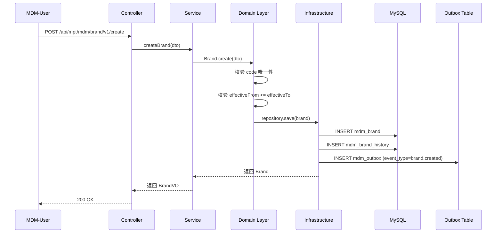

### F2 - Outbox 写入 + 后台 Relay 任务推 Kafka

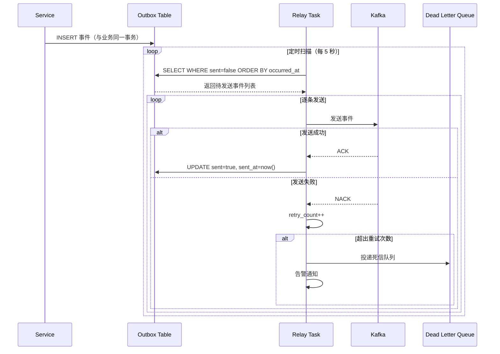

### F3 - 下游 Bootstrap 拉全量快照流程

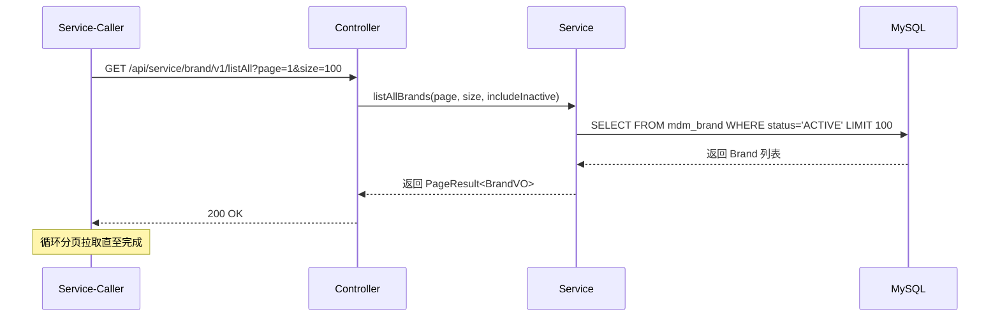

### F4 - 失效（Deactivate）的事件传播

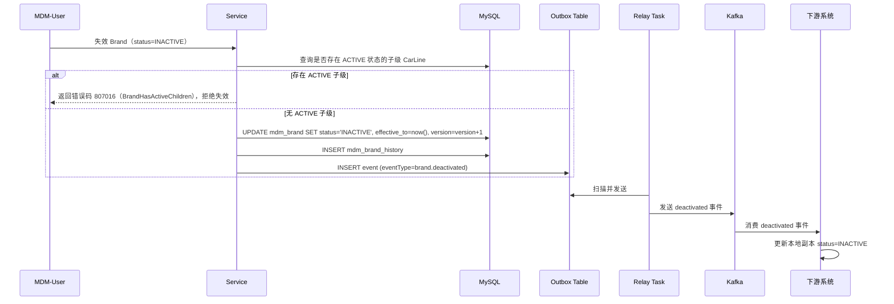

> **CR-010 失效依赖检查说明**：Product MDM 子域中所有具有上下层关系的实体（Brand→CarLine→Model→Variant→Configuration 与 OptionFamily→OptionCode）在失效时均执行 ACTIVE 子级依赖检查。错误码映射：807016（Brand）/ 807017（CarLine）/ 807018（Platform）/ 807019（Model）/ 807021（Variant）/ 807022（OptionFamily）。

### F5 - 上游 Kafka 消息接入流程

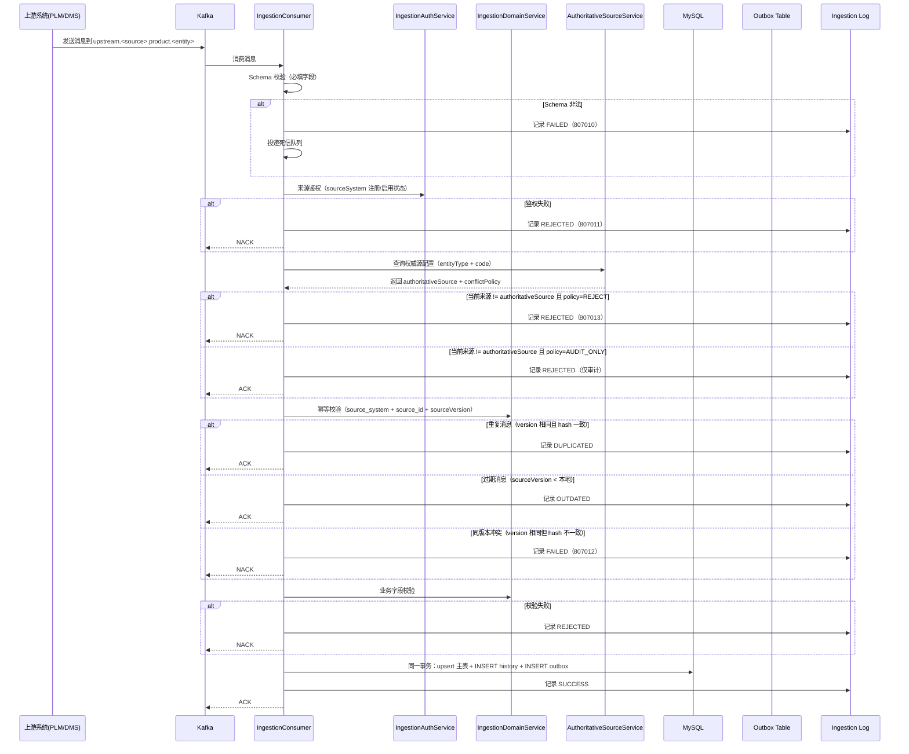

### F6 - 上游 Feign/HTTP 接入流程


### F7 - Variant/Configuration 绑定 Option Code（含互斥校验）

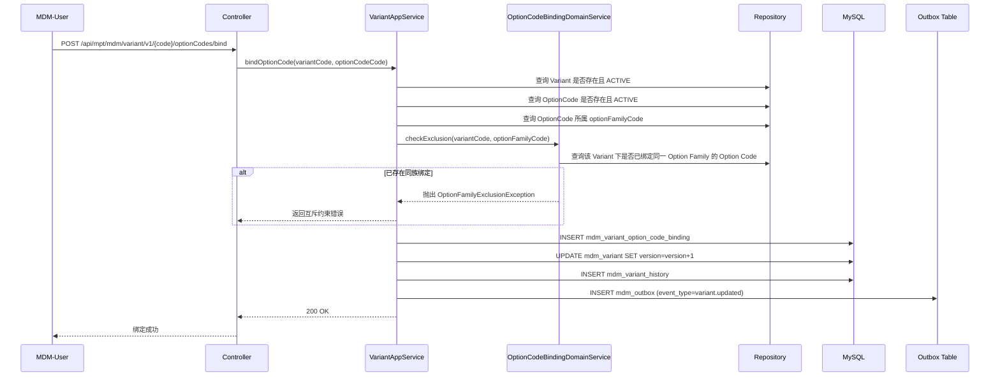

### F8 - 按 Option Code 组合反查 Configuration

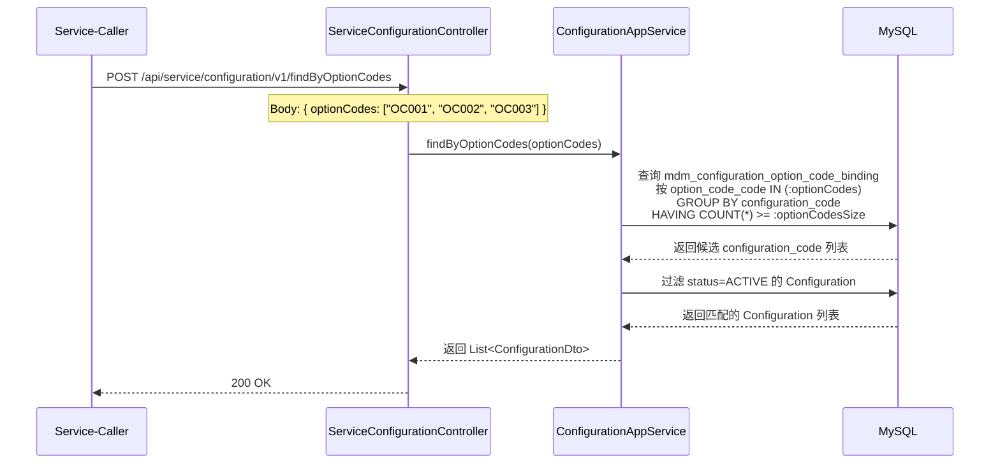

### F9 - Configuration code 自动生成与上游 ingest 决策（CR-005）

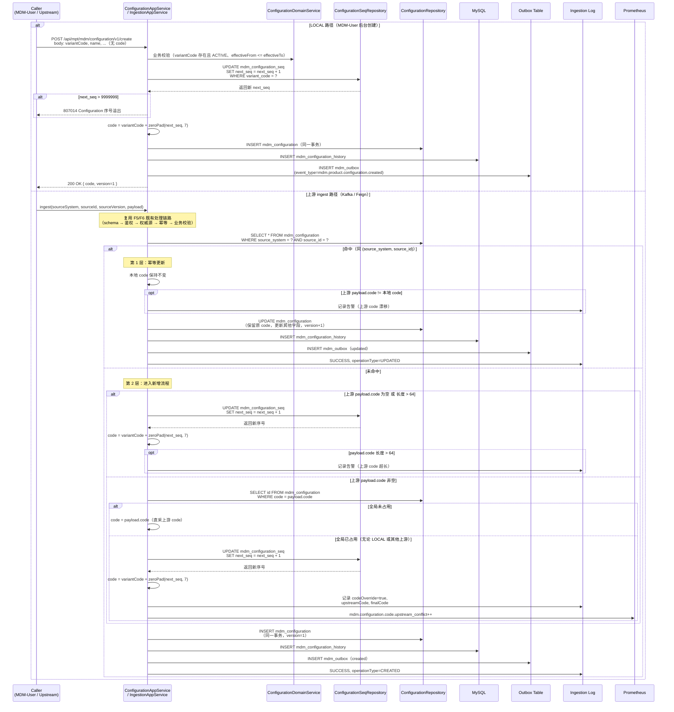

### F10 - VehicleNode CRUD（CR-007 EEAD 子域）

VehicleNode 的创建 / 更新 / 失效 / 列表查询沿用 F1（MDM-User 维护品牌）的同一模式，区别仅在命名空间与持久化目标。**简化为对 F1 的差异化注记**而不再重画完整时序图：

| 操作 | F1 (Brand) | F10 (VehicleNode) | 差异点 |
|---|---|---|---|
| Controller | MptBrandController | MptVehicleNodeController | 扁平包路径 `service.adapter.web.controller.mpt`，类名前缀 VehicleNode 体现子域归属 |
| AppService | BrandAppService | VehicleNodeAppService | 扁平包路径 `service.application.service`，类名前缀 VehicleNode 体现子域归属 |
| Aggregate | Brand | VehicleNode | 扁平包路径 `service.domain.model.aggregate`，类名前缀 VehicleNode 体现子域归属 |
| 主表 | mdm_brand | mdm_eead_vehicle_node | §3.1 |
| History 表 | mdm_brand_history | mdm_eead_vehicle_node_history | §3.2 |
| Outbox aggregate_type | BRAND | VEHICLE_NODE | §3.3 已扩展枚举 |
| Outbox event_type | brand.created / updated / deactivated | VehicleNodeCreated / VehicleNodeUpdated / VehicleNodeDeleted（payload 内字段，非 outbox 列） | requirements US-041 |
| Kafka topic | mdm.product.brand.created / updated / deactivated（多 topic） | mdm.eead.vehicleNode.event（单 topic + eventType 区分） | §3.3 注记 + §2 CR-007 决策 |
| 校验规则 | code 唯一、effectiveFrom <= effectiveTo | node_code 唯一、node_code 不可变（更新时校验）、effective_from <= effective_to、枚举值合法性（NodeType / FunctionalDomain / OtaSupportType / HsmCapability / SecurityLevel） | requirements US-039 / US-040 |
| 权限点 | mdm:product:brand:* | mdm:eead:vehicleNode:list / query / add / edit / remove / export | requirements US-039 |

**列表查询特殊点**（VehicleNode 三种列表接口）：
- `GET /list`：支持按 nodeType / functionalDomain / otaSupportType / isCoreNode / status 任意组合过滤 + 分页（US-039）
- `GET /listAll`：仅 status=ACTIVE 简要列表，不分页，供前端下拉选择（US-039）
- `GET /listByOtaType?type=FOTA`：按 OTA 支持类型批量查询（US-044），用于 OTA 服务圈选目标节点；返回精简能力声明响应（VehicleNodeCapabilityResponse）

### F11 - VehicleNode 删除前置依赖反查（CR-007 核心新流程）

VehicleNode 的删除流程是 EEAD 子域引入的**反向 Feign 调用模式**，需重点画出与 F1 不同的关键链路：DRAFT 状态直删；ACTIVE / INACTIVE 状态须先反查 VMD VehiclePart 的 source=MDM 副本，存在引用则硬拒绝（812003）。MDM-Admin 通过 `force` 旁路点可绕过反查直删，但仍写审计。

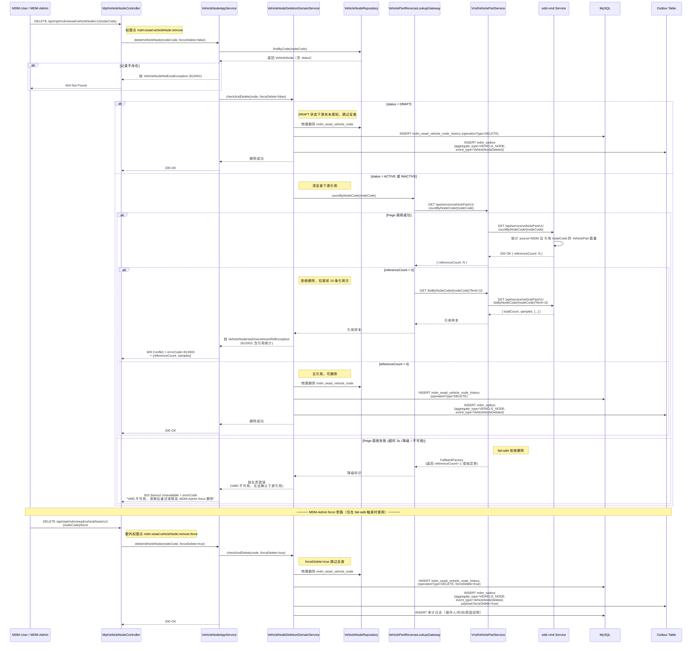

**F11 关键设计点**：

1. **DRAFT vs 非 DRAFT 分支**：DRAFT 状态下游尚未通过事件感知到 VehicleNode，因此可直接物理删除而无需反查；ACTIVE / INACTIVE 必须反查
2. **反向 Feign 调用的两步**：先 `countByNodeCode` 拿数量（轻量），数量 > 0 时再 `listByNodeCode?limit=10` 拿样本（用于错误响应展示，便于运维定位下游引用方）；这两步合并在一次后端处理中完成，对前端是单次 DELETE 请求
3. **fail-safe 默认拒绝**：VMD Feign 失败时不允许盲删（即便 VMD 不可用也不能让 MDM 主数据进入悬空引用状态）；force 旁路是有意识的运维行为，需要更高权限点 + 操作人填写原因说明 + 写审计
4. **删除事件 payload 携带 forceDelete 标记**：下游收到 VehicleNodeDeleted 事件时，可识别这次是常规删除还是 admin 强删，决定是否额外告警
5. **域内不写 history 表的 entity_id 链**：DRAFT 物理删除时主表 id 已消失，history 表 entity_id 列允许 NULL，仅留 nodeCode 与快照体作为审计依据

### F12 - Plant CRUD（CR-008 Org 子域）

Plant 的创建 / 更新 / 失效 / 列表查询沿用 F1（MDM-User 维护品牌）的同一模式，区别仅在命名空间与持久化目标。**简化为对 F1 的差异化注记**而不再重画完整时序图：

| 操作 | F1 (Brand) | F12 (Plant) | 差异点 |
|---|---|---|---|
| Controller | MptBrandController | MptPlantController | 扁平包路径 `service.adapter.web.controller.mpt`，类名前缀 Plant 体现子域归属 |
| AppService | BrandAppService | PlantAppService | 扁平包路径 `service.application.service`，类名前缀 Plant 体现子域归属 |
| Aggregate | Brand | Plant | 扁平包路径 `service.domain.model.aggregate`，类名前缀 Plant 体现子域归属 |
| 主表 | mdm_brand | mdm_org_plant | §3.1 |
| History 表 | mdm_brand_history | mdm_org_plant_history | §3.2 |
| Outbox aggregate_type | BRAND | PLANT | §3.3 已扩展枚举 |
| Outbox event_type | brand.created / updated / deactivated | PlantCreated / PlantUpdated / PlantDeleted（payload 内字段，非 outbox 列） | requirements US-050 |
| Kafka topic | mdm.product.brand.created / updated / deactivated（多 topic） | mdm.org.plant.event（单 topic + eventType 区分） | §3.3 注记 + §2 CR-008 决策 |
| 校验规则 | code 唯一、effectiveFrom <= effectiveTo | code 唯一、code 不可变（更新时校验）、effective_from <= effective_to、枚举值合法性（PlantType） | requirements US-047 / US-048 |
| 权限点 | mdm:product:brand:* | mdm:org:plant:list / query / add / edit / remove / export | requirements US-047 |
| 来源字段 | source_system / source_id / source_version / ingestion_channel / ingestion_time / source_payload_hash | 同左（复用 Brand/Party 模式） | 与 EEAD 的 source 枚举模式不同 |

**列表查询特殊点**（Plant 三种列表接口）：
- `GET /list`：支持按 plantType / country / status 任意组合过滤 + 分页（US-047）
- `GET /listAll`：仅 status=ACTIVE 简要列表，不分页，供前端下拉选择（US-047）
- `GET /listByType?type=VEHICLE_ASSEMBLY`：按工厂类型批量查询（US-053），用于 VMD 等下游圈选目标工厂；返回精简响应（PlantBriefResponse）

### F13 - Plant 删除前置依赖反查（CR-008 核心新流程）

Plant 的删除流程沿用 F11（VehicleNode 删除）的**反向 Feign 调用模式**：DRAFT 状态直删；ACTIVE / INACTIVE 状态须先反查 VMD Manufacturer/Plant 的本地副本，存在引用则硬拒绝（813003）。MDM-Admin 通过 `force` 旁路点可绕过反查直删，但仍写审计。

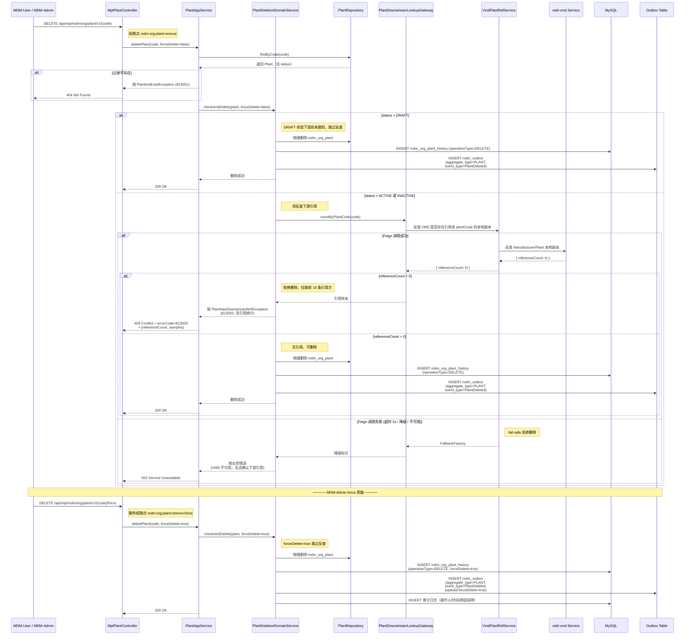

**F13 关键设计点**（与 F11 同模式，仅命名空间不同）：

1. **DRAFT vs 非 DRAFT 分支**：DRAFT 状态下游尚未通过事件感知到 Plant，因此可直接物理删除而无需反查；ACTIVE / INACTIVE 必须反查
2. **反向 Feign 调用**：反查 VMD 中 source=MDM 且引用该 plantCode 的 Manufacturer/Plant 本地副本；VMD-CR-014 落地后字段为 `Vehicle.plantCode`，过渡期可同时反查 `manufacturerCode`
3. **fail-safe 默认拒绝**：VMD Feign 失败时不允许盲删；force 旁路需要更高权限点 + 操作人填写原因说明 + 写审计
4. **删除事件 payload 携带 forceDelete 标记**：下游收到 PlantDeleted 事件时，可识别常规删除还是 admin 强删
5. **域内不写 history 表的 entity_id 链**：DRAFT 物理删除时主表 id 已消失，history 表 entity_id 列允许 NULL，仅留 code 与快照体作为审计依据
### F14 - 按 Variant 和 Option Code 组合反查 Configuration Code（CR-022 核心新流程）

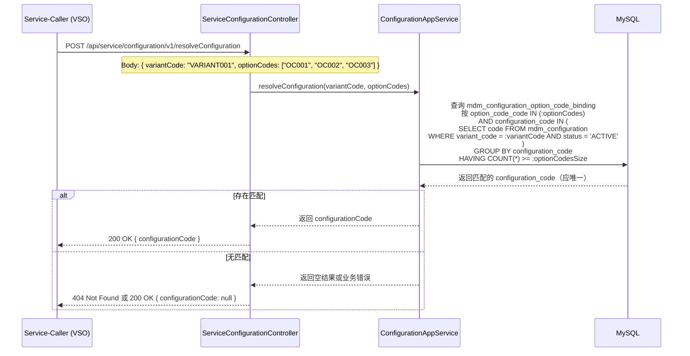

**F14 关键设计点**：

1. **与 F8 的区别**：F8 仅按 optionCodes 反查，返回 Configuration 列表；F14 增加 variantCode 约束，返回单个 Configuration Code（理论下同一 Variant + Option Code 组合应唯一匹配一个 Configuration）
2. **查询逻辑**：复用 mdm_configuration_option_code_binding 表，增加 variant_code 过滤子查询
3. **返回值语义**：匹配成功返回单个 configurationCode；匹配失败可返回 null 或 404，由调用方决定处理策略
4. **性能考虑**：variant_code + option_code 联合索引优化查询性能

## 5. API Contracts

### 5.1 MPT 端接口（后台管理）

#### Brand 接口

| Method | Path | 说明 |
|--------|------|------|
| POST | /api/mpt/mdm/brand/v1/create | 创建品牌 |
| PUT | /api/mpt/mdm/brand/v1/{code} | 更新品牌 |
| DELETE | /api/mpt/mdm/brand/v1/{code} | 删除品牌（仅 DRAFT 状态） |
| POST | /api/mpt/mdm/brand/v1/{code}/deactivate | 失效品牌 |
| GET | /api/mpt/mdm/brand/v1/{code} | 查询品牌详情 |
| GET | /api/mpt/mdm/brand/v1/list | 分页查询品牌列表 |
| GET | /api/mpt/mdm/brand/v1/{code}/history | 查询品牌历史版本 |

#### CarLine 接口

| Method | Path | 说明 |
|--------|------|------|
| POST | /api/mpt/mdm/carline/v1/create | 创建车系 |
| PUT | /api/mpt/mdm/carline/v1/{code} | 更新车系 |
| DELETE | /api/mpt/mdm/carline/v1/{code} | 删除车系（仅 DRAFT 状态） |
| POST | /api/mpt/mdm/carline/v1/{code}/deactivate | 失效车系 |
| GET | /api/mpt/mdm/carline/v1/{code} | 查询车系详情 |
| GET | /api/mpt/mdm/carline/v1/list | 分页查询车系列表（支持 brandCode、status 过滤） |
| GET | /api/mpt/mdm/carline/v1/{code}/history | 查询车系历史版本 |

#### Platform 接口

| Method | Path | 说明 |
|--------|------|------|
| POST | /api/mpt/mdm/platform/v1/create | 创建平台 |
| PUT | /api/mpt/mdm/platform/v1/{code} | 更新平台 |
| DELETE | /api/mpt/mdm/platform/v1/{code} | 删除平台（仅 DRAFT 状态） |
| POST | /api/mpt/mdm/platform/v1/{code}/deactivate | 失效平台 |
| GET | /api/mpt/mdm/platform/v1/{code} | 查询平台详情 |
| GET | /api/mpt/mdm/platform/v1/list | 分页查询平台列表 |
| GET | /api/mpt/mdm/platform/v1/{code}/history | 查询平台历史版本 |

#### Model 接口

| Method | Path | 说明 |
|--------|------|------|
| POST | /api/mpt/mdm/model/v1/create | 创建车型 |
| PUT | /api/mpt/mdm/model/v1/{code} | 更新车型 |
| DELETE | /api/mpt/mdm/model/v1/{code} | 删除车型（仅 DRAFT 状态） |
| POST | /api/mpt/mdm/model/v1/{code}/deactivate | 失效车型 |
| GET | /api/mpt/mdm/model/v1/{code} | 查询车型详情 |
| GET | /api/mpt/mdm/model/v1/list | 分页查询车型列表（支持 carlineCode、platformCode、status 过滤） |
| GET | /api/mpt/mdm/model/v1/{code}/history | 查询车型历史版本 |

#### Variant 接口

| Method | Path | 说明 |
|--------|------|------|
| POST | /api/mpt/mdm/variant/v1/create | 创建版本 |
| PUT | /api/mpt/mdm/variant/v1/{code} | 更新版本 |
| DELETE | /api/mpt/mdm/variant/v1/{code} | 删除版本（仅 DRAFT 状态） |
| POST | /api/mpt/mdm/variant/v1/{code}/deactivate | 失效版本 |
| GET | /api/mpt/mdm/variant/v1/{code} | 查询版本详情 |
| GET | /api/mpt/mdm/variant/v1/list | 分页查询版本列表（支持 modelCode、carlineCode、platformCode、status 过滤） |
| GET | /api/mpt/mdm/variant/v1/{code}/history | 查询版本历史版本 |
| POST | /api/mpt/mdm/variant/v1/{code}/optionCodes/bind | 绑定选项码 |
| POST | /api/mpt/mdm/variant/v1/{code}/optionCodes/unbind | 解绑选项码 |
| GET | /api/mpt/mdm/variant/v1/{code}/optionCodes | 查询版本已绑定的选项码列表 |

#### Configuration 接口

> **CR-005 重要变更**：Configuration 的 `code` 由系统按 `{variantCode}` + 7 位零填充自增序号自动生成（详见 §3.6 mdm_configuration_seq 与 §4 F9）。`ConfigurationCreateCmd` 不暴露 code 字段；create 接口响应体中回填生成的 code 供调用方后续使用。`ConfigurationUpdateCmd` 同样不含 code 字段；`PUT /api/mpt/mdm/configuration/v1/{code}` 仅接受 path 参数中的 code 用于定位记录，不允许修改 code。

| Method | Path | 说明 |
|--------|------|------|
| POST | /api/mpt/mdm/configuration/v1/create | 创建配置（code 由系统自动生成，响应体回填 code） |
| PUT | /api/mpt/mdm/configuration/v1/{code} | 更新配置（不允许修改 code） |
| DELETE | /api/mpt/mdm/configuration/v1/{code} | 删除配置（仅 DRAFT 状态；不回收序号） |
| POST | /api/mpt/mdm/configuration/v1/{code}/deactivate | 失效配置 |
| GET | /api/mpt/mdm/configuration/v1/{code} | 查询配置详情 |
| GET | /api/mpt/mdm/configuration/v1/list | 分页查询配置列表（支持 variantCode、status 过滤） |
| GET | /api/mpt/mdm/configuration/v1/{code}/history | 查询配置历史版本 |
| POST | /api/mpt/mdm/configuration/v1/{code}/optionCodes/bind | 绑定选项码 |
| POST | /api/mpt/mdm/configuration/v1/{code}/optionCodes/unbind | 解绑选项码 |
| GET | /api/mpt/mdm/configuration/v1/{code}/optionCodes | 查询配置已绑定的选项码列表 |

#### Option Family 接口

| Method | Path | 说明 |
|--------|------|------|
| POST | /api/mpt/mdm/optionFamily/v1/create | 创建选项族 |
| PUT | /api/mpt/mdm/optionFamily/v1/{code} | 更新选项族 |
| DELETE | /api/mpt/mdm/optionFamily/v1/{code} | 删除选项族（仅 DRAFT 状态） |
| POST | /api/mpt/mdm/optionFamily/v1/{code}/deactivate | 失效选项族 |
| GET | /api/mpt/mdm/optionFamily/v1/{code} | 查询选项族详情 |
| GET | /api/mpt/mdm/optionFamily/v1/list | 分页查询选项族列表（支持 category、status 过滤，CR-010） |
| GET | /api/mpt/mdm/optionFamily/v1/{code}/history | 查询选项族历史版本 |

#### Option Code 接口

| Method | Path | 说明 |
|--------|------|------|
| POST | /api/mpt/mdm/optionCode/v1/create | 创建选项码 |
| PUT | /api/mpt/mdm/optionCode/v1/{code} | 更新选项码 |
| DELETE | /api/mpt/mdm/optionCode/v1/{code} | 删除选项码（仅 DRAFT 状态） |
| POST | /api/mpt/mdm/optionCode/v1/{code}/deactivate | 失效选项码 |
| GET | /api/mpt/mdm/optionCode/v1/{code} | 查询选项码详情 |
| GET | /api/mpt/mdm/optionCode/v1/list | 分页查询选项码列表（支持 optionFamilyCode 过滤） |
| GET | /api/mpt/mdm/optionCode/v1/{code}/history | 查询选项码历史版本 |

#### Supplier 接口

| Method | Path | 说明 |
|--------|------|------|
| POST | /api/mpt/mdm/supplier/v1/create | 创建供应商 |
| PUT | /api/mpt/mdm/supplier/v1/{code} | 更新供应商 |
| DELETE | /api/mpt/mdm/supplier/v1/{code} | 删除供应商（仅 DRAFT 状态） |
| POST | /api/mpt/mdm/supplier/v1/{code}/deactivate | 失效供应商 |
| GET | /api/mpt/mdm/supplier/v1/{code} | 查询供应商详情 |
| GET | /api/mpt/mdm/supplier/v1/list | 分页查询供应商列表（支持 supplierType、status 过滤） |
| GET | /api/mpt/mdm/supplier/v1/{code}/history | 查询供应商历史版本 |

#### VehicleNode 接口（CR-007 EEAD 子域）

| Method | Path | 权限点 | 说明 |
|--------|------|---------|------|
| POST | /api/mpt/mdm/eead/vehicleNode/v1/create | mdm:eead:vehicleNode:add | 创建车载节点（US-039） |
| PUT | /api/mpt/mdm/eead/vehicleNode/v1/{nodeCode} | mdm:eead:vehicleNode:edit | 更新车载节点（不可修改 nodeCode） |
| DELETE | /api/mpt/mdm/eead/vehicleNode/v1/{nodeCode} | mdm:eead:vehicleNode:remove | 删除车载节点（按 §4 F11 流程：DRAFT 直删，ACTIVE/INACTIVE 反查 VMD VehiclePart）（US-045） |
| DELETE | /api/mpt/mdm/eead/vehicleNode/v1/{nodeCode}/force | mdm:eead:vehicleNode:remove + mdm:eead:vehicleNode:remove:force | MDM-Admin 旁路删除（跳过反查、写审计），仅在 VMD 不可用时使用（US-045） |
| POST | /api/mpt/mdm/eead/vehicleNode/v1/{nodeCode}/deactivate | mdm:eead:vehicleNode:edit | 失效车载节点（status=INACTIVE） |
| GET | /api/mpt/mdm/eead/vehicleNode/v1/{nodeCode} | mdm:eead:vehicleNode:query | 查询车载节点详情（含全量字段：身份/分类/能力声明/来源字段/审计字段） |
| GET | /api/mpt/mdm/eead/vehicleNode/v1/list | mdm:eead:vehicleNode:list | 分页查询车载节点列表（支持 nodeType / functionalDomain / otaSupportType / isCoreNode / status 任意组合过滤） |
| GET | /api/mpt/mdm/eead/vehicleNode/v1/listAll | mdm:eead:vehicleNode:list | 列出全部 ACTIVE 车载节点（不分页，供前端下拉选择） |
| GET | /api/mpt/mdm/eead/vehicleNode/v1/export | mdm:eead:vehicleNode:export | 按当前过滤条件导出 Excel/CSV |
| GET | /api/mpt/mdm/eead/vehicleNode/v1/{nodeCode}/history | mdm:eead:vehicleNode:query | 查询车载节点历史版本（按 version 降序，响应含来源字段） |

#### Plant 接口（CR-008 Org 子域）

| Method | Path | 权限点 | 说明 |
|--------|------|---------|------|
| POST | /api/mpt/mdm/org/plant/v1/create | mdm:org:plant:add | 创建工厂（US-047） |
| PUT | /api/mpt/mdm/org/plant/v1/{code} | mdm:org:plant:edit | 更新工厂（不可修改 code） |
| DELETE | /api/mpt/mdm/org/plant/v1/{code} | mdm:org:plant:remove | 删除工厂（按 §4 F13 流程：DRAFT 直删，ACTIVE/INACTIVE 反查 VMD Manufacturer）（US-054） |
| DELETE | /api/mpt/mdm/org/plant/v1/{code}/force | mdm:org:plant:remove + mdm:org:plant:remove:force | MDM-Admin 旁路删除（跳过反查、写审计）（US-054） |
| POST | /api/mpt/mdm/org/plant/v1/{code}/deactivate | mdm:org:plant:edit | 失效工厂（status=INACTIVE） |
| GET | /api/mpt/mdm/org/plant/v1/{code} | mdm:org:plant:query | 查询工厂详情（含全量字段） |
| GET | /api/mpt/mdm/org/plant/v1/list | mdm:org:plant:list | 分页查询工厂列表（支持 plantType / country / status 任意组合过滤） |
| GET | /api/mpt/mdm/org/plant/v1/listAll | mdm:org:plant:list | 列出全部 ACTIVE 工厂（不分页） |
| GET | /api/mpt/mdm/org/plant/v1/export | mdm:org:plant:export | 按当前过滤条件导出 Excel/CSV |
| GET | /api/mpt/mdm/org/plant/v1/{code}/history | mdm:org:plant:query | 查询工厂历史版本（按 version 降序，响应含来源字段） |

#### MaterialCategory 接口（CR-009 Material 子域）

| Method | Path | 权限点 | 说明 |
|--------|------|---------|------|
| POST | /api/mpt/mdm/material/category/v1/create | mdm:material:category:add | 创建物料品类（US-056） |
| PUT | /api/mpt/mdm/material/category/v1/{code} | mdm:material:category:edit | 更新物料品类（不可修改 code） |
| DELETE | /api/mpt/mdm/material/category/v1/{code} | mdm:material:category:删除 | 删除物料品类（DRAFT 直删；非 DRAFT 检查子项与 Part 引用）（US-057） |
| GET | /api/mpt/mdm/material/category/v1/{code} | mdm:material:category:query | 查询物料品类详情 |
| GET | /api/mpt/mdm/material/category/v1/list | mdm:material:category:list | 分页查询物料品类列表（支持 parentCode / status 过滤） |
| GET | /api/mpt/mdm/material/category/v1/tree | mdm:material:category:list | 查询物料品类树形结构 |
| GET | /api/mpt/mdm/material/category/v1/{code}/history | mdm:material:category:query | 查询物料品类历史版本（按 version 降序，响应含来源字段） |

#### Part 接口（CR-009 Material 子域）

| Method | Path | 权限点 | 说明 |
|--------|------|---------|------|
| POST | /api/mpt/mdm/material/part/v1/create | mdm:material:part:add | 创建零件（US-059） |
| PUT | /api/mpt/mdm/material/part/v1/{code} | mdm:material:part:edit | 更新零件（不可修改 code） |
| DELETE | /api/mpt/mdm/material/part/v1/{code} | mdm:material:part:remove | 删除零件（按 §4 F16 流程：DRAFT 直删，ACTIVE/INACTIVE 检查 substitutePartCode 引用）（US-070） |
| DELETE | /api/mpt/mdm/material/part/v1/{code}/force | mdm:material:part:remove + mdm:material:part:remove:force | MDM-Admin 旁路删除（跳过反查、写审计）（US-070） |
| POST | /api/mpt/mdm/material/part/v1/{code}/deactivate | mdm:material:part:edit | 失效零件（status=INACTIVE） |
| GET | /api/mpt/mdm/material/part/v1/{code} | mdm:material:part:query | 查询零件详情（含全量字段） |
| GET | /api/mpt/mdm/material/part/v1/list | mdm:material:part:list | 分页查询零件列表（支持 categoryCode / partType / vehicleNodeCode / supplierCode / lifecycleStage / status 任意组合过滤） |
| GET | /api/mpt/mdm/material/part/v1/listAll | mdm:material:part:list | 列出全部 ACTIVE 零件（不分页） |
| GET | /api/mpt/mdm/material/part/v1/export | mdm:material:part:export | 按当前过滤条件导出 Excel/CSV |
| GET | /api/mpt/mdm/material/part/v1/{code}/history | mdm:material:part:query | 查询零件历史版本（按 version 降序，响应含来源字段） |

### 5.2 Service 端接口（下游消费）

#### Brand 接口

| Method | Path | 说明 |
|--------|------|------|
| GET | /api/service/brand/v1/listAll | 全量快照（支持分页、includeInactive） |
| GET | /api/service/brand/v1/{code} | 按 code 单点查询 |

#### CarLine 接口

| Method | Path | 说明 |
|--------|------|------|
| GET | /api/service/carline/v1/listAll | 全量快照（支持分页、brandCode 过滤） |
| GET | /api/service/carline/v1/{code} | 按 code 单点查询 |

#### Platform 接口

| Method | Path | 说明 |
|--------|------|------|
| GET | /api/service/platform/v1/listAll | 全量快照（支持分页） |
| GET | /api/service/platform/v1/{code} | 按 code 单点查询 |

#### Model 接口

| Method | Path | 说明 |
|--------|------|------|
| GET | /api/service/model/v1/listAll | 全量快照（支持分页、carlineCode / platformCode 过滤） |
| GET | /api/service/model/v1/{code} | 按 code 单点查询 |

#### Variant 接口

| Method | Path | 说明 |
|--------|------|------|
| GET | /api/service/variant/v1/listAll | 全量快照（支持分页、modelCode / carlineCode / platformCode 过滤） |
| GET | /api/service/variant/v1/{code} | 按 code 单点查询 |
| GET | /api/service/variant/v1/{code}/optionCodes | 查询版本已绑定的选项码列表 |

#### Configuration 接口

| Method | Path | 说明 |
|--------|------|------|
| GET | /api/service/configuration/v1/listAll | 全量快照（支持分页、variantCode 过滤） |
| GET | /api/service/configuration/v1/{code} | 按 code 单点查询 |
| GET | /api/service/configuration/v1/{code}/optionCodes | 查询配置已绑定的选项码列表 |
| POST | /api/service/configuration/v1/findByOptionCodes | 按选项码组合反查配置（包含匹配） |
| POST | /api/service/configuration/v1/resolveConfiguration | 按 Variant 和 Option Code 组合反查 Configuration Code（包含匹配） |

#### Option Family 接口

| Method | Path | 说明 |
|--------|------|------|
| GET | /api/service/optionFamily/v1/listAll | 全量快照（支持分页） |
| GET | /api/service/optionFamily/v1/{code} | 按 code 单点查询 |

#### Option Code 接口

| Method | Path | 说明 |
|--------|------|------|
| GET | /api/service/optionCode/v1/listAll | 全量快照（支持分页、optionFamilyCode 过滤） |
| GET | /api/service/optionCode/v1/{code} | 按 code 单点查询 |

#### Supplier 接口

| Method | Path | 说明 |
|--------|------|------|
| GET | /api/service/supplier/v1/listAll | 全量快照（支持分页、includeInactive、supplierType 过滤） |
| GET | /api/service/supplier/v1/{code} | 按 code 单点查询 |

#### VehicleNode 接口（CR-007 EEAD 子域）

| Method | Path | 关联 US | 说明 |
|--------|------|---------|------|
| GET | /api/service/mdm/eead/v1/vehicleNode/snapshot | US-042 | 全量快照（默认仅 ACTIVE，支持 includeInactive=true 与 page/size 分页；响应每条记录含全量字段，含来源字段 source/external_ref_id/external_version/last_sync_time） |
| GET | /api/service/mdm/eead/v1/vehicleNode/{nodeCode} | US-043 | 按 nodeCode 单点查询节点完整定义（含能力声明）；记录不存在或 status=INACTIVE 返回 404 |
| GET | /api/service/mdm/eead/v1/vehicleNode/listByOtaType?type={FOTA\|SOTA\|BOTH\|NOT_SUPPORTED} | US-044 | 按 OTA 支持类型批量查询（仅 status=ACTIVE）；响应使用精简能力声明响应 VehicleNodeCapabilityResponse（含 nodeCode / nodeName / nodeType / functionalDomain / otaSupportType / hsmCapability / securityLevel）；type 取值不在枚举范围或为空返回参数校验错误 |

> **EEAD Service 端接口路径硬约束**：所有 EEAD Service 接口路径必须以 `/api/service/mdm/eead/v1/` 开头（CR-007 决策与 requirements §5 子域硬隔离矩阵 G13）；与 Product MDM / Party MDM 历史 `/api/service/<entity>/v1/` 模式不同，为后续 EEAD 通讯矩阵 / 诊断 / 刷写 / 安全 4 块预留命名空间。

#### Plant 接口（CR-008 Org 子域）

| Method | Path | 关联 US | 说明 |
|--------|------|---------|------|
| GET | /api/service/mdm/org/v1/plant/snapshot | US-051 | 全量快照（默认仅 ACTIVE，支持 includeInactive=true 与 page/size 分页；响应每条记录含全量字段，含来源字段 source_system/source_id/source_version/ingestion_channel/ingestion_time） |
| GET | /api/service/mdm/org/v1/plant/{code} | US-052 | 按 code 单点查询工厂完整定义；记录不存在或 status=INACTIVE 返回 404 |
| GET | /api/service/mdm/org/v1/plant/listByType?type={VEHICLE_ASSEMBLY\|POWERTRAIN\|BATTERY\|STAMPING\|WELDING\|PAINTING\|OTHER} | US-053 | 按工厂类型批量查询（仅 status=ACTIVE）；响应使用精简 PlantBriefResponse（含 code / name / plantType / country / city / status）；type 取值不在枚举范围或为空返回参数校验错误 |

> **Org Service 端接口路径硬约束**：所有 Org Service 接口路径必须以 `/api/service/mdm/org/v1/` 开头（CR-008 决策与 requirements §5 子域硬隔离矩阵）；为后续 Org 法人 / BU / 部门 / 成本中心 / 仓库等实体预留命名空间。

#### MaterialCategory 接口（CR-009 Material 子域）

| Method | Path | 关联 US | 说明 |
|--------|------|---------|------|
| GET | /api/service/mdm/material/v1/category/snapshot | US-065 | 全量快照（默认仅 ACTIVE，支持 includeInactive=true 与 page/size 分页；响应每条记录含全量字段，含来源字段） |
| GET | /api/service/mdm/material/v1/category/{code} | US-065 | 按 code 单点查询物料品类完整定义；记录不存在或 status=INACTIVE 返回 404 |
| GET | /api/service/mdm/material/v1/category/tree | US-065 | 查询物料品类树形结构（仅 status=ACTIVE） |

#### Part 接口（CR-009 Material 子域）

| Method | Path | 关联 US | 说明 |
|--------|------|---------|------|
| GET | /api/service/mdm/material/v1/part/snapshot | US-065 | 全量快照（默认仅 ACTIVE，支持 includeInactive=true 与 page/size 分页；响应每条记录含全量字段，含来源字段） |
| GET | /api/service/mdm/material/v1/part/{code} | US-065 | 按 code 单点查询零件完整定义；记录不存在或 status=INACTIVE 返回 404 |
| GET | /api/service/mdm/material/v1/part/listByCategory?categoryCode={categoryCode} | US-065 | 按品类批量查询（仅 status=ACTIVE）；响应使用精简 PartBriefResponse |
| GET | /api/service/mdm/material/v1/part/listByVehicleNode?vehicleNodeCode={vehicleNodeCode} | US-065 | 按车载节点批量查询（仅 status=ACTIVE）；响应使用精简 PartBriefResponse |
| GET | /api/service/mdm/material/v1/part/listBySupplier?supplierCode={supplierCode} | US-065 | 按供应商批量查询（仅 status=ACTIVE）；响应使用精简 PartBriefResponse |

> **Material Service 端接口路径硬约束**：所有 Material Service 接口路径必须以 `/api/service/mdm/material/v1/` 开头（CR-009 决策与 requirements §5 子域硬隔离矩阵）；为后续 Material BOM / SubstituteRelation 等实体预留命名空间。

### 5.3 上游接入接口（Upstream 端）

#### Brand 接入

| Method | Path | 说明 |
|--------|------|------|
| POST | /api/upstream/mdm/brand/v1/ingest | 接收上游 Brand 主数据 |

#### CarLine 接入

| Method | Path | 说明 |
|--------|------|------|
| POST | /api/upstream/mdm/carline/v1/ingest | 接收上游 CarLine 主数据 |

#### Platform 接入

| Method | Path | 说明 |
|--------|------|------|
| POST | /api/upstream/mdm/platform/v1/ingest | 接收上游 Platform 主数据 |

#### Model 接入

| Method | Path | 说明 |
|--------|------|------|
| POST | /api/upstream/mdm/model/v1/ingest | 接收上游 Model 主数据 |

#### Variant 接入

| Method | Path | 说明 |
|--------|------|------|
| POST | /api/upstream/mdm/variant/v1/ingest | 接收上游 Variant 主数据 |

#### Configuration 接入

| Method | Path | 说明 |
|--------|------|------|
| POST | /api/upstream/mdm/configuration/v1/ingest | 接收上游 Configuration 主数据（payload.code 可选，详见 CR-005 决策） |

> **CR-005 决策**：Configuration 上游 ingest 路径下，IngestRequest.payload 中的 `code` 字段为**可选**：
> - 若未携带 code 或 code 长度 > 64 → 系统按 LOCAL 规则生成（`{variantCode}` + 7 位零填充自增序号）
> - 若携带 code 且经 (source_system, source_id) 命中本地记录 → 走幂等更新，本地 code 保持不变
> - 若携带 code 且未命中且全局未占用 → 直采上游 code 入库
> - 若携带 code 且未命中但全局已被占用 → 视为冲突，系统按 LOCAL 规则生成新 code 兜底，记录告警 + 监控指标 `mdm.configuration.code.upstream_conflict`，并在 mdm_ingestion_log 中记录 codeOverride=true / upstreamCode / finalCode

#### Option Family 接入

| Method | Path | 说明 |
|--------|------|------|
| POST | /api/upstream/mdm/optionFamily/v1/ingest | 接收上游 Option Family 主数据 |

#### Option Code 接入

| Method | Path | 说明 |
|--------|------|------|
| POST | /api/upstream/mdm/optionCode/v1/ingest | 接收上游 Option Code 主数据 |

#### Supplier 接入

| Method | Path | 说明 |
|--------|------|------|
| POST | /api/upstream/mdm/supplier/v1/ingest | 接收上游 Supplier 主数据 |

**请求头**：`X-Source-System`（来源系统编码）、`Authorization`（API Key 或 OAuth2 Token）

**请求体**（IngestRequest）：

| 字段 | 类型 | 必填 | 说明 |
|------|------|------|------|
| sourceId | String | Y | 上游业务主键 |
| sourceVersion | String | Y | 上游版本号 |
| occurredAt | DateTime | Y | 上游事件发生时间 |
| payload | Object | Y | 业务字段（与本地维护一致） |

**响应体**（IngestResponse）：

| 字段 | 类型 | 说明 |
|------|------|------|
| entityId | Long | 本地实体 ID |
| version | Integer | 本地版本号 |
| operationType | String | CREATED / UPDATED / DUPLICATED / REJECTED |

### 5.4 MPT 端接口（管理后台 - 接入审计）

#### 接入日志查询

| Method | Path | 说明 |
|--------|------|------|
| GET | /api/mpt/mdm/ingestion/v1/log | 分页查询接入处理记录（支持 sourceSystem / entityType / status / 时间窗过滤） |
| GET | /api/mpt/mdm/ingestion/v1/{messageId} | 查询单条接入处理明细 |

### 5.5 错误码表（统一段位 812XXX，按子域分段）

| 错误码 | 说明 | HTTP 状态码 | 子域 |
|--------|------|------------|------|
| **Product 子域（8121XX）** | | | |
| 812101 | 业务主键（code）已存在 | 409 Conflict | Product |
| 812102 | 记录不存在 | 404 Not Found | Product |
| 812103 | 状态不允许删除（非 DRAFT） | 400 Bad Request | Product |
| 812104 | 生效期无效（effectiveFrom > effectiveTo） | 400 Bad Request | Product |
| 812105 | 引用的 Brand 不存在或状态无效 | 400 Bad Request | Product |
| 812106 | 状态不允许失效（非 ACTIVE） | 400 Bad Request | Product |
| 812107 | 引用的上层实体不存在或状态无效（通用引用完整性错误） | 400 Bad Request | Product |
| 812108 | 存在下层实体引用，不允许删除 | 409 Conflict | Product |
| 812109 | 同一选项族互斥约束违反（同一 Variant/Configuration 下同一 Option Family 已绑定其他 Option Code） | 409 Conflict | Product |
| 812110 | 上游消息 schema 非法或必填字段缺失 | 400 Bad Request | Product |
| 812111 | 上游来源鉴权失败（来源未注册/被禁用） | 401 Unauthorized | Product |
| 812112 | 同版本冲突（sourceVersion 相同但 payload hash 不一致） | 409 Conflict | Product |
| 812113 | 非权威源写入被拒绝 | 403 Forbidden | Product |
| 812114 | Configuration 序号溢出（mdm_configuration_seq.next_seq > 9,999,999） | 409 Conflict | Product |
| 812115 | Variant code 长度超限（> 57 字符，影响 Configuration code 自动拼接） | 400 Bad Request | Product |
| 812116 | BrandHasActiveChildren：品牌下存在活跃车系，失效被拒绝 | 409 Conflict | Product |
| 812117 | CarLineHasActiveChildren：车系下存在活跃车型，失效被拒绝 | 409 Conflict | Product |
| 812118 | PlatformHasActiveChildren：平台下存在活跃车型，失效被拒绝 | 409 Conflict | Product |
| 812119 | ModelHasActiveChildren：车型下存在活跃版本，失效被拒绝 | 409 Conflict | Product |
| 812121 | VariantHasActiveChildren：版本下存在活跃配置，失效被拒绝 | 409 Conflict | Product |
| 812122 | OptionFamilyHasActiveChildren：选项族下存在活跃选项码，失效被拒绝 | 409 Conflict | Product |
| 812123 | OPTION_FAMILY_CATEGORY_INVALID：Option Family category 为空或取值不在枚举范围（EXTERIOR / INTERIOR / POWERTRAIN / INTELLIGENT / COMFORT / SAFETY / ACCESSORY / OTHER） | 400 Bad Request | Product |
| 812199 | 系统内部错误 | 500 Internal Server Error | Product |
| **EEAD 子域（8123XX）** | | | |
| 812301 | VEHICLE_NODE_NOT_EXIST：车载节点不存在 | 404 Not Found | EEAD |
| 812302 | VEHICLE_NODE_CODE_EXIST：车载节点 nodeCode 已存在 | 409 Conflict | EEAD |
| 812303 | VEHICLE_NODE_HAS_DOWNSTREAM_REF：车载节点存在下游引用，删除被拒绝（含 referenceCount + 前 10 条引用样本） | 409 Conflict | EEAD |
| **Org 子域（8125XX）** | | | |
| 812501 | PLANT_NOT_EXIST：工厂不存在 | 404 Not Found | Org |
| 812502 | PLANT_CODE_EXIST：工厂 code 已存在 | 409 Conflict | Org |
| 812503 | PLANT_HAS_DOWNSTREAM_REF：工厂存在下游引用，删除被拒绝（含 referenceCount + 前 10 条引用样本） | 409 Conflict | Org |
| 812504 | PLANT_EFFECTIVE_PERIOD_INVALID：工厂生效期非法（effective_from > effective_to） | 400 Bad Request | Org |
| 812510 | PLANT_UPSTREAM_SCHEMA_INVALID：上游消息 schema 非法（预留，本期不使用） | 400 Bad Request | Org |
| 812511 | PLANT_UPSTREAM_AUTH_FAILED：上游来源鉴权失败（预留，本期不使用） | 401 Unauthorized | Org |
| 812512 | PLANT_UPSTREAM_VERSION_CONFLICT：同版本冲突（预留，本期不使用） | 409 Conflict | Org |
| 812513 | PLANT_UPSTREAM_NON_AUTHORITY：非权威源写入被拒绝（预留，本期不使用） | 403 Forbidden | Org |
| **Party 子域（8127XX）** | | | |
| 812701 | Supplier code 重复 | 409 Conflict | Party |
| **Material 子域（8129XX）** | | | |
| 812901 | MATERIAL_CATEGORY_NOT_EXIST：物料品类不存在 | 404 Not Found | Material |
| 812902 | MATERIAL_CATEGORY_CODE_EXIST：物料品类 code 已存在 | 409 Conflict | Material |
| 812903 | MATERIAL_CATEGORY_HAS_CHILDREN：物料品类存在子项或被 Part 引用，删除被拒绝 | 409 Conflict | Material |
| 812904 | MATERIAL_CATEGORY_EFFECTIVE_PERIOD_INVALID / PART_EFFECTIVE_PERIOD_INVALID：生效期非法（effective_from > effective_to） | 400 Bad Request | Material |
| 812905 | MATERIAL_CATEGORY_PARENT_NOT_EXIST：父品类不存在 | 400 Bad Request | Material |
| 812906 | MATERIAL_CATEGORY_LOOP_DETECTED：物料品类层级形成环路 | 400 Bad Request | Material |
| 812910 | PART_CODE_EXIST：零件 code 已存在 | 409 Conflict | Material |
| 812911 | PART_CATEGORY_INVALID：零件 categoryCode 指向不存在或非 ACTIVE 的 MaterialCategory | 400 Bad Request | Material |
| 812912 | PART_VEHICLE_NODE_INVALID：零件 vehicleNodeCode 指向不存在的 VehicleNode | 400 Bad Request | Material |
| 812913 | PART_SUPPLIER_INVALID：零件 supplierCode 指向不存在的 Supplier | 400 Bad Request | Material |
| 812914 | PART_SUBSTITUTE_INVALID：零件 substitutePartCode 指向不存在或指向自身 | 400 Bad Request | Material |
| 812915 | PART_LIFECYCLE_INVALID_TRANSITION：零件 lifecycleStage 状态机逆向跳转或 OBSOLETE 终态变更 | 400 Bad Request | Material |
| 812916 | PART_HAS_DOWNSTREAM_REF：零件存在下游引用（substitutePartCode），删除被拒绝 | 409 Conflict | Material |

### 5.6 跨服务依赖（CR-007 新增）

EEAD 子域 VehicleNode 删除前置依赖检查（US-045 / §4 F11）需要反向调用 VMD 服务的 VehiclePart 接口。本节定义 **MDM 调用方契约**——VMD 侧实现由 VMD-CR-013 承接。

#### MDM → VMD：VehiclePart 反查接口契约

| Method | Path | 用途 | 鉴权 |
|--------|------|------|------|
| GET | /api/service/vehiclePart/v1/countByNodeCode/{nodeCode} | 统计 VMD 中 source=MDM 且引用该 nodeCode 的 VehiclePart 记录数（轻量计数）| 服务间鉴权（service.internal.vehiclePart:read） |
| GET | /api/service/vehiclePart/v1/listByNodeCode/{nodeCode}?limit=10 | 拉取前 N 条引用样本（用于错误响应展示，便于运维定位下游引用方） | 同上 |

**Request Header**：
- `X-Source-Service: edd-mdm`（标识调用方服务）
- `X-Trace-Id: <traceId>`（追溯链路）

**Response Schema**：

`countByNodeCode` 响应：
```json
{
  "code": 0,
  "data": {
    "nodeCode": "TBOX",
    "referenceCount": 1247,
    "sourceFilter": "MDM"
  }
}
```

`listByNodeCode` 响应：
```json
{
  "code": 0,
  "data": {
    "nodeCode": "TBOX",
    "totalCount": 1247,
    "samples": [
      {"partCode": "TBOX-V2.3", "vehicleVin": "LRWXXXXX...", "createTime": "2026-04-01T08:00:00"},
      {"partCode": "TBOX-V2.4", "vehicleVin": "LRWYYYYY...", "createTime": "2026-04-15T08:00:00"}
    ]
  }
}
```

**MDM 调用方实现要点**：

| 项 | 选择 | 说明 |
|---|------|------|
| Feign Client | `VmdVehiclePartService`（位于 `edd-mdm-api` 的 `api.service` 包，与 BrandService / SupplierService 同级） | 与同包现有 Feign 接口命名风格对齐 |
| FallbackFactory | `VmdVehiclePartServiceFallbackFactory` | 降级时返回 referenceCount=-1 标识不可用，由 VehicleNodeDeletionDomainService 触发 fail-safe |
| 超时配置 | connect-timeout: 1s, read-timeout: 2s | 删除接口对延迟敏感，超时后 fail-safe 拒绝 |
| 重试策略 | 不重试（由 fail-safe 处理） | 避免重试期间删除接口阻塞过久 |
| 熔断 | Resilience4j 熔断（10s 窗口、50% 错误率触发） | 防止 VMD 故障时 MDM 删除接口持续超时 |
| 缓存 | 不缓存（每次实时查询） | 引用数实时性 > 性能；删除是低频操作，不需缓存优化 |

**VMD 侧实现约束（写给 VMD-CR-013）**：

- `countByNodeCode` 接口实现 SHALL 仅统计 source=MDM 且 row_valid=1 的 VehiclePart 记录，不统计 source=MANUAL 的本地记录（因为 MANUAL 记录是 VMD 自有数据，不受 MDM VehicleNode 删除影响）
- `listByNodeCode` 接口的 limit 参数默认 10、最大 50，超过 50 时 SHALL 截断
- 接口响应 SHALL 在毫秒级（< 100ms p99），由 VMD 侧添加 (node_code, source) 索引保障
- VMD 侧 SHALL 为 `service.internal.vehiclePart:read` 权限点配置默认允许 edd-mdm 服务调用（基于 X-Source-Service 头或 mTLS 证书）

#### MDM → VMD：Manufacturer/Plant 反查接口契约（CR-008 新增）

CR-008 沿用 CR-007 的反向 Feign 调用模式，但反查目标从 VehiclePart 改为 Manufacturer/Plant 本地副本。VMD-CR-014 落地后，VMD 须暴露以下反查接口供 MDM Plant 删除前置依赖检查（§4 F13）使用：

**过渡期接口**（VMD-CR-014 落地前，反查 Manufacturer 实体）：
- `GET /api/service/manufacturer/v1/countByPlantCode/{plantCode}` — 统计 source=MDM 且引用该 plantCode 的 Manufacturer 本地副本数量
- `GET /api/service/manufacturer/v1/listByPlantCode/{plantCode}?limit=10` — 拉取前 10 条引用方样本

**目标期接口**（VMD-CR-014 落地后，反查 Vehicle.plantCode）：
- `GET /api/service/vehicle/v1/countByPlantCode/{plantCode}` — 统计 source=MDM 且引用该 plantCode 的 Vehicle 数量
- `GET /api/service/vehicle/v1/listByPlantCode/{plantCode}?limit=10` — 拉取前 10 条引用方样本

**MDM 调用方实现**：与 §5.6 现有 VehiclePart 反查同模式（Feign Client `VmdPlantRefService` + FallbackFactory + 超时 2s + 重试 1 次 + 熔断 + 不缓存）。

## 6. Coverage Mapping

| US-ID | Design Section | Note |
|-------|----------------|------|
| US-001 | §3.1 (mdm_brand), §4 (F1), §5.1 (Brand API) | Brand CRUD |
| US-002 | §3.1 (mdm_series), §5.1 (CarLine API) | CarLine CRUD + 过滤 |
| US-003 | §3.1 (mdm_platform), §5.1 (Platform API) | Platform CRUD |
| US-004 | §3.2 (history 表) | 历史版本快照 |
| US-005 | §4 (F1 中的校验逻辑) | 生效期校验 |
| US-006 | §3.3 (mdm_outbox), §4 (F2, F4) | Brand 事件发布 |
| US-007 | §3.3, §4 (F2, F4) | CarLine 事件发布 |
| US-008 | §3.3, §4 (F2, F4) | Platform 事件发布 |
| US-009 | §5.2 (Brand Service API) | Brand 全量快照 |
| US-010 | §5.2 (CarLine Service API) | CarLine 全量快照 |
| US-011 | §5.2 (Platform Service API) | Platform 全量快照 |
| US-012 | §5.2 (单点查询 API) | 按 code 单点查询 |
| US-013 | §3.1 (来源字段), §4 (F5), §5.3 (上游接入 API) | 上游 Kafka 接入 |
| US-014 | §3.1 (来源字段), §4 (F6), §5.3 (上游接入 API) | 上游 Feign/HTTP 接入 |
| US-015 | §3.1 (source_* 字段), §3.2 (history 来源字段) | 数据来源记录 |
| US-016 | §4 (F5/F6 幂等校验逻辑) | 上游消息幂等处理 |
| US-017 | §3.4 (mdm_authoritative_source_config) | 权威源配置与冲突裁决 |
| US-018 | §3.5 (mdm_ingestion_log), §5.4 (MPT 接入审计 API) | 上游接入审计与监控 |
| US-019 | §3.1 (mdm_model), §4 (F1 同模式), §5.1 (Model API) | Model CRUD + 引用校验 + 组合查询 |
| US-020 | §3.1 (mdm_variant，含 code 长度上限 57), §4 (F1 同模式), §5.1 (Variant API) | Variant CRUD + 引用校验 + 组合查询 + code 长度约束（CR-005） |
| US-021 | §3.1 (mdm_variant_option_code_binding), §4 (F7), §5.1 (Variant 绑定 API) | Variant 绑定/解绑 Option Code + 互斥校验 |
| US-022 | §3.1 (mdm_configuration), §3.6 (mdm_configuration_seq), §4 (F1 同模式 + F9 code 自动生成), §5.1 (Configuration API) | Configuration CRUD + 引用校验 + code 自动生成（CR-005） |
| US-023 | §3.1 (mdm_configuration_option_code_binding), §4 (F7), §5.1 (Configuration 绑定 API) | Configuration 绑定/解绑 Option Code + 互斥校验 |
| US-024 | §3.1 (mdm_configuration_option_code_binding), §4 (F8), §5.2 (Configuration findByOptionCodes API) | 按选项码组合反查配置 |
| US-025 | §3.1 (mdm_option_family), §4 (F1 同模式), §5.1 (Option Family API) | Option Family CRUD + 引用校验 |
| US-026 | §3.1 (mdm_option_code), §4 (F1 同模式), §5.1 (Option Code API) | Option Code CRUD + 引用校验 |
| US-071 | §2 (CR-010 决策), §3.1 (mdm_option_family.category + IDX_OF_CATEGORY_STATUS), §5.1 (Option Family list 过滤), §5.5 (812123) | Option Family 商品分类（category）管理（CR-010） |
| US-072 | §4 (F14), §5.2 (Configuration resolveConfiguration API) | 按 Variant 和 Option Code 组合反查 Configuration Code（CR-022） |
| US-027 | §3.3 (mdm_outbox), §4 (F2, F4) | 5 类新实体事件发布 |
| US-028 | §5.2 (5 类新实体 Service API) | 5 类新实体全量快照消费 |
| US-029 | §3.2 (5 类新实体 history 表) | 5 类新实体历史版本追溯 |
| US-030 | §4 (F5/F6 + F9 Configuration code 决策), §5.3 (5 类新实体 Upstream API), §3.6 (mdm_configuration_seq) | 5 类新实体上游接入扩展 + Configuration code 上游决策（CR-005） |
| US-031 | §3.1 (mdm_supplier), §4 (F1 同模式), §5.1 (Supplier MPT API), §5.5 (807020) | Supplier CRUD |
| US-032 | §3.2 (mdm_supplier_history), §5.1 (Supplier history API) | Supplier 历史版本快照 |
| US-033 | §3.3 (mdm_outbox, aggregate_type=SUPPLIER), §4 (F2/F4 同模式) | Supplier 事件发布（mdm.party.supplier.*） |
| US-034 | §5.2 (Supplier Service API) | Supplier 全量快照 |
| US-035 | §4 (F5 同模式), §3.5 (mdm_ingestion_log) | Supplier 上游接入（Kafka，upstream.*.party.supplier） |
| US-036 | §4 (F6 同模式), §5.3 (Supplier Upstream API) | Supplier 上游接入（Feign/HTTP） |
| US-037 | §3.1 (mdm_supplier 来源字段), §3.4 (entity_type=SUPPLIER) | Supplier 来源记录/幂等/权威源（复用 US-015/016/017） |
| US-038 | §3.5 (mdm_ingestion_log, entity_type=SUPPLIER), §5.4 (MPT 审计 API) | Supplier 接入审计与监控（复用 US-018） |
| US-039 | §1 (EEAD 子域包结构), §3.1 (mdm_eead_vehicle_node), §4 (F10), §5.1 (VehicleNode MPT 接口 10 个，含 force 旁路与 6 种细分权限点), §5.5 (812001 / 812002) | VehicleNode CRUD + 列表 + 列出全部 + 导出 + 历史版本 + 权限点 |
| US-040 | §3.1 (mdm_eead_vehicle_node 表 UK_VN_NODE_CODE 唯一约束), §5.5 (812002) | nodeCode 全局唯一校验（含已物理删除节点 nodeCode 复用语义） |
| US-041 | §3.3 (mdm_outbox aggregate_type=VEHICLE_NODE 扩展 + EEAD 子域使用注记), §4 (F10 沿用 F2 + topic 单一化注记表 + KafkaEventGatewayImpl topic 路由), §1 (EEAD 共享层不重建 KafkaEventGateway) | 单一 topic mdm.eead.vehicleNode.event + payload 内 eventType discriminator 事件发布 |
| US-042 | §5.2 (VehicleNode Service 接口 - snapshot), §3.1 (mdm_eead_vehicle_node 全量字段) | 全量快照 GET /api/service/mdm/eead/v1/vehicleNode/snapshot |
| US-043 | §5.2 (VehicleNode Service 接口 - byCode), §3.1 (mdm_eead_vehicle_node 全量字段含能力声明) | 节点能力查询 GET /api/service/mdm/eead/v1/vehicleNode/{nodeCode} |
| US-044 | §5.2 (VehicleNode Service 接口 - listByOtaType), §3.1 (IDX_VN_OTA_STATUS 索引), §1 (VehicleNodeCapabilityResponse 精简响应) | 按 OTA 类型批量查询 GET /api/service/mdm/eead/v1/vehicleNode/listByOtaType?type=FOTA |
| US-045 | §1 (VmdVehiclePartService + VehiclePartReverseLookupGateway), §4 (F11 删除前置依赖反查流程 - 含 DRAFT 直删 / ACTIVE-INACTIVE 反查 / count→list 两步反查 / Feign fail-safe / MDM-Admin force 旁路 5 个分支), §5.1 (DELETE 与 force 旁路接口), §5.5 (812003), §5.6 (MDM→VMD 反查接口契约) | 删除前置依赖检查（方案 A：反查 + 硬拒绝，含 force 旁路） |
| US-046 | §3.1 (source / external_ref_id / external_version / last_sync_time 字段及默认值), §5.1 (后台展示 source 字段), §5.2 (Service 端响应携带来源字段), §2 CR-007 决策（本期不开启上游接入路径） | source=MDM/MANUAL 治理（MDM 即权威源） |
| US-047 | §1 (Org 子域类清单), §3.1 (mdm_org_plant), §4 (F12), §5.1 (Plant MPT 接口 10 个，含 force 旁路与 6 种细分权限点), §5.5 (813001 / 813002 / 813004) | Plant CRUD + 列表 + 列出全部 + 导出 + 历史版本 + 权限点 |
| US-048 | §3.1 (mdm_org_plant 表 UK_PLANT_CODE 唯一约束), §5.5 (813002) | plantCode 全局唯一校验 |
| US-049 | §3.2 (mdm_org_plant_history), §5.1 (Plant history API) | Plant 历史版本快照 |
| US-050 | §3.3 (mdm_outbox aggregate_type=PLANT 扩展 + Org 子域使用注记), §4 (F12 沿用 F2 + topic 单一化), §1 (Org 共享层不重建) | 单一 topic mdm.org.plant.event + payload 内 eventType discriminator 事件发布 |
| US-051 | §5.2 (Plant Service 接口 - snapshot) | 全量快照 GET /api/service/mdm/org/v1/plant/snapshot |
| US-052 | §5.2 (Plant Service 接口 - byCode) | 按 code 单点查询 GET /api/service/mdm/org/v1/plant/{code} |
| US-053 | §5.2 (Plant Service 接口 - listByType), §3.1 (IDX_PLANT_TYPE_STATUS 索引), §1 (PlantBriefResponse 精简响应) | 按工厂类型批量查询 GET /api/service/mdm/org/v1/plant/listByType?type=VEHICLE_ASSEMBLY |
| US-054 | §1 (VmdPlantRefService + PlantDownstreamLookupGateway), §4 (F13 删除前置依赖反查流程), §5.1 (DELETE 与 force 旁路接口), §5.5 (813003), §5.6 (MDM→VMD Plant 引用反查契约) | 删除前置依赖检查（沿用方案 A：反查 + 硬拒绝，含 force 旁路） |
| US-055 | §3.1 (source_system / source_id / source_version / ingestion_channel / ingestion_time / source_payload_hash 字段), §5.1 (后台展示来源字段), §5.2 (Service 端响应携带来源字段), §2 CR-008 决策（本期不开启上游接入路径） | 数据来源记录（复用 US-015 Brand/Party 模式） |
| US-056 | §1 (Material 子域类清单), §3.1 (mdm_material_category), §4 (F14), §5.1 (MaterialCategory MPT 接口 8 个), §5.5 (814001 / 814002 / 814004) | MaterialCategory CRUD + 列表 + 树形查询 |
| US-057 | §3.1 (mdm_material_category 业务约束), §4 (F14 删除保护注记), §5.5 (814003) | MaterialCategory 删除保护（存在子项或被 Part 引用时阻止删除） |
| US-058 | §3.1 (mdm_material_category.parent_code), §4 (F14 树形/防环注记), §5.5 (814005 / 814006) | MaterialCategory 树形层级维护（parentCode 防环） |
| US-059 | §1 (Material 子域类清单), §3.1 (mdm_material_part, 47 列), §4 (F15), §5.1 (Part MPT 接口 10 个，含 force 旁路与 6 种细分权限点), §5.5 (814010 ~ 814015) | Part CRUD + 列表 + 引用完整性校验 + 生命周期状态机 + 替代件校验 + 新增 12 个业务属性字段 |
| US-060 | §3.1 (mdm_material_part.category_code 业务约束), §4 (F15 引用完整性校验注记), §5.5 (814011) | Part categoryCode 引用完整性校验 |
| US-061 | §3.1 (mdm_material_part.vehicle_node_code 业务约束), §4 (F15 引用完整性校验注记), §5.5 (814012) | Part vehicleNodeCode 引用完整性校验 |
| US-062 | §3.1 (mdm_material_part.supplier_code 业务约束), §4 (F15 引用完整性校验注记), §5.5 (814013) | Part supplierCode 引用完整性校验 |
| US-063 | §3.2 (mdm_material_part_history + mdm_material_category_history), §5.1 (Part/MaterialCategory history API) | Part 与 MaterialCategory 历史版本快照 |
| US-064 | §3.3 (mdm_outbox aggregate_type=PART/MATERIAL_CATEGORY 扩展 + Material 子域使用注记), §4 (F14/F15 沿用 F2 + topic 单一化), §1 (Material 共享层不重建) | 单一 topic mdm.material.part.event + mdm.material.category.event + payload 内 eventType discriminator 事件发布 |
| US-065 | §5.2 (Part Service 接口 - snapshot/byCode/listByCategory/listByVehicleNode/listBySupplier + MaterialCategory Service 接口 - snapshot/byCode/tree), §3.1 (IDX_PART_CATEGORY/IDX_PART_VEHICLE_NODE/IDX_PART_SUPPLIER 索引) | Part 与 MaterialCategory 全量快照与批量查询 |
| US-066 | §3.1 (mdm_material_part/mdm_material_category 来源字段), §5.1 (后台展示来源字段), §5.2 (Service 端响应携带来源字段), §2 CR-009 决策（本期不开启上游接入路径） | 数据来源记录（复用 US-015 Brand/Party 模式） |
| US-067 | §3.1 (mdm_material_part.lifecycle_stage 业务约束), §4 (F15 生命周期状态机注记), §5.5 (814015) | Part 生命周期状态机（PROTOTYPE→PRE_PRODUCTION→MASS_PRODUCTION→PHASE_OUT→OBSOLETE） |
| US-068 | §3.1 (mdm_material_part.substitute_part_code 业务约束), §4 (F15 替代件校验注记), §5.5 (814014) | Part 替代件设置 |
| US-069 | §3.1 (mdm_material_part UK_PART_CODE + mdm_material_category UK_MC_CODE 唯一约束), §5.5 (814002 / 814010) | Part 与 MaterialCategory code 全局唯一校验 |
| US-070 | §4 (F16 删除前置依赖检查流程), §5.1 (DELETE 与 force 旁路接口), §5.5 (814016) | Part 删除前置依赖检查（检查 substitutePartCode 引用，含 force 旁路） |

## 7. Impact Analysis

### 对上游系统的影响

- PLM / DMS / 集团主数据平台需要按照约定的 Topic 命名（`upstream.<sourceSystem>.product.<entity>`）和消息格式推送主数据
- 上游系统需要实现或对接 edd-mdm 提供的 Feign ingest 接口（POST /api/upstream/mdm/{entity}/ingest）
- 上游系统需要在 edd-mdm 注册 sourceSystem 编码并获取鉴权凭据（API Key）
- 上游系统需保证 sourceVersion 单调递增，以支持 edd-mdm 的幂等校验机制
- CR-004 新增：CPQ / 产品定义系统如需推送 Model / Variant / Configuration / Option Family / Option Code，需完成来源注册与权威源配置
- CR-006 新增：ERP / SRM / 集团供应商主数据平台如需推送 Supplier，需按 `upstream.<sourceSystem>.party.supplier` Topic 命名推送，或调用 POST /api/upstream/mdm/supplier/v1/ingest 接口，完成来源注册与权威源配置

### 对 VMD 项目的影响

- VMD 需要新增本地投影副本表（external_ref_id, external_version, source='MDM', last_sync_time）
- VMD 需要实现 Kafka 消费者订阅 `mdm.product.*` 事件
- VMD 需要实现 Feign 客户端调用 edd-mdm Service 端接口
- VMD 需要改造 Brand / CarLine / Platform 的查询逻辑，优先读本地副本，Fallback 到 MDM
- CR-004 新增：VMD 侧的车型 / 版本 / 配置 / 选项族 / 选项码后台维护能力需降级为只读
- CR-004 新增：VMD 侧对应的下游迁移由 VMD-CR-011 承接
- CR-006 新增：VMD-CR-012 承接 Supplier 从 VMD 迁移至 MDM 的下游改造，VMD 侧 Supplier 数据切换为消费 MDM Party 事件（`mdm.party.supplier.*`）+ 本地投影副本模式

### 对下游系统的影响

- 订单服务、销售配置器、BI 系统需要订阅 Kafka 事件或调用 Feign 接口
- 下游系统需要实现 upsert 逻辑：`IF event.version > local.external_version THEN upsert ELSE ignore`
- CR-004 新增：下游需扩展订阅范围，新增 Model / Variant / Configuration / Option Family / Option Code 5 类事件
- CR-004 新增：订单/销售域需对接按选项码组合反查配置接口（POST /api/service/configuration/v1/findByOptionCodes）
- CR-006 新增：采购系统 / SRM / 财务系统需订阅 `mdm.party.supplier.*` 事件，完成供应商主数据的本地同步或引用切换

### EEAD 子域上线对现有 design 的影响（CR-007）

#### 包结构 / 模块层影响

- **包路径强隔离**：EEAD 子域全部位于 `net.hwyz.iov.cloud.edd.mdm.{api,service}.eead.*`，与现有 product / party 平铺包结构物理隔离；不修改 product / party 任一现有类
- **新增反向 Feign 客户端**：首次出现 MDM → VMD 反向调用（VmdVehiclePartService，位于 edd-mdm-api 的 api.service 包），打破"MDM 是上游、不依赖下游"的单向数据流约定。此为有意识的架构权衡（避免下游悬空引用）；后续若 EEAD 其他子域（通讯矩阵 / 诊断架构 / 刷写）需要类似反查能力，应在 edd-mdm-api 的 api.service 包下新增对应 Feign 接口，按业务命名前缀（如 VmdVehicleConfig* 等）区分
- **共享层不重建**：`OutboxRepository` / `OutboxRelayScheduler` / `KafkaEventGateway` / `MdmConstants` / `MdmBusinessException` 等基础设施全部复用，不在 `service.infrastructure.*` 下为 EEAD 重建同名实现

#### 数据库层影响

- **mdm_outbox.aggregate_type 列扩展**：新增 VEHICLE_NODE 取值；现有 OutboxRelayScheduler / KafkaEventGatewayImpl 需在 topic 路由表中追加 `VEHICLE_NODE → mdm.eead.vehicleNode.event` 映射；不需要 DDL 变更（VARCHAR(32) 容量足够）
- **mdm_authoritative_source_config.entity_type / mdm_ingestion_log.entity_type 列扩展**：预留 VEHICLE_NODE 取值供未来 EEAD 开启上游接入路径（Q14）使用；本期不写入数据，不需要 DDL 变更
- **新增 mdm_eead_vehicle_node + mdm_eead_vehicle_node_history 两张表**：通过 `V20260528_001_EEAD__create_vehicle_node.sql` Flyway 脚本建立；表前缀 `mdm_eead_*` 与现有 `mdm_*` 物理隔离，不影响现有表
- **DB 表前缀漂移说明**：现有 Product/Party 表使用 `mdm_*` 平铺前缀（`mdm_brand` / `mdm_supplier` 等），EEAD 子域使用 `mdm_eead_*` 强中缀前缀；这是 CR-007 决策的子域硬隔离体现，非历史漂移修复（详见 §2 CR-007 决策表）

#### 错误码层影响

- **错误码段位首次使用 812xxx**：CR-007 新增 812001 / 812002 / 812003 三个错误码；framework 错误码注册表需在 EEAD 子域上线前注册 812 段（共享 framework owner 协调）
- **段位历史漂移**：Product/Party 历史使用 807xxx 段（共 17 个错误码），EEAD 使用 812xxx 段；两段共存是 requirements §7 Q12 跟踪的技术债，未来由独立 CR 统一对齐

#### 服务间依赖层影响

- **新增对 VMD 服务的同步反向依赖**：MDM 通过 Feign 调用 VMD 的 `/api/service/vehiclePart/v1/countByNodeCode` 与 `/listByNodeCode` 接口；VMD-CR-013 须在 EEAD 子域上线前完成接口实现与索引建立（详见 §5.6 VMD 侧实现约束）
- **熔断 + fail-safe 拒绝**：MDM 删除接口的可用性现在与 VMD 服务可用性耦合；当 VMD 不可用时 MDM-User 看到 503 错误，但 MDM-Admin 可通过 force 旁路兜底（详见 §4 F11）

#### 系统上下文层影响

- **Service Caller 扩展**：现有上下文图中的 OTA 服务（如 ORDER / CONFIG / BI 等节点）现在也是 EEAD VehicleNode 数据的消费方；新增的 OTA 服务、诊断服务（未来）也将订阅 `mdm.eead.vehicleNode.event` topic
- **不重画上下文图**：本 design CR-007 选择以文字段补充 EEAD 上下文（详见 §1 系统上下文图后的补充段），避免重画体量大的 mermaid 图；后续 EEAD 其他四块（通讯矩阵 / 诊断 / 刷写 / 安全）若新增显著新外部参与方，再决定是否重画

#### 对下游系统的影响（CR-007 新增订阅与对接）

- **OTA 服务**：通过 Feign 调用 `GET /api/service/mdm/eead/v1/vehicleNode/listByOtaType` 圈选目标节点；通过 `GET /vehicleNode/{nodeCode}` 单点查询节点的 hsmCapability / securityLevel 做安全策略判定；订阅 `mdm.eead.vehicleNode.event` 同步本地副本
- **VMD（VMD-CR-013 承接）**：(1) Device 实体降级为本地投影副本，订阅 `mdm.eead.vehicleNode.event` topic 刷新本地数据；(2) source=MDM 的本地副本只读；(3) 暴露 `/api/service/vehiclePart/v1/countByNodeCode` 与 `/listByNodeCode` 反查接口供 MDM 删除前置依赖检查使用（详见 §5.6 VMD 侧实现约束）
- **诊断服务（未来）**：节点能力声明（hsmCapability / securityLevel / functionalDomain）可作为诊断策略圈选依据；本期不立即对接，待诊断架构子能力 CR 立项时一并设计
- **配置 / 销售配置器**：若已基于 VMD Device 做"车型可选硬件节点"列表，须切换为消费 `mdm.eead.vehicleNode.event` 或 Feign 全量快照；source=MDM 的本地副本由 VMD 同步刷新

### Org 子域上线对现有 design 的影响（CR-008）

#### 包结构 / 模块层影响

- 无新增包——Org 子域所有类平铺在现有 `service.{adapter,application,domain,infrastructure}.*` 与 `api.{service,fallback,vo}` 同级包下，与 Brand / VehicleNode 等一致
- API 模块新增 PlantService + PlantServiceFallbackFactory + 请求/响应 VO
- Service 模块新增 Plant 相关 DDD 四层类（详见 §1 Org 子域类清单）
- 新增反向 Feign 客户端 `VmdPlantRefService`（位于 edd-mdm-api 的 api.service 包），与 CR-007 的 VmdVehiclePartService 同模式

#### 数据库层影响

- 新增 2 张表：`mdm_org_plant`（主表）+ `mdm_org_plant_history`（历史快照表）；Flyway 脚本 `V*_ORG__create_plant.sql` / `V*_ORG__create_plant_history.sql`
- `mdm_outbox` 表 aggregate_type 枚举扩展 PLANT 取值；KafkaEventGatewayImpl topic 路由表追加 `PLANT → mdm.org.plant.event` 映射
- `mdm_authoritative_source_config` 表 entity_type 枚举预留 PLANT 取值（本期不写入）
- `mdm_ingestion_log` 表 entity_type 枚举预留 PLANT 取值（本期不写入）

#### 错误码层影响

- 新增 813xxx 段错误码（813001 ~ 813004 + 813010 ~ 813013 预留），与 807xxx / 812xxx 三段共存

#### 服务间依赖层影响

- 新增对 VMD 服务的同步反向依赖：MDM 通过 `VmdPlantRefService` Feign 调用 VMD 的 Plant 引用反查接口（详见 §5.6 CR-008 跨服务依赖）
- VMD-CR-014 须在 Org 子域上线前完成反查接口实现

#### 系统上下文层影响

- 上游接入层：本期无变化（Plant 不开启上游接入路径）
- 下游消费层：VSO / 数仓 / VMD（VMD-CR-014）订阅 `mdm.org.plant.event` topic

#### 对下游系统的影响（CR-008 新增订阅与对接）

- **VMD（VMD-CR-014 承接）**：Manufacturer 实体降级为本地投影副本；`Vehicle.manufacturerCode` 改名 `plantCode`；暴露反向查询接口供 MDM US-054 使用
- **VSO**：订单中"交付工厂"字段切换为消费 MDM Plant 事件
- **数仓**：DWS 车辆静态主数据宽表 `manufacturer_code` 更名 `plant_code`
- **未来 MES / WMS**：作为 Plant SSOT 下游消费方接入

### Material 子域上线对现有 design 的影响（CR-009）

#### 包结构 / 模块层影响

- 无新增包——Material 子域所有类平铺在现有 `service.{adapter,application,domain,infrastructure}.*` 与 `api.{service,fallback,vo}` 同级包下，与 Brand / VehicleNode / Plant 等一致
- API 模块新增 PartService + MaterialCategoryService + 对应 FallbackFactory + 请求/响应 VO
- Service 模块新增 Part / MaterialCategory 相关 DDD 四层类（详见 §1 Material 子域类清单）
- **无反向 Feign 客户端**：Material 子域本期不涉及反向 Feign 调用；Part 删除前置依赖检查（US-070）在 MDM 内部完成（检查其他 Part 的 substitutePartCode 引用），无需调用外部服务

#### 数据库层影响

- 新增 4 张表：`mdm_material_category`（主表）+ `mdm_material_category_history`（历史快照表）+ `mdm_material_part`（主表，47 列）+ `mdm_material_part_history`（历史快照表）；Flyway 脚本 `V*_MATERIAL__create_*.sql`
- `mdm_outbox` 表 aggregate_type 枚举扩展 PART / MATERIAL_CATEGORY 取值；KafkaEventGatewayImpl topic 路由表追加 `PART → mdm.material.part.event` / `MATERIAL_CATEGORY → mdm.material.category.event` 映射
- `mdm_authoritative_source_config` 表 entity_type 枚举预留 PART / MATERIAL_CATEGORY 取值（本期不写入）
- `mdm_ingestion_log` 表 entity_type 枚举预留 PART / MATERIAL_CATEGORY 取值（本期不写入）

#### 错误码层影响

- 新增 814xxx 段错误码（814001 ~ 814006 MaterialCategory + 814010 ~ 814016 Part 共 13 个），与 807xxx / 812xxx / 813xxx 四段共存

#### 对下游系统的影响（CR-009 新增订阅与对接）

- **VMD（VMD-CR-015 承接）**：零件数据降级为本地投影副本；VMD 订阅 `mdm.material.part.event` topic 完成零件实体同步；VMD-CR-015 须在 Material 子域上线前完成订阅与本地副本改造
- **采购系统 / SRM**：可订阅 `mdm.material.part.event` 事件获取零件主数据；可通过 Feign 全量快照按 supplierCode 过滤获取特定供应商的零件清单
- **OTA 服务**：可基于 Part 的 `fotaUpgradeable` 字段圈选可 OTA 升级的物料级目标；可结合 VehicleNode 的 `otaSupportType` 做联合决策
- **BOM / 制造域（未来）**：可消费 MDM Part 主数据作为 BOM 构建的零件字典；可基于 Part 的 lifecycleStage 信息做生产排程决策

#### 权限治理影响

- 需在权限服务（IAM / Casbin / RBAC 后台）注册新的权限点：
  - `mdm:material:category:list / query / add / edit / remove / export`（6 个）
  - `mdm:material:part:list / query / add / edit / remove / export`（6 个）
  - `mdm:material:part:remove:force`（管理员旁路点）
- 物料工程 / 采购工程角色须通过 MDM-Admin 在权限后台分配 Material 权限点，与其他子域的运营角色权限点物理隔离

## 8. Open Questions

| 编号 | 问题 | 答案 | 状态 |
|------|------|------|------|
| OQ-1 | Outbox Relay 任务的扫描频率和批量大小如何配置？ | 扫描频率：5 秒，批量大小：100 条，支持 Nacos 动态配置 | 已确认 |
| OQ-1-Q1 | Product MDM 上层失效时，是否级联失效下层？ | 采用方案 B（阻止失效 + 依赖检查）：失效父级时检查是否存在 ACTIVE 状态的子级，存在则拒绝失效并返回错误码（807016~807022）。Brand→CarLine→Model→Variant→Configuration 与 OptionFamily→OptionCode 两条链路均适用 | 已确认（CR-010） |
| OQ-2 | Kafka 消息的 Key 如何选择？ | 使用 entity code（如 BRAND_001），保证同一实体事件在同一 Partition 内有序 | 已确认 |
| OQ-3 | Feign 接口是否需要支持增量拉取（基于 modify_time）？ | 本期不实现，留待后续 CR。首期用 Kafka 事件实现增量同步，Feign 接口聚焦 Bootstrap 和对账 | 已确认 |
| OQ-4 | 按选项码组合反查配置的匹配语义？ | 采用"包含匹配"：Configuration 绑定的 Option Code 集合完全包含所提供的组合即匹配。精确匹配和通配留待后续 CR | 已确认 |
| OQ-5 | Variant/Configuration 绑定 Option Code 时是否需要批量操作接口？ | 首期提供单条绑定/解绑接口，批量操作由前端循环调用。后续可按性能需求新增批量接口 | 已确认 |
| OQ-6 | 5 类新实体的 Kafka Topic 命名？ | 沿用现有命名规则：`mdm.product.model.*` / `mdm.product.variant.*` / `mdm.product.configuration.*` / `mdm.product.optionFamily.*` / `mdm.product.optionCode.*` | 已确认 |
| OQ-7 | EEAD VehicleNode 是否需要建独立 history 表？还是建一个 mdm_eead_history 多实体共用表，按 entity_type 区分？ | 建独立表 mdm_eead_vehicle_node_history（与 Product / Party 风格一致）；多实体合并表会带来后续 schema 演化痛苦（每加一个 EEAD 实体就要扩列），单表查询性能与索引设计也更可控 | 已确认（CR-007） |
| OQ-8 | VmdVehiclePartService 的超时与降级策略？是否需要熔断？ | connect-timeout: 1s, read-timeout: 2s，不重试；FallbackFactory 触发 fail-safe 拒绝删除（与 US-045 AC 一致）；接入 Resilience4j 熔断（10s 窗口、50% 错误率触发，避免 VMD 故障时 MDM 删除接口持续超时） | 已确认（CR-007，详见 §5.6） |
| OQ-9 | VehicleNodeDeleted 事件 payload 是否携带删除前的全量字段？是否需要标识 force 旁路删除？ | (1) 携带删除前最后一份完整 payload，方便下游归档审计与悬空引用排查；(2) payload 携带 `forceDelete: boolean` 标记，下游收到 force 删除事件可额外触发告警，识别"非正常流程"的删除事件 | 已确认（CR-007，详见 §4 F11 关键设计点 4） |
| OQ-10 | Plant 的 `code` 是否需要系统层正则校验（如 `PLT_<国家>_<城市>_<序号>`）？ | 首期仅在用户文档约定命名规范，不做系统层正则校验（待业务确认） | 待确认（CR-008，requirements Q15） |
| OQ-11 | `legalEntityCode` / `costCenterCode` 未来是否回填外键约束 + 数据回扫？ | 建议未来 Legal Entity / Cost Center 落地时回填外键并执行数据回扫脚本（待架构师确认） | 待确认（CR-008，requirements Q16） |
| OQ-12 | Plant 失效（INACTIVE）是否需要反查下层引用？ | 建议沿用 VehicleNode 反查策略（反查 + 硬拒绝），因为 Plant 在 VMD 中是 Vehicle 强引用字段（待业务确认） | 待确认（CR-008，requirements Q17） |
| OQ-13 | 未来 ERP 上线后 Plant 权威源切换是否需要独立灰度方案？ | 建议立独立 CR 设计三阶段灰度方案（双写期 / 数据校验期 / 切换期）（待 ERP 项目计划确认） | 待确认（CR-008，requirements Q18） |
| OQ-14 | Manufacturer 与 Plant 是否需要拆为两个独立实体？ | 建议本期合并语义到 Plant；未来如有诉求再立 CR 拆分（待业务确认） | 待确认（CR-008，requirements Q19） |
| OQ-15 | Part 的 partType 枚举是否需要更细化的分类？ | 首期采用 RAW_MATERIAL / STANDARD_PART / CUSTOM_PART / SOFTWARE / ASSEMBLY 五类，未来按业务反馈扩展（待物料工程确认） | 待确认（CR-009，requirements Q20） |
| OQ-16 | Part 的 vehicleNodeCode 是否允许引用 status≠ACTIVE 的 VehicleNode？ | 建议仅允许引用 ACTIVE 状态的 VehicleNode，与 MaterialCategory 引用策略一致（待业务确认） | 待确认（CR-009，requirements Q21） |
| OQ-17 | MaterialCategory 的树形层级深度是否需要限制？ | 首期不做系统层深度限制，在用户文档约定合理深度（如不超过 5 层）；待业务确认 | 待确认（CR-009，requirements Q22） |
| OQ-18 | Part 的 substitutePartCode 是否需要支持一对多替代关系？ | 首期仅支持一对一替代（一个 substitutePartCode 字段），一对多替代关系留待 SubstituteRelation 独立实体管理（待业务确认） | 待确认（CR-009，requirements Q23） |
| OQ-19 | Part 的 fotaUpgradeable 与 VehicleNode 的 otaSupportType 如何协同？ | 建议两个字段独立管理，不做强制一致性校验；由下游 OTA 服务自行决策（待 OTA 服务确认） | 待确认（CR-009，requirements Q24） |
| OQ-20 | Material 子域的错误码段位是否沿用 814xxx 段？ | 建议采用 814xxx 段（与 EEAD 812xxx / Org 813xxx 错开），待架构师确认 | 待确认（CR-009，requirements Q25） |

## 9. Changelog

| Date | Change ID | Type | Description |
|------|-----------|------|-------------|
| 2026-05-26 | CR-001 | Added | 首版产出：建立 Product MDM 子域（Brand / CarLine / Platform）设计文档 |
| 2026-05-26 | CR-002 | Added | 新增上游系统数据接入设计：(1) 系统上下文图新增上游系统（PLM/DMS/集团MDM）和 MDM-Admin 角色；(2) 包结构新增上游接入层（UpstreamController、IngestionConsumer、IngestionAppService、IngestionDomainService 等）；(3) 主表和 history 表新增来源字段（source_system/source_id/source_version/ingestion_channel/ingestion_time/source_payload_hash）；(4) 新增 mdm_authoritative_source_config 权威源配置表和 mdm_ingestion_log 接入审计表；(5) 新增 F5（上游 Kafka 接入）和 F6（上游 Feign/HTTP 接入）核心流程；(6) 新增上游接入 API（/api/upstream/mdm/{entity}/ingest）和 MPT 审计查询 API；(7) 新增错误码 807010~807013；(8) 新增上游接入相关技术决策；(9) 更新 Coverage Mapping 补充 US-013~US-018 映射 |
| 2026-05-27 | CR-004 | Added | 纳入产品树底层 5 类主数据设计：(1) 包结构新增 Model/Variant/Configuration/OptionFamily/OptionCode 全层类文件；(2) 数据模型新增 5 张主表（mdm_model/mdm_variant/mdm_configuration/mdm_option_family/mdm_option_code）+ 5 张 history 表 + 2 张绑定关系表（mdm_variant_option_code_binding/mdm_configuration_option_code_binding）；(3) 新增 F7（Option Code 绑定/互斥校验）和 F8（按选项码反查配置）核心流程；(4) API Contracts 新增 5 类实体的 MPT/Service/Upstream 接口；(5) 新增错误码 807007~807009；(6) Coverage Mapping 补充 US-019~US-030 映射；(7) Impact Analysis 补充 VMD 产品树底层迁移影响 |
| 2026-05-27 | CR-005 | Modified | 细化 Configuration code 自动生成规则：(1) §3.1 mdm_variant.code 字段说明补充长度上限 57；mdm_configuration.code 字段说明补充自动生成规则与上游 ingest 决策；(2) §3.6 新增 mdm_configuration_seq 序列表（按 variant_code 行锁原子自增 next_seq，与业务事务一致，序号只增不复用）；(3) §4 新增 F9 流程图，覆盖 LOCAL 路径下的 code 自动生成、上游 ingest 路径下的两层决策（先按 (source_system, source_id) 幂等更新保持原 code；未命中再按 code 是否被占用决定直采上游 code 或本地兜底生成 + 告警 + 监控）；(4) 包结构新增 ConfigurationSeqRepository / Po / Mapper / RepositoryImpl，新增 ConfigurationSeqOverflowException / VariantCodeTooLongException；(5) §5.1 Configuration 接口标注 code 由系统生成、不允许修改；§5.3 Configuration ingest 接口标注 payload.code 为可选与决策规则；(6) §5.5 错误码表新增 807014（Configuration 序号溢出）/ 807015（Variant code 长度超限）；(7) Coverage Mapping 更新 US-020 / US-022 / US-030 三行的章节引用 |
| 2026-05-27 | CR-006 | Added | 引入 Party MDM 子域，纳入 Supplier 作为首个实体：(1) §1 系统上下文图新增 ERP/SRM 上游系统和采购/财务下游消费方，标题改为 MDM 平台；(2) 包结构新增 Supplier 全层类文件（Controller/AppService/Aggregate/Repository/Po/Mapper 等），shared enums 扩展 SourceSystem（ERP/SRM）和新增 EntityType；(3) §2 新增 CR-006 技术决策（Party MDM 部署模式、Topic 命名空间隔离、治理机制复用等）；(4) §3.1 新增 mdm_supplier 主表（含全量业务字段 + 通用治理字段）；§3.2 新增 mdm_supplier_history；§3.3 aggregate_type 扩展 SUPPLIER；§3.4/§3.5 entity_type 扩展 SUPPLIER；(5) §5 新增 Supplier MPT/Service/Upstream 接口；§5.5 新增错误码 807020（Supplier code 重复）；(6) §6 Coverage Mapping 新增 US-031~US-038 映射；(7) §7 Impact Analysis 补充 ERP/SRM 上游推送、VMD-CR-012 Supplier 迁移、采购/SRM/财务系统订阅 party.supplier 事件 |
| 2026-05-28 | CR-007 | Added | 引入 EEAD 子域，纳入 Vehicle Node 作为首个实体：(1) §1 系统上下文图后追加 EEAD 子域文字补充段（Service Caller / Kafka 消费 / 上游空缺 / MDM→VMD 反向 Feign）；包结构新增独立"EEAD 子域包结构"段（API 模块 + Service 模块 DDD 四层完整树状图，覆盖 controller / 反向 feign / VehicleNodeAppService / cmd / query / dto / aggregate / 5 个枚举值对象 / 3 个事件 / repository / 3 个错误码异常 / po / mapper / converter / gateway 反向 Feign 实现），并明确 EEAD 共享层不重建 outbox / authoritative_source_config / KafkaEventGateway；(2) §2 新增 CR-007 技术决策表 14 行（包路径 / 表前缀 / Kafka topic 单一化 / Feign 路径 / 权限点 / 删除策略方案 A / Feign fail-safe / NodeType 11 类 / FunctionalDomain 9 类 / SecurityLevel ISO/SAE 21434 CAL / HsmCapability / 上游接入空缺 / Outbox 复用 / 权威源配置预留 / Flyway 命名 / 历史表独立），每行附 alternatives + rationale；(3) §3.1 新增 mdm_eead_vehicle_node 主表（27 列含 5 个枚举字段、4 个索引、3 条业务约束）；§3.2 历史表名列表追加 mdm_eead_vehicle_node_history；§3.3 mdm_outbox.aggregate_type 扩展 VEHICLE_NODE 取值并追加 EEAD topic 路由表注记；§3.4 / §3.5 entity_type 列预留 VEHICLE_NODE 取值（本期不写入）；(4) §4 新增 F10（VehicleNode CRUD 差异化注记表，沿用 F1）+ F11（VehicleNode 删除前置依赖反查完整 mermaid 时序图，含 DRAFT 直删 / ACTIVE-INACTIVE 反查 VMD VehiclePart / count→list 两步反查 / Feign fail-safe 降级 / MDM-Admin force 旁路 5 个分支，附 5 个关键设计点）；(5) §5.1 新增 VehicleNode MPT 接口 10 个含 force 旁路与 6 种细分权限点；§5.2 新增 VehicleNode Service 接口 3 个（snapshot / byCode / listByOtaType）路径硬约束 /api/service/mdm/eead/v1/**；§5.5 错误码表标题改为段位 807XXX 与 812XXX 共存，追加 812001 / 812002 / 812003 三行；新增 §5.6 跨服务依赖（MDM→VMD VehiclePart 反查接口契约：2 个接口 Schema、调用方实现要点 6 项 含 Resilience4j 熔断、VMD 侧实现约束 4 项）；(6) §6 Coverage Mapping 追加 US-039 ~ US-046 共 8 行；(7) §7 Impact Analysis 追加"EEAD 子域上线对现有 design 的影响"段含 6 子小节（包结构/模块层 / 数据库层 / 错误码层 / 服务间依赖层 / 系统上下文层 / 对下游 OTA-VMD-诊断-配置 系统的影响）；(8) §8 Open Questions 追加 OQ-7（独立 history 表）/ OQ-8（VmdVehiclePartService 超时 1s+2s 与 Resilience4j 熔断）/ OQ-9（VehicleNodeDeleted 携带最后一份完整 payload + forceDelete 标记）；(9) 顶部 banner 移除"EEAD design 待后续 CR 补充"声明（本 CR 已落地） |
| 2026-05-28 | CR-008 | Added | 引入 Org 子域，纳入 Plant 作为首个实体：(1) §1 覆盖范围声明追加 Org 子域 + 系统上下文补充段（Service Caller / Kafka 消费 / 上游空缺 / MDM→VMD Manufacturer 反向 Feign / 来源字段模式说明）；包结构新增"Org 子域类清单"段（API 模块 10 类 + Service 模块 DDD 四层 35 类，含 VmdPlantRefService 反向 Feign），明确 Org 共享层不重建 + 来源字段复用 Brand/Party 模式；(2) §2 新增 CR-008 技术决策表 14 行（包路径 / 表前缀 / Kafka topic 单一化 / Feign 路径 / 权限点 / **Plant 同步来源字段选型 Brand/Party 模式**（附与 EEAD 模式的对比决策理由）/ 删除策略方案 A / Feign fail-safe / PlantType 7 类 / 上游接入空缺 / Outbox 复用 / 权威源配置预留 / Flyway 命名 / 历史表独立）；(3) §3.1 新增 mdm_org_plant 主表（36 列含 source_system/source_id/source_version/ingestion_channel/ingestion_time/source_payload_hash 来源字段、3 个索引、4 条业务约束）；§3.2 历史表名列表追加 mdm_org_plant_history；§3.3 mdm_outbox.aggregate_type 扩展 PLANT 取值并追加 Org topic 路由表注记（含来源字段模式差异说明）；§3.4 / §3.5 entity_type 列预留 PLANT 取值（本期不写入）；(4) §4 新增 F12（Plant CRUD 差异化注记表，沿用 F1，含来源字段 Brand/Party 模式差异行）+ F13（Plant 删除前置依赖反查 mermaid 时序图，含 DRAFT 直删 / ACTIVE-INACTIVE 反查 VMD Manufacturer / Feign fail-safe / MDM-Admin force 旁路 4 个分支，附 5 个关键设计点）；(5) §5.1 新增 Plant MPT 接口 10 个含 force 旁路与 6 种细分权限点；§5.2 新增 Plant Service 接口 3 个（snapshot / byCode / listByType）路径硬约束 /api/service/mdm/org/v1/**；§5.5 错误码表标题改为段位 807XXX / 812XXX / 813XXX 共存，追加 813001~813004 + 813010~813013（预留）共 8 行；§5.6 跨服务依赖新增 MDM→VMD Manufacturer 反查接口契约（过渡期 + 目标期两套接口）；(6) §6 Coverage Mapping 追加 US-047 ~ US-055 共 9 行；(7) §7 Impact Analysis 追加"Org 子域上线对现有 design 的影响"段含 6 子小节；(8) §8 Open Questions 追加 OQ-10 ~ OQ-14（对应 requirements Q15~Q19）；(9) 顶部 banner 追加 Org 子域覆盖声明 + Org 物理隔离硬约束注记 |
| 2026-05-29 | CR-009 | Added | 引入 Material 子域，纳入 MaterialCategory（物料品类）与 Part（零件）作为首批实体：(1) §1 覆盖范围声明追加 Material 子域 + Material 物理隔离硬约束注记（表前缀 `mdm_material_*` / Kafka topic `mdm.material.part.event` + `mdm.material.category.event` / Feign 路径 `/api/service/mdm/material/v1/**` / 权限点前缀 `mdm:material:*` / Flyway 命名 `V*_MATERIAL__*.sql` / 来源字段 Brand/Party 模式）+ 系统上下文补充段（Service Caller / Kafka 消费 / 上游空缺 / 无反向 Feign / 来源字段模式说明）；包结构新增"Material 子域类清单"段（API 模块 18 类 + Service 模块 DDD 四层 52 类），明确 Material 共享层不重建 + 来源字段复用 Brand/Party 模式；(2) §2 新增 CR-009 技术决策表 16 行（包路径 / 表前缀 / Kafka topic 单一化 / Feign 路径 / 权限点 / **Part 同步来源字段选型 Brand/Party 模式** / Part 引用完整性校验三字段 / Part 生命周期状态机 5 阶段单向推进 / Part 删除策略方案 A / Feign fail-safe / MaterialCategory 树形结构防环 / MaterialCategory 删除保护 / 上游接入空缺 / Outbox 复用 / 权威源配置预留 / Flyway 命名 / 历史表独立）；(3) §3.1 新增 mdm_material_category 主表（22 列含 parent_code 自关联、2 个索引、4 条业务约束）+ mdm_material_part 主表（35 列含 category_code/part_type/vehicle_node_code/supplier_code/is_software/fota_upgradeable/is_safety_critical/uom/drawing_no/drawing_version/weight/weight_uom/lifecycle_stage/substitute_part_code、5 个索引、7 条业务约束）；§3.2 历史表名列表追加 mdm_material_category_history + mdm_material_part_history；§3.3 mdm_outbox.aggregate_type 扩展 PART / MATERIAL_CATEGORY 取值并追加 Material topic 路由表注记；§3.4 / §3.5 entity_type 列预留 PART / MATERIAL_CATEGORY 取值（本期不写入）；(4) §4 新增 F14（MaterialCategory CRUD 差异化注记表，含树形查询/防环检测/删除保护行）+ F15（Part CRUD 差异化注记表，含引用完整性校验/生命周期状态机/替代件校验行）+ F16（Part 删除前置依赖检查 mermaid 时序图，含 DRAFT 直删 / ACTIVE-INACTIVE 检查 substitutePartCode 引用 / MDM-Admin force 旁路 3 个分支）；(5) §5.1 新增 MaterialCategory MPT 接口 8 个 + Part MPT 接口 10 个含 force 旁路与 12 种细分权限点；§5.2 新增 MaterialCategory Service 接口 3 个（snapshot / byCode / tree）+ Part Service 接口 5 个（snapshot / byCode / listByCategory / listByVehicleNode / listBySupplier）路径硬约束 /api/service/mdm/material/v1/**；§5.5 错误码表标题改为段位 807XXX / 812XXX / 813XXX / 814XXX 共存，追加 814001~814006（MaterialCategory）+ 814010~814016（Part）共 13 行；(6) §6 Coverage Mapping 追加 US-056 ~ US-070 共 15 行；(7) §7 Impact Analysis 追加"Material 子域上线对现有 design 的影响"段含 5 子小节（包结构/模块层 / 数据库层 / 错误码层 / 对下游 VMD-采购-OTA-BOM 制造系统的影响）；(8) §8 Open Questions 追加 OQ-15 ~ OQ-20（对应 requirements Q20~Q25）；(9) 顶部 banner 追加 Material 子域覆盖声明 + Material 物理隔离硬约束注记 |
| 2026-05-29 | CR-009-Enh | Modified | Part 字段扩展：新增 12 个业务属性字段（is_key_part/is_regulatory_part/is_frame_part/is_accurately_traced/ffa_code/ffa_desc/is_digitate/initial_model/production_code/first_production_date/designer/designer_dept），mdm_material_part 表从 35 列扩展至 47 列；新增索引 IDX_PART_KEY_LEVEL (is_key_part, status)；同步更新 requirements.md US-059 字段定义与 AC（列表查询支持 isKeyPart 过滤） |
| 2026-05-29 | CR-010 | Modified | 决议 Q1：Product MDM 上层失效时采用方案 B（阻止失效 + 依赖检查）。(1) §5.5 错误码表新增 807016~807019 / 807021~807022 共 6 个错误码（BrandHasActiveChildren / CarLineHasActiveChildren / PlatformHasActiveChildren / ModelHasActiveChildren / VariantHasActiveChildren / OptionFamilyHasActiveChildren）；(2) §8 Open Questions 新增 OQ-1-Q1 记录决议结果；(3) 实现层：Repository 接口新增 existsByXxxCodeAndStatusActive 方法，ProductDomainService 各 deactivate 方法新增依赖检查逻辑 |
| 2026-05-29 | CR-017 | Modified | 决议 Q9：Supplier 数据建模采用方案 A（一条记录 + supplier_type 多选）。(1) §3.1 mdm_supplier 表 supplier_type 字段类型从 VARCHAR(32) 改为 VARCHAR(256)，说明改为"业务分类，支持多选，逗号分隔"；(2) 存储格式：逗号分隔（如 "MATERIAL,SERVICE"）；(3) 查询方式：使用 FIND_IN_SET 函数精确匹配；(4) 理由：避免数据冗余、符合主数据单一 Golden Record 理念 |
| 2026-05-29 | CR-020 | Modified | 决议 Q12：错误码段位统一迁移至 812XXX 段。(1) §5.5 错误码表重新分段：Product=8121XX、EEAD=8123XX、Org=8125XX、Party=8127XX、Material=8129XX；(2) Product 子域：807xxx → 8121XX（共 23 个错误码）；(3) EEAD 子域：812xxx → 8123XX（3 个错误码）；(4) Org 子域：813xxx → 8125XX（4 个 + 4 个预留）；(5) Party 子域：807020 → 812701；(6) Material 子域：814xxx → 8129XX（13 个错误码）；(7) 理由：统一规范、便于管理和扩展 |
| 2026-05-31 | CR-021 | Modified | 为 Option Family 实体新增 category 字段（CR-010）：(1) §1 banner 追加 CR-010 覆盖声明；(2) §2 新增 CR-010 技术决策表 8 行（字段类型 / 是否独立表 / 与 functionalDomain 关系 / 默认值策略 / 列表过滤 / 索引策略 / Flyway 迁移 / 校验错误码）；(3) §3.1 mdm_option_family 主表新增 category 列（VARCHAR(32) 必填枚举）+ IDX_OF_CATEGORY_STATUS 索引 + 业务约束；(4) §5.1 Option Family list 接口追加 category 过滤说明；(5) §5.5 错误码表新增 812123（OPTION_FAMILY_CATEGORY_INVALID）；(6) §6 Coverage Mapping 新增 US-071 映射行 |
| 2026-06-03 | CR-022 | Added | 新增按 Variant 和 Option Code 组合反查 Configuration Code 接口设计（US-072）：(1) §4 新增 F14 流程图（按 Variant + Option Code 反查 Configuration Code，含查询逻辑与返回值语义）；(2) §5.2 Configuration Service 接口新增 POST /api/service/configuration/v1/resolveConfiguration；(3) §6 Coverage Mapping 新增 US-072 映射行 |
