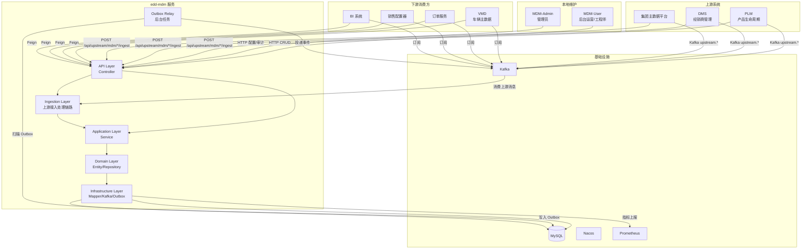
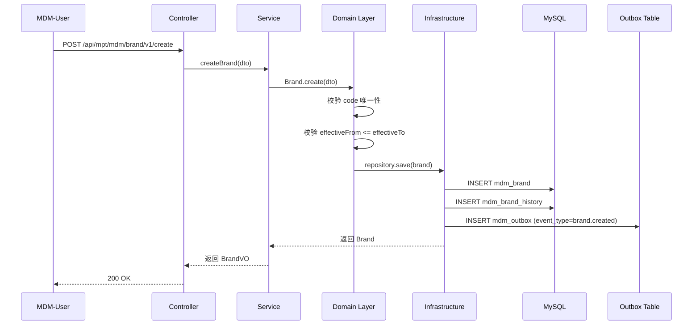
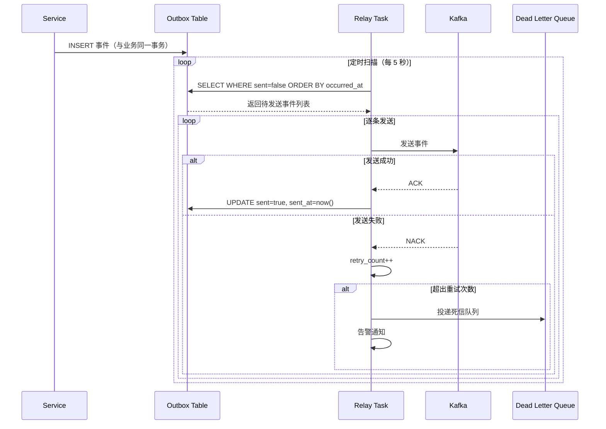
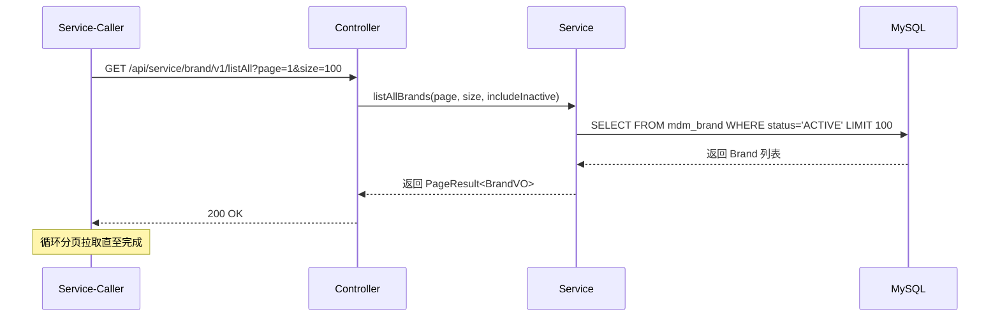
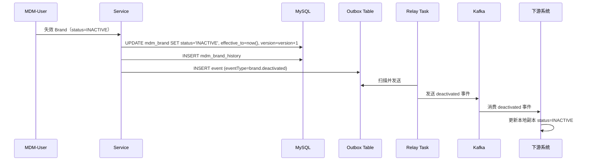
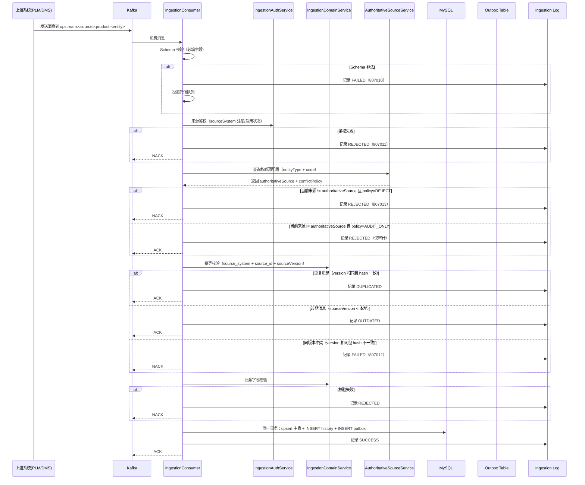
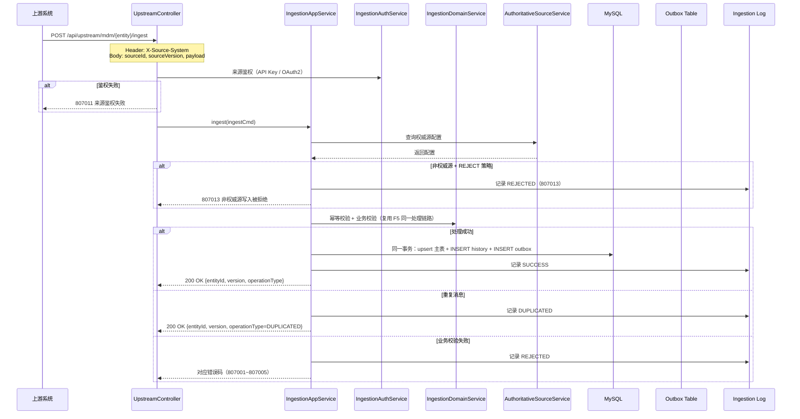

# Product MDM 子域 - Design

## 1. Architecture Overview

### 系统上下文图



### 模块依赖

#### Parent POM

| 模块 | 继承 | 说明 |
|------|------|------|
| edd-mdm-api | `net.hwyz.iov.cloud.parent:api:0.0.1-SNAPSHOT` | API 模块 |
| edd-mdm-service | `net.hwyz.iov.cloud.parent:service:0.0.1-SNAPSHOT` | Service 模块 |

#### Framework Starter 依赖

| Starter | GroupId | ArtifactId | 职责 |
|---------|---------|-----------|------|
| 常用 | `net.hwyz.iov.cloud.framework` | `framework-common` | 常用对象、常量、枚举、工具类 |
| MySQL | `net.hwyz.iov.cloud.framework` | `framework-mysql-starter` | 数据源配置、MyBatis-Plus 集成、分页插件 |
| Kafka | `net.hwyz.iov.cloud.framework` | `framework-kafka-starter` | Kafka 生产者/消费者配置 |
| Web | `net.hwyz.iov.cloud.framework` | `framework-web-starter` | WEB 服务相关（Service 模块默认依赖） |

**使用约定**：
- Service 模块按需引入所需的 Framework Starter，不直接依赖底层中间件原生 starter
- Service 模块的 Parent 已默认依赖 framework-web-starter，且 framework-web-starter 已默认依赖 framework-common
- Framework Starter 已包含对应中间件的 Spring Boot Starter 传递依赖，业务模块无需重复声明
- 版本由 Parent POM 统一管理，业务模块不指定 Framework Starter 版本号

#### 包结构

**API 模块** (`net.hwyz.iov.cloud.edd.mdm.api`)

```
net.hwyz.iov.cloud.edd.mdm.api
├── service                          // 服务API接口，命名规则：MdmXxxService
│   ├── BrandService.java
│   ├── CarLineService.java
│   └── PlatformService.java
├── fallback                         // 服务API接口fallback类，命名规则：MdmXxxServiceFallbackFactory
│   ├── BrandServiceFallbackFactory.java
│   ├── CarLineServiceFallbackFactory.java
│   └── PlatformServiceFallbackFactory.java
└── vo
    ├── request                      // 入参 VO，命名规则：XxxRequest
    │   ├── BrandCreateRequest.java
    │   ├── BrandUpdateRequest.java
    │   └── ...
    └── response                     // 出参 VO，命名规则：XxxResponse
        ├── BrandResponse.java
        ├── BrandPageResponse.java
        └── ...
```

**Service 模块** (`net.hwyz.iov.cloud.edd.mdm.service`)

```
net.hwyz.iov.cloud.edd.mdm.service
├── adapter                          【接入层 / Interface Adapter】
│   ├── web
│   │   ├── controller
│   │   │   ├── service              // 服务端，命名规则：ServiceXxxController
│   │   │   │   ├── ServiceBrandController.java
│   │   │   │   ├── ServiceCarLineController.java
│   │   │   │   └── ServicePlatformController.java
│   │   │   ├── mpt                  // 管理后台，命名规则：MptXxxController
│   │   │   │   ├── MptBrandController.java
│   │   │   │   ├── MptCarLineController.java
│   │   │   │   ├── MptPlatformController.java
│   │   │   │   └── MptIngestionController.java   // 上游接入审计查询
│   │   │   └── upstream             // 上游系统接入，命名规则：UpstreamXxxController
│   │   │       ├── UpstreamBrandController.java
│   │   │       ├── UpstreamCarLineController.java
│   │   │       └── UpstreamPlatformController.java
│   │   ├── vo
│   │   │   ├── request              // 入参 VO，命名规则：XxxRequest
│   │   │   └── response             // 出参 VO，命名规则：XxxResponse
│   │   └── assembler                // VO ⇄ DTO 转换器
│   │       ├── BrandAssembler.java
│   │       ├── CarLineAssembler.java
│   │       └── PlatformAssembler.java
│   ├── mq
│   │   └── consumer                 // 消息消费入口(驱动 Application)
│   │       └── UpstreamIngestionConsumer.java  // 上游 Kafka 消息消费
│   └── task
│       └── scheduler                // 定时任务入口(驱动 Application)
│           └── OutboxRelayScheduler.java
│
├── application                      【应用层 / Use Case Orchestration】
│   ├── service                      // 用例编排、事务边界，命名规则：XxxAppService
│   │   ├── BrandAppService.java
│   │   ├── CarLineAppService.java
│   │   ├── PlatformAppService.java
│   │   └── IngestionAppService.java  // 上游接入处理编排（鉴权→权威源校验→幂等→业务校验→upsert）
│   ├── dto
│   │   ├── cmd                      // 写入类入参，命名规则：XxxCmd
│   │   │   ├── BrandCreateCmd.java
│   │   │   ├── BrandUpdateCmd.java
│   │   │   ├── IngestCmd.java       // 上游接入统一入参
│   │   │   └── ...
│   │   ├── query                    // 查询类入参，命名规则：XxxQuery
│   │   │   ├── BrandQuery.java
│   │   │   ├── CarLineQuery.java
│   │   │   ├── IngestionLogQuery.java  // 接入日志查询
│   │   │   └── ...
│   │   └── result                   // 出参，命名规则：XxxResult / XxxDto
│   │       ├── BrandDto.java
│   │       ├── CarLineDto.java
│   │       ├── IngestionResult.java   // 接入处理结果（entityId/version/operationType）
│   │       ├── IngestionLogDto.java   // 接入日志详情
│   │       └── ...
│   ├── assembler                    // DTO ⇄ Domain Model 转换器，命名规则：XxxAssembler
│   │   ├── BrandDomainAssembler.java
│   │   ├── CarLineDomainAssembler.java
│   │   └── PlatformDomainAssembler.java
│   └── port                         // ★ Application 定义的出站端口
│       ├── gateway                  // 外部系统 Port(跨上下文、三方 API)
│       │   └── KafkaEventGateway.java
│       └── service                  // 技术能力 Port(日志、幂等、锁、ID)
│           ├── OutboxService.java
│           └── IngestionAuthService.java  // 上游来源鉴权端口
│
├── domain                           【领域层 / Domain Core】
│   ├── model
│   │   ├── aggregate                // 聚合根
│   │   │   ├── Brand.java
│   │   │   ├── CarLine.java
│   │   │   └── Platform.java
│   │   ├── entity                   // 实体(聚合内)
│   │   │   └── IngestionLog.java    // 接入审计日志实体
│   │   ├── valueobject              // 值对象
│   │   │   ├── BrandStatus.java
│   │   │   ├── CarLineType.java
│   │   │   ├── PlatformType.java
│   │   │   ├── SourceSystem.java    // 来源系统枚举（LOCAL/PLM/DMS/GROUP_MDM）
│   │   │   ├── IngestionChannel.java // 接入通道枚举（LOCAL/KAFKA/FEIGN）
│   │   │   ├── IngestionStatus.java  // 接入处理状态（SUCCESS/DUPLICATED/OUTDATED/REJECTED/FAILED）
│   │   │   └── ...
│   │   └── event                    // 领域事件
│   │       ├── BrandCreatedEvent.java
│   │       ├── BrandUpdatedEvent.java
│   │       ├── BrandDeactivatedEvent.java
│   │       └── ...
│   ├── service                      // 领域服务(跨聚合业务逻辑)
│   │   ├── ProductDomainService.java
│   │   ├── IngestionDomainService.java  // 上游接入领域服务（幂等校验、权威源校验、冲突裁决）
│   │   └── AuthoritativeSourceService.java // 权威源配置查询与匹配
│   ├── repository                   // ★ 聚合持久化接口(仅接口)，命名规则：XxxRepository
│   │   ├── BrandRepository.java
│   │   ├── CarLineRepository.java
│   │   ├── PlatformRepository.java
│   │   ├── OutboxRepository.java
│   │   ├── IngestionLogRepository.java       // 接入审计日志
│   │   └── AuthoritativeSourceConfigRepository.java // 权威源配置
│   ├── gateway                      // ★ (可选)领域级外部依赖接口
│   ├── policy                       // 业务策略 / 规则引擎
│   │   └── AuthoritativeSourcePolicy.java // 权威源策略（匹配规则、回退逻辑）
│   ├── factory                      // 聚合工厂，命名规则：XxxFactory
│   └── exception                    // 领域异常
│       ├── BrandNotFoundException.java
│       ├── DuplicateCodeException.java
│       ├── IngestionSchemaException.java     // 807010 消息 schema 非法
│       ├── IngestionAuthException.java       // 807011 来源鉴权失败
│       ├── IngestionVersionConflictException.java // 807012 同版本冲突
│       ├── NonAuthoritativeSourceException.java   // 807013 非权威源写入被拒绝
│       └── ...
│
├── infrastructure                   【基础设施层 / Implementation】
│   ├── persistence
│   │   ├── po                       // 数据库对象,不得外泄，命名规则：XxxPo
│   │   │   ├── BrandPo.java
│   │   │   ├── CarLinePo.java
│   │   │   ├── PlatformPo.java
│   │   │   ├── BrandHistoryPo.java
│   │   │   ├── CarLineHistoryPo.java
│   │   │   ├── PlatformHistoryPo.java
│   │   │   ├── OutboxPo.java
│   │   │   ├── IngestionLogPo.java           // 接入审计日志
│   │   │   └── AuthoritativeSourceConfigPo.java // 权威源配置
│   │   ├── mapper                   // MyBatis / JPA Mapper，命名规则：XxxMapper
│   │   │   ├── BrandMapper.java
│   │   │   ├── CarLineMapper.java
│   │   │   ├── PlatformMapper.java
│   │   │   ├── BrandHistoryMapper.java
│   │   │   ├── CarLineHistoryMapper.java
│   │   │   ├── PlatformHistoryMapper.java
│   │   │   ├── OutboxMapper.java
│   │   │   ├── IngestionLogMapper.java
│   │   │   └── AuthoritativeSourceConfigMapper.java
│   │   ├── repository               // Domain Repository 接口实现，命名规则：XxxRepositoryImpl
│   │   │   ├── BrandRepositoryImpl.java
│   │   │   ├── CarLineRepositoryImpl.java
│   │   │   ├── PlatformRepositoryImpl.java
│   │   │   ├── OutboxRepositoryImpl.java
│   │   │   ├── IngestionLogRepositoryImpl.java
│   │   │   └── AuthoritativeSourceConfigRepositoryImpl.java
│   │   └── converter                // DO ⇄ Domain Model 转换器，命名规则：XxxConverter
│   │       ├── BrandConverter.java
│   │       ├── CarLineConverter.java
│   │       └── PlatformConverter.java
│   ├── cache
│   │   └── redis
│   │       └── AuthoritativeSourceConfigCache.java // 权威源配置缓存（支持热更新）
│   ├── gateway                      // ★ Application/Domain 定义的 Gateway 实现
│   │   └── mq                       // 消息生产者(对外发消息)
│   │       └── KafkaEventGatewayImpl.java
│   ├── service                      // ★ Application 定义的 Service Port 实现
│   │   ├── OutboxServiceImpl.java
│   │   └── IngestionAuthServiceImpl.java  // 上游来源鉴权实现（API Key / OAuth2）
│   ├── config                       // Spring 配置、数据源、Bean 装配
│   │   └── IngestionMonitoringConfig.java // 接入监控指标配置（Prometheus）
│   └── common                       // Infra 内部工具
│
└── common / shared                  【跨层通用】
    ├── constant
    │   └── MdmConstants.java
    ├── enums                        // 与协议/存储无关的通用枚举
    │   ├── EntityStatus.java
    │   ├── EventType.java
    │   ├── SourceSystem.java        // 来源系统（LOCAL/PLM/DMS/GROUP_MDM）
    │   ├── IngestionChannel.java    // 接入通道（LOCAL/KAFKA/FEIGN）
    │   ├── IngestionStatus.java     // 接入状态（SUCCESS/DUPLICATED/OUTDATED/REJECTED/FAILED）
    │   └── ConflictPolicy.java      // 冲突策略（REJECT/AUDIT_ONLY）
    ├── exception                    // 基础异常类(ServiceException 等)
    │   └── MdmBusinessException.java
    └── util                         // 纯工具类(日期、字符串)
```

### DDD 四层架构

| 层 | 英文 | 职责 | 对应对象 | 主要组件 |
|---|------|------|----------|----------|
| **接入层** | Controller / Adapter | 协议适配、参数校验、鉴权、序列化 | VO | Controller、Assembler |
| **应用层** | Application | 用例编排、事务边界、跨聚合协调，**不含业务规则** | DTO | AppService、DTO、Assembler、Port |
| **领域层** | Domain | 业务规则、实体、值对象、领域服务、领域事件 | Domain Model | Aggregate、Entity、VO、Event、Repository 接口 |
| **基础设施层** | Infrastructure | 持久化、消息、缓存、外部 RPC | DO | Mapper、Repository 实现、Converter、Gateway 实现 |

**依赖方向**：Controller → Application → Domain ← Infrastructure

Domain 是核心，不得依赖任何其他层。Infrastructure 通过依赖倒置（DIP）实现 Domain 定义的接口（Repository、Gateway 等）。

#### 对象约束

| 对象 | 定义位置 | 命名规范 | 说明 |
|------|----------|----------|------|
| **PO** | infrastructure.persistence.po | XxxPo | 与数据库表结构一一对应，包含审计字段 |
| **Domain Model** | domain.model | 业务名（如 Brand） | 纯 POJO，包含业务逻辑方法，不含框架注解 |
| **DTO** | application.dto | XxxDto / XxxCmd / XxxQuery | 应用层输入/输出契约，纯数据载体 |
| **VO** | adapter.web.vo 或 api.vo | XxxRequest / XxxResponse | 对外暴露的数据对象，字段对前端友好 |

#### 转换规则

| 转换 | 归属层 | 推荐组件 |
|------|--------|----------|
| VO ⇄ DTO | Controller 层 | Assembler |
| DTO ⇄ Domain Model | Application 层 | Assembler |
| Domain Model ⇄ DO | Infrastructure 层 | Converter |

**规范**：
- 禁止跨层直接转换（例如 VO → Domain Model、DO → VO）
- 转换器为无状态 @Component 或静态工具，禁止在转换器中写业务逻辑
- 所有层间对象转换必须使用 MapStruct，禁止手动写 setXxx() 转换代码

## 2. Tech Stack & Decisions

### 平台统一 Parent 与 Framework

本项目继承 OpenIOV 平台统一的 Parent POM 和 Framework Starter，不自行管理基础中间件版本与配置。

| 决策 | 选择 | 说明 |
|------|------|------|
| Parent POM (API) | `net.hwyz.iov.cloud.parent:api:0.0.1-SNAPSHOT` | API 模块继承 |
| Parent POM (Service) | `net.hwyz.iov.cloud.parent:service:0.0.1-SNAPSHOT` | Service 模块继承 |
| Framework Common | `net.hwyz.iov.cloud.framework:framework-common` | 常用对象、常量、枚举、工具类 |
| Framework MySQL | `net.hwyz.iov.cloud.framework:framework-mysql-starter` | 数据源配置、MyBatis-Plus 集成、分页插件 |
| Framework Kafka | `net.hwyz.iov.cloud.framework:framework-kafka-starter` | Kafka 生产者/消费者配置 |
| Framework Web | `net.hwyz.iov.cloud.framework:framework-web-starter` | WEB 服务相关（Service 模块默认依赖） |

**使用约定**：
- Service 模块按需引入所需的 Framework Starter，不直接依赖底层中间件原生 starter
- Service 模块的 Parent 已默认依赖 framework-web-starter，且 framework-web-starter 已默认依赖 framework-common
- Framework Starter 已包含对应中间件的 Spring Boot Starter 传递依赖，业务模块无需重复声明
- 版本由 Parent POM 统一管理，业务模块不指定 Framework Starter 版本号
- 设计 MySQL 数据库的 Service，引入 framework-mysql-starter 后，相关 Dao 或 Mapper 需要继承 `net.hwyz.iov.cloud.framework.mysql.dao.BaseDao`

### 2.1 审计字段填充策略

| 字段 | 填充方式 | 说明 |
|------|----------|------|
| create_by | 优先使用客户端传值，为空时自动从 `SecurityUtils.getUsername()` 获取 | 当前认证用户 |
| modify_by | 优先使用客户端传值，为空时自动从 `SecurityUtils.getUsername()` 获取 | 当前认证用户 |
| create_time | 服务端自动填充 `new Date()` | 不接受客户端传值 |
| modify_time | 服务端自动填充 `new Date()` | 不接受客户端传值 |

### 2.2 技术选型

| Decision | Choice | Alternatives | Rationale |
|----------|--------|--------------|-----------|
| JDK 版本 | JDK 17 | JDK 8, JDK 11 | 与 VMD 对齐，LTS 版本 |
| Web 框架 | Spring Boot 2.7.x + Spring Cloud | Quarkus, Micronaut | 与 VMD 对齐，生态成熟 |
| 注册中心 | Nacos | Eureka, Consul | 与 VMD 对齐，支持配置管理 |
| ORM | MyBatis-Plus | JPA, MyBatis | 与 VMD 对齐，简化 CRUD |
| 数据库迁移 | Flyway | Liquibase | 与 VMD 对齐，版本化管理 |
| 消息队列 | Apache Kafka | RabbitMQ, RocketMQ | 与 VMD 对齐，高吞吐 |
| 事件分发模式 | Outbox Pattern + Relay | 直接 Kafka, CDC | 事务一致性、不丢消息 |
| 历史版本存储 | 独立 history 表 | 同表 version 字段, Event Sourcing | 查询简单、主表性能好 |
| Brand-CarLine 关联 | 逻辑引用 (brandCode) | 物理外键 | 解耦、灵活 |
| API 风格 | RESTful | gRPC, GraphQL | 与 VMD 对齐，通用性好 |
| 分页支持 | PageHelper + 分页 VO | 游标分页 | 与 VMD 对齐，简单通用 |

### 新增技术决策

| 决策 | 选择 | 说明 |
|------|------|------|
| Outbox 实现 | 本地表 + 后台 Relay 任务 | 不依赖 Debezium，运维简单 |
| Kafka Topic 命名 | `mdm.product.<entity>.<eventType>` | 语义清晰，便于订阅 |
| Feign 契约策略 | edd-mdm-api 模块定义接口 + VO | 契约 SSOT，下游依赖 api jar |
| FallbackFactory | 返回空对象 + 日志告警 | 避免 NPE，便于排查 |
| 错误码段位 | 807XXX | 与企业数字底座领域其他服务对齐 |
| 上游 Kafka Topic 命名 | `upstream.<sourceSystem>.product.<entity>` | 与下游事件 Topic 隔离，语义清晰 |
| 上游接入处理链路 | 统一处理链路（鉴权→权威源→幂等→业务→upsert） | Kafka/Feign 复用同一逻辑，维护成本低 |
| 权威源配置存储 | MySQL 配置表 + Redis 缓存 + Nacos 热更新 | 支持动态调整，无需重启 |
| 幂等校验维度 | (source_system, source_id, source_version) | 三元组定位上游记录，支持版本递增 |
| 接入监控 | Prometheus 按 sourceSystem/entityType/status 维度 | 与现有监控体系统一 |
| 上游鉴权方式 | API Key（Feign）+ 来源系统注册校验（Kafka） | 轻量级，与现有安全体系对齐 |

## 3. Data Model

### 3.1 主表

#### mdm_brand（品牌表）

| 字段 | 类型 | 必填 | 说明 |
|------|------|------|------|
| id | BIGINT | Y | 主键，自增 |
| code | VARCHAR(64) | Y | 业务主键，跨系统稳定 |
| name | VARCHAR(128) | Y | 官方名称（如 BMW） |
| name_local | VARCHAR(128) | N | 本地化名称（如 宝马） |
| description | VARCHAR(512) | N | 品牌描述 |
| logo | VARCHAR(256) | N | Logo URL |
| country | VARCHAR(64) | N | 国家 |
| founded_year | INT | N | 创立年份 |
| source_system | VARCHAR(32) | Y | 来源系统编码（LOCAL / PLM / DMS / GROUP_MDM） |
| source_id | VARCHAR(128) | N | 上游系统中的业务主键（本地维护时与 code 相同或为空） |
| source_version | VARCHAR(64) | N | 上游系统中的版本号（本地维护时可为空） |
| ingestion_channel | VARCHAR(16) | Y | 接入通道（LOCAL / KAFKA / FEIGN） |
| ingestion_time | DATETIME | Y | 最近一次接收/变更时间 |
| source_payload_hash | VARCHAR(64) | N | 最近一次接入消息体的哈希值 |
| version | INT | Y | 业务版本号，每次变更 +1 |
| effective_from | DATETIME | N | 生效开始时间 |
| effective_to | DATETIME | N | 生效结束时间 |
| status | VARCHAR(16) | Y | ACTIVE / INACTIVE / DEPRECATED / DRAFT |
| create_by | VARCHAR(64) | Y | 创建人 |
| create_time | DATETIME | Y | 创建时间 |
| modify_by | VARCHAR(64) | Y | 修改人 |
| modify_time | DATETIME | Y | 修改时间 |
| row_version | INT | Y | 乐观锁版本号，默认 0 |
| row_valid | TINYINT | Y | 行有效标记，1=有效，0=无效 |

**唯一约束**：UK(code)  
**业务约束**：(source_system, source_id) 作为上游记录的逻辑主键用于幂等校验

#### mdm_series（车系表）

| 字段 | 类型 | 必填 | 说明 |
|------|------|------|------|
| id | BIGINT | Y | 主键，自增 |
| code | VARCHAR(64) | Y | 业务主键 |
| name | VARCHAR(128) | Y | 官方名称（如 Model 3） |
| name_local | VARCHAR(128) | N | 本地化名称（如 汉） |
| brand_code | VARCHAR(64) | Y | 逻辑引用 Brand.code |
| series_type | VARCHAR(16) | N | 轿车/SUV/MPV/皮卡/商用 |
| lifecycle_status | VARCHAR(16) | N | 在研/在售/停售 |
| target_market | VARCHAR(16) | N | 国内/海外/全球 |
| source_system | VARCHAR(32) | Y | 来源系统编码（LOCAL / PLM / DMS / GROUP_MDM） |
| source_id | VARCHAR(128) | N | 上游系统中的业务主键（本地维护时与 code 相同或为空） |
| source_version | VARCHAR(64) | N | 上游系统中的版本号（本地维护时可为空） |
| ingestion_channel | VARCHAR(16) | Y | 接入通道（LOCAL / KAFKA / FEIGN） |
| ingestion_time | DATETIME | Y | 最近一次接收/变更时间 |
| source_payload_hash | VARCHAR(64) | N | 最近一次接入消息体的哈希值 |
| version | INT | Y | 业务版本号，每次变更 +1 |
| effective_from | DATETIME | N | 生效开始时间 |
| effective_to | DATETIME | N | 生效结束时间 |
| status | VARCHAR(16) | Y | ACTIVE / INACTIVE / DEPRECATED / DRAFT |
| create_by | VARCHAR(64) | Y | 创建人 |
| create_time | DATETIME | Y | 创建时间 |
| modify_by | VARCHAR(64) | Y | 修改人 |
| modify_time | DATETIME | Y | 修改时间 |
| row_version | INT | Y | 乐观锁版本号，默认 0 |
| row_valid | TINYINT | Y | 行有效标记，1=有效，0=无效 |

**唯一约束**：UK(code)  
**业务约束**：brand_code 必须指向已存在且 status=ACTIVE 的 Brand；(source_system, source_id) 作为上游记录的逻辑主键用于幂等校验

#### mdm_platform（平台表）

| 字段 | 类型 | 必填 | 说明 |
|------|------|------|------|
| id | BIGINT | Y | 主键，自增 |
| code | VARCHAR(64) | Y | 业务主键 |
| name | VARCHAR(128) | Y | 官方名称（如 MEB） |
| name_local | VARCHAR(128) | N | 本地化名称（如有） |
| platform_type | VARCHAR(16) | N | 油车/纯电/插混/增程 |
| architecture | VARCHAR(64) | N | EE 架构代号 |
| source_system | VARCHAR(32) | Y | 来源系统编码（LOCAL / PLM / DMS / GROUP_MDM） |
| source_id | VARCHAR(128) | N | 上游系统中的业务主键（本地维护时与 code 相同或为空） |
| source_version | VARCHAR(64) | N | 上游系统中的版本号（本地维护时可为空） |
| ingestion_channel | VARCHAR(16) | Y | 接入通道（LOCAL / KAFKA / FEIGN） |
| ingestion_time | DATETIME | Y | 最近一次接收/变更时间 |
| source_payload_hash | VARCHAR(64) | N | 最近一次接入消息体的哈希值 |
| version | INT | Y | 业务版本号，每次变更 +1 |
| effective_from | DATETIME | N | 生效开始时间 |
| effective_to | DATETIME | N | 生效结束时间 |
| status | VARCHAR(16) | Y | ACTIVE / INACTIVE / DEPRECATED / DRAFT |
| create_by | VARCHAR(64) | Y | 创建人 |
| create_time | DATETIME | Y | 创建时间 |
| modify_by | VARCHAR(64) | Y | 修改人 |
| modify_time | DATETIME | Y | 修改时间 |
| row_version | INT | Y | 乐观锁版本号，默认 0 |
| row_valid | TINYINT | Y | 行有效标记，1=有效，0=无效 |

**唯一约束**：UK(code)  
**业务约束**：(source_system, source_id) 作为上游记录的逻辑主键用于幂等校验

### 3.2 历史快照表

历史快照表结构与主表一致（包含所有业务字段、来源字段和审计字段），额外增加以下字段：

| 字段 | 类型 | 必填 | 说明 |
|------|------|------|------|
| snapshot_id | BIGINT | Y | 主键，自增 |
| entity_id | BIGINT | Y | 关联主表 id |
| operation_type | VARCHAR(16) | Y | CREATE / UPDATE / DEACTIVATE / DELETE |
| snapshot_time | DATETIME | Y | 快照时间 |
| operator | VARCHAR(64) | Y | 操作人 |

**表名**：
- mdm_brand_history
- mdm_series_history
- mdm_platform_history

### 3.3 事务性发件箱表

#### mdm_outbox

| 字段 | 类型 | 必填 | 说明 |
|------|------|------|------|
| id | BIGINT | Y | 主键，自增 |
| aggregate_type | VARCHAR(32) | Y | 聚合类型（BRAND / SERIES / PLATFORM） |
| aggregate_id | VARCHAR(64) | Y | 聚合根 ID（code） |
| event_type | VARCHAR(64) | Y | 事件类型 |
| payload | TEXT | Y | JSON 格式事件体 |
| occurred_at | DATETIME | Y | 事件发生时间 |
| sent | BOOLEAN | Y | 是否已发送，默认 false |
| sent_at | DATETIME | N | 发送时间 |
| retry_count | INT | Y | 重试次数，默认 0 |
| create_by | VARCHAR(64) | Y | 创建人 |
| create_time | DATETIME | Y | 创建时间 |
| modify_by | VARCHAR(64) | Y | 修改人 |
| modify_time | DATETIME | Y | 修改时间 |
| row_version | INT | Y | 乐观锁版本号，默认 0 |
| row_valid | TINYINT | Y | 行有效标记，1=有效，0=无效 |

**索引**：
- IDX_OUTBOX_SENT_OCCURRED (sent, occurred_at)：用于 Relay 扫描
- IDX_OUTBOX_AGGREGATE (aggregate_type, aggregate_id)：用于聚合查询

### 3.4 权威源配置表

#### mdm_authoritative_source_config

| 字段 | 类型 | 必填 | 说明 |
|------|------|------|------|
| id | BIGINT | Y | 主键，自增 |
| entity_type | VARCHAR(16) | Y | 实体类型（BRAND / SERIES / PLATFORM） |
| code_pattern | VARCHAR(64) | Y | code 匹配模式（精确 code 或通配 *） |
| authoritative_source | VARCHAR(32) | Y | 权威源（LOCAL / PLM / DMS / GROUP_MDM） |
| conflict_policy | VARCHAR(16) | Y | 冲突策略（REJECT / AUDIT_ONLY） |
| priority | INT | Y | 优先级，数值越小优先级越高 |
| enabled | TINYINT | Y | 是否启用，1=启用，0=禁用 |
| create_by | VARCHAR(64) | Y | 创建人 |
| create_time | DATETIME | Y | 创建时间 |
| modify_by | VARCHAR(64) | Y | 修改人 |
| modify_time | DATETIME | Y | 修改时间 |
| row_version | INT | Y | 乐观锁版本号，默认 0 |
| row_valid | TINYINT | Y | 行有效标记，1=有效，0=无效 |

**索引**：
- IDX_ASC_ENTITY_CODE (entity_type, code_pattern)：用于匹配查询
- UK_ASC_ENTITY_CODE_PRIORITY (entity_type, code_pattern, priority)：唯一约束

**配置回退规则**：精确 code 匹配 → entityType 级默认（code_pattern=*）→ 全局默认（authoritative_source=LOCAL, conflict_policy=REJECT）

### 3.5 上游接入审计日志表

#### mdm_ingestion_log

| 字段 | 类型 | 必填 | 说明 |
|------|------|------|------|
| id | BIGINT | Y | 主键，自增 |
| message_id | VARCHAR(128) | Y | 消息唯一标识（Kafka offset 或 HTTP 请求 ID） |
| source_system | VARCHAR(32) | Y | 来源系统编码 |
| source_id | VARCHAR(128) | Y | 上游业务主键 |
| source_version | VARCHAR(64) | N | 上游版本号 |
| entity_type | VARCHAR(16) | Y | 实体类型（BRAND / SERIES / PLATFORM） |
| entity_code | VARCHAR(64) | N | 本地实体 code（处理成功时填充） |
| ingestion_channel | VARCHAR(16) | Y | 接入通道（KAFKA / FEIGN） |
| received_at | DATETIME | Y | 消息接收时间 |
| processed_at | DATETIME | N | 处理完成时间 |
| status | VARCHAR(16) | Y | 处理状态（SUCCESS / DUPLICATED / OUTDATED / REJECTED / FAILED） |
| error_code | VARCHAR(8) | N | 错误码（如 807010） |
| error_message | VARCHAR(512) | N | 错误描述 |
| payload_hash | VARCHAR(64) | N | 消息体哈希值 |
| create_by | VARCHAR(64) | Y | 创建人（系统处理时为 source_system 标识） |
| create_time | DATETIME | Y | 记录创建时间 |
| modify_by | VARCHAR(64) | Y | 修改人 |
| modify_time | DATETIME | Y | 修改时间 |
| row_version | INT | Y | 乐观锁版本号，默认 0 |
| row_valid | TINYINT | Y | 行有效标记，1=有效，0=无效 |

**索引**：
- IDX_IL_MESSAGE_ID (message_id)：按消息 ID 查询
- IDX_IL_SOURCE (source_system, source_id)：按来源查询
- IDX_IL_STATUS_TIME (status, received_at)：按状态和时间范围查询
- IDX_IL_ENTITY (entity_type, entity_code)：按实体查询

## 4. Core Flows

### F1 - MDM-User 维护品牌（CRUD）



### F2 - Outbox 写入 + 后台 Relay 任务推 Kafka



### F3 - 下游 Bootstrap 拉全量快照流程



### F4 - 失效（Deactivate）的事件传播



### F5 - 上游 Kafka 消息接入流程



### F6 - 上游 Feign/HTTP 接入流程



## 5. API Contracts

### 5.1 MPT 端接口（后台管理）

#### Brand 接口

| Method | Path | 说明 |
|--------|------|------|
| POST | /api/mpt/mdm/brand/v1/create | 创建品牌 |
| PUT | /api/mpt/mdm/brand/v1/{code} | 更新品牌 |
| DELETE | /api/mpt/mdm/brand/v1/{code} | 删除品牌（仅 DRAFT 状态） |
| POST | /api/mpt/mdm/brand/v1/{code}/deactivate | 失效品牌 |
| GET | /api/mpt/mdm/brand/v1/{code} | 查询品牌详情 |
| GET | /api/mpt/mdm/brand/v1/list | 分页查询品牌列表 |
| GET | /api/mpt/mdm/brand/v1/{code}/history | 查询品牌历史版本 |

#### CarLine 接口

| Method | Path | 说明 |
|--------|------|------|
| POST | /api/mpt/mdm/series/v1/create | 创建车系 |
| PUT | /api/mpt/mdm/series/v1/{code} | 更新车系 |
| DELETE | /api/mpt/mdm/series/v1/{code} | 删除车系（仅 DRAFT 状态） |
| POST | /api/mpt/mdm/series/v1/{code}/deactivate | 失效车系 |
| GET | /api/mpt/mdm/series/v1/{code} | 查询车系详情 |
| GET | /api/mpt/mdm/series/v1/list | 分页查询车系列表（支持 brandCode、status 过滤） |
| GET | /api/mpt/mdm/series/v1/{code}/history | 查询车系历史版本 |

#### Platform 接口

| Method | Path | 说明 |
|--------|------|------|
| POST | /api/mpt/mdm/platform/v1/create | 创建平台 |
| PUT | /api/mpt/mdm/platform/v1/{code} | 更新平台 |
| DELETE | /api/mpt/mdm/platform/v1/{code} | 删除平台（仅 DRAFT 状态） |
| POST | /api/mpt/mdm/platform/v1/{code}/deactivate | 失效平台 |
| GET | /api/mpt/mdm/platform/v1/{code} | 查询平台详情 |
| GET | /api/mpt/mdm/platform/v1/list | 分页查询平台列表 |
| GET | /api/mpt/mdm/platform/v1/{code}/history | 查询平台历史版本 |

### 5.2 Service 端接口（下游消费）

#### Brand 接口

| Method | Path | 说明 |
|--------|------|------|
| GET | /api/service/brand/v1/listAll | 全量快照（支持分页、includeInactive） |
| GET | /api/service/brand/v1/{code} | 按 code 单点查询 |

#### CarLine 接口

| Method | Path | 说明 |
|--------|------|------|
| GET | /api/service/series/v1/listAll | 全量快照（支持分页、brandCode 过滤） |
| GET | /api/service/series/v1/{code} | 按 code 单点查询 |

#### Platform 接口

| Method | Path | 说明 |
|--------|------|------|
| GET | /api/service/platform/v1/listAll | 全量快照（支持分页） |
| GET | /api/service/platform/v1/{code} | 按 code 单点查询 |

### 5.3 上游接入接口（Upstream 端）

#### Brand 接入

| Method | Path | 说明 |
|--------|------|------|
| POST | /api/upstream/mdm/brand/v1/ingest | 接收上游 Brand 主数据 |

#### CarLine 接入

| Method | Path | 说明 |
|--------|------|------|
| POST | /api/upstream/mdm/series/v1/ingest | 接收上游 CarLine 主数据 |

#### Platform 接入

| Method | Path | 说明 |
|--------|------|------|
| POST | /api/upstream/mdm/platform/v1/ingest | 接收上游 Platform 主数据 |

**请求头**：`X-Source-System`（来源系统编码）、`Authorization`（API Key 或 OAuth2 Token）

**请求体**（IngestRequest）：

| 字段 | 类型 | 必填 | 说明 |
|------|------|------|------|
| sourceId | String | Y | 上游业务主键 |
| sourceVersion | String | Y | 上游版本号 |
| occurredAt | DateTime | Y | 上游事件发生时间 |
| payload | Object | Y | 业务字段（与本地维护一致） |

**响应体**（IngestResponse）：

| 字段 | 类型 | 说明 |
|------|------|------|
| entityId | Long | 本地实体 ID |
| version | Integer | 本地版本号 |
| operationType | String | CREATED / UPDATED / DUPLICATED / REJECTED |

### 5.4 MPT 端接口（管理后台 - 接入审计）

#### 接入日志查询

| Method | Path | 说明 |
|--------|------|------|
| GET | /api/mpt/mdm/ingestion/v1/log | 分页查询接入处理记录（支持 sourceSystem / entityType / status / 时间窗过滤） |
| GET | /api/mpt/mdm/ingestion/v1/{messageId} | 查询单条接入处理明细 |

### 5.5 错误码表（段位 807XXX）

| 错误码 | 说明 | HTTP 状态码 |
|--------|------|------------|
| 807001 | 业务主键（code）已存在 | 409 Conflict |
| 807002 | 记录不存在 | 404 Not Found |
| 807003 | 状态不允许删除（非 DRAFT） | 400 Bad Request |
| 807004 | 生效期无效（effectiveFrom > effectiveTo） | 400 Bad Request |
| 807005 | 引用的 Brand 不存在或状态无效 | 400 Bad Request |
| 807006 | 状态不允许失效（非 ACTIVE） | 400 Bad Request |
| 807010 | 上游消息 schema 非法或必填字段缺失 | 400 Bad Request |
| 807011 | 上游来源鉴权失败（来源未注册/被禁用） | 401 Unauthorized |
| 807012 | 同版本冲突（sourceVersion 相同但 payload hash 不一致） | 409 Conflict |
| 807013 | 非权威源写入被拒绝 | 403 Forbidden |
| 807099 | 系统内部错误 | 500 Internal Server Error |

## 6. Coverage Mapping

| US-ID | Design Section | Note |
|-------|----------------|------|
| US-001 | §3.1 (mdm_brand), §4 (F1), §5.1 (Brand API) | Brand CRUD |
| US-002 | §3.1 (mdm_series), §5.1 (CarLine API) | CarLine CRUD + 过滤 |
| US-003 | §3.1 (mdm_platform), §5.1 (Platform API) | Platform CRUD |
| US-004 | §3.2 (history 表) | 历史版本快照 |
| US-005 | §4 (F1 中的校验逻辑) | 生效期校验 |
| US-006 | §3.3 (mdm_outbox), §4 (F2, F4) | Brand 事件发布 |
| US-007 | §3.3, §4 (F2, F4) | CarLine 事件发布 |
| US-008 | §3.3, §4 (F2, F4) | Platform 事件发布 |
| US-009 | §5.2 (Brand Service API) | Brand 全量快照 |
| US-010 | §5.2 (CarLine Service API) | CarLine 全量快照 |
| US-011 | §5.2 (Platform Service API) | Platform 全量快照 |
| US-012 | §5.2 (单点查询 API) | 按 code 单点查询 |
| US-013 | §3.1 (来源字段), §4 (F5), §5.3 (上游接入 API) | 上游 Kafka 接入 |
| US-014 | §3.1 (来源字段), §4 (F6), §5.3 (上游接入 API) | 上游 Feign/HTTP 接入 |
| US-015 | §3.1 (source_* 字段), §3.2 (history 来源字段) | 数据来源记录 |
| US-016 | §4 (F5/F6 幂等校验逻辑) | 上游消息幂等处理 |
| US-017 | §3.4 (mdm_authoritative_source_config) | 权威源配置与冲突裁决 |
| US-018 | §3.5 (mdm_ingestion_log), §5.4 (MPT 接入审计 API) | 上游接入审计与监控 |

## 7. Impact Analysis

### 对上游系统的影响

- PLM / DMS / 集团主数据平台需要按照约定的 Topic 命名（`upstream.<sourceSystem>.product.<entity>`）和消息格式推送主数据
- 上游系统需要实现或对接 edd-mdm 提供的 Feign ingest 接口（POST /api/upstream/mdm/{entity}/ingest）
- 上游系统需要在 edd-mdm 注册 sourceSystem 编码并获取鉴权凭据（API Key）
- 上游系统需保证 sourceVersion 单调递增，以支持 edd-mdm 的幂等校验机制

### 对 VMD 项目的影响

- VMD 需要新增本地投影副本表（external_ref_id, external_version, source='MDM', last_sync_time）
- VMD 需要实现 Kafka 消费者订阅 `mdm.product.*` 事件
- VMD 需要实现 Feign 客户端调用 edd-mdm Service 端接口
- VMD 需要改造 Brand / CarLine / Platform 的查询逻辑，优先读本地副本，Fallback 到 MDM

### 对下游系统的影响

- 订单服务、销售配置器、BI 系统需要订阅 Kafka 事件或调用 Feign 接口
- 下游系统需要实现 upsert 逻辑：`IF event.version > local.external_version THEN upsert ELSE ignore`

## 8. Open Questions

| 编号 | 问题 | 答案 | 状态 |
|------|------|------|------|
| OQ-1 | Outbox Relay 任务的扫描频率和批量大小如何配置？ | 扫描频率：5 秒，批量大小：100 条，支持 Nacos 动态配置 | 已确认 |
| OQ-2 | Kafka 消息的 Key 如何选择？ | 使用 entity code（如 BRAND_001），保证同一实体事件在同一 Partition 内有序 | 已确认 |
| OQ-3 | Feign 接口是否需要支持增量拉取（基于 modify_time）？ | 本期不实现，留待后续 CR。首期用 Kafka 事件实现增量同步，Feign 接口聚焦 Bootstrap 和对账 | 已确认 |

## 9. Changelog

| Date | Change ID | Type | Description |
|------|-----------|------|-------------|
| 2026-05-26 | CR-001 | Added | 首版产出：建立 Product MDM 子域（Brand / CarLine / Platform）设计文档 |
| 2026-05-26 | CR-002 | Added | 新增上游系统数据接入设计：(1) 系统上下文图新增上游系统（PLM/DMS/集团MDM）和 MDM-Admin 角色；(2) 包结构新增上游接入层（UpstreamController、IngestionConsumer、IngestionAppService、IngestionDomainService 等）；(3) 主表和 history 表新增来源字段（source_system/source_id/source_version/ingestion_channel/ingestion_time/source_payload_hash）；(4) 新增 mdm_authoritative_source_config 权威源配置表和 mdm_ingestion_log 接入审计表；(5) 新增 F5（上游 Kafka 接入）和 F6（上游 Feign/HTTP 接入）核心流程；(6) 新增上游接入 API（/api/upstream/mdm/{entity}/ingest）和 MPT 审计查询 API；(7) 新增错误码 807010~807013；(8) 新增上游接入相关技术决策；(9) 更新 Coverage Mapping 补充 US-013~US-018 映射 |
